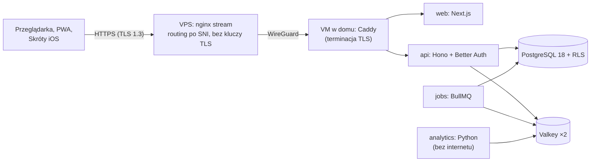

# OligInvest

**Cel:** przedstawić projekt OligInvest — czym jest, w jakim jest stanie, gdzie jest dokumentacja i jak rozpocząć budowę aplikacji w Codex na jej podstawie.

OligInvest to prywatna aplikacja webowa (PWA) do analizy inwestycji dla właściciela i kilku zaufanych osób: portfel w PLN z GPW, USA i ETF, import historii z XTB i mBank eMakler, rzetelne wyniki (FIFO, TWR, XIRR, ekspozycja walutowa), scenariusze i rozkłady zamiast prognoz, alerty, integracja z iPhone'em (Skróty) i warstwa edukacyjna. Działa za 0 zł na własnym serwerze.

> OligInvest służy do analizy i nauki. Nie świadczy doradztwa inwestycyjnego ani nie formułuje rekomendacji inwestycyjnych ([`docs/11-zgodnosc-prawna.md`](docs/11-zgodnosc-prawna.md)).

## Status

**Faza: M0-1 — zweryfikowany lokalnie szkielet.** Istnieją oba lockfile, szkielety pakietów i modułów, strona testowa, konfiguracja z obsługą sekretów plikowych i fundament platformy z testami. Instalacje frozen i `pnpm turbo run lint typecheck test build` przechodzą lokalnie. Własne CI pozostaje szkicem; Compose dev używa zatwierdzonego bridge (`internal: false`) z portami na pętli zwrotnej; produkcyjne sieci internal pozostają bez zmian. Stan i brakujące prace: [raport M0-1](docs/08-plan/m0-1-session-report.md); etapy M0–M6: [roadmapa](docs/08-plan/roadmapa.md).

## Zasady produktu

1. **Scenariusze, nie wyrocznie** — wyniki analiz to rozkłady z założeniami; zero prognoz punktowych i poleceń „kup/sprzedaj”.
2. **Każda liczba ma źródło i czas** — dane opóźnione i EOD są jawnie oznaczone.
3. **Szybko na telefonie** — budżety wydajności egzekwowane w CI (LCP < 2 s, JS początkowy < 200 KB gzip).
4. **Prywatność domyślnie** — dane na serwerze właściciela w Polsce, TLS kończony w domu, RLS w bazie, brak trackerów.
5. **Poprawność ponad efektowność** — wzory udokumentowane i testowane na wektorach referencyjnych, uzgodnienie z brokerem po każdym imporcie.
6. **0 zł i prostota** — self-hosting, darmowe źródła danych, mniej zależności; ograniczenia wypisane jawnie w [`docs/10-ograniczenia.md`](docs/10-ograniczenia.md).

## Architektura w skrócie

Monorepo Turborepo + pnpm: `apps/{web,api,jobs,analytics}`, `modules/*` (identity, notifications, market, portfolio + wyłączalne analytics, alerts, education, admin, quick-actions) i `packages/*` (m.in. `core` — jedyna implementacja obliczeń finansowych). Szczegóły: [`docs/01-architektura/`](docs/01-architektura/przeglad-architektury.md).

## Dokumentacja

| Katalog | Zawartość |
|---|---|
| [`docs/00-przeglad/`](docs/00-przeglad/wizja-produktu.md) | wizja, wymagania FR/NFR z zastrzeżeniami do specyfikacji, macierz pokrycia wymagań, słownik pojęć, specyfikacja źródłowa |
| [`docs/01-architektura/`](docs/01-architektura/przeglad-architektury.md) | C4, stos z uzasadnieniami, moduły i ich granice, przepływy danych |
| [`docs/02-api/`](docs/02-api/konwencje-api.md) | OpenAPI 3.1, kontrakty SSE, konwencje API |
| [`docs/03-dane/`](docs/03-dane/zrodla-danych.md) | źródła danych, model danych, DDL z RLS, strategia cache, wzory finansowe, formaty importu, fixtures |
| [`docs/04-frontend/`](docs/04-frontend/architektura-ui.md) | architektura UI, system projektowy, mapa ekranów, teksty interfejsu, wydajność, dostępność |
| [`docs/05-mobile/`](docs/05-mobile/strategia-mobilna.md) | strategia PWA, Skróty iOS, integracje Androida |
| [`docs/06-bezpieczenstwo/`](docs/06-bezpieczenstwo/model-zagrozen.md) | model zagrożeń STRIDE, kontrole i OWASP ASVS 5.0, uwierzytelnianie, RODO, plan reagowania |
| [`docs/07-wdrozenie/`](docs/07-wdrozenie/infrastruktura.md) | infrastruktura, CI/CD, monitoring, kopie i odtwarzanie |
| [`docs/08-plan/`](docs/08-plan/roadmapa.md) | roadmapa M0–M6, MVP, backlog z estymacją, rejestr ryzyk, prompty dla Codex |
| [`docs/09-decyzje/`](docs/09-decyzje/ADR-000-szablon.md) | ADR-001…015, audyt pluginów, research bibliotek |
| [`docs/10-ograniczenia.md`](docs/10-ograniczenia.md) | czego nie da się zrobić za 0 zł i co tracimy |
| [`docs/11-zgodnosc-prawna.md`](docs/11-zgodnosc-prawna.md) | MiFID II, MAR, disclaimery, podatki, licencje danych |
| [`docs/12-dla-uzytkownika/`](docs/12-dla-uzytkownika/instrukcja.md) | instrukcja użytkownika i administratora, samouczki, regulamin, informacja o danych |

## Jak rozpocząć budowę (Codex)

1. Codex czyta automatycznie [`AGENTS.md`](AGENTS.md) — stałe reguły, stos, granice modułów, checklisty metodologiczne.
2. Otwórz [`docs/08-plan/prompty-codex.md`](docs/08-plan/prompty-codex.md) i wklej **Prompt 0** (etap M0, zadania `BL-001`–`BL-019`, `BL-032`–`BL-035`).
3. Przeglądaj każdy PR przed scaleniem; statusy zadań prowadzi [`docs/08-plan/backlog.md`](docs/08-plan/backlog.md).
4. Zadania na serwerach (VPS, VM, DNS w home.pl) wykonuje właściciel według skryptów i instrukcji przygotowanych przez Codex.

## Dla deweloperów

- Zasady pracy, Conventional Commits i Definition of Done: [`CONTRIBUTING.md`](CONTRIBUTING.md).
- Zgłaszanie podatności: [`SECURITY.md`](SECURITY.md) — prywatnie, przez GitHub.
- Claude Code: [`CLAUDE.md`](CLAUDE.md), serwery MCP w [`.mcp.json`](.mcp.json) (klucze wyłącznie ze zmiennych środowiskowych — wzór w [`.env.example`](.env.example)), skille w `.claude/skills/` (audyt: [`docs/09-decyzje/audyt-pluginow.md`](docs/09-decyzje/audyt-pluginow.md)).
- Repozytorium jest publiczne: bez sekretów, adresów IP, nazw hostów domowych i rzeczywistych wyciągów ([ADR-013](docs/09-decyzje/ADR-013-repozytorium-publiczne.md)).

## Licencja

Repozytorium nie ma pliku `LICENSE` — **wszelkie prawa zastrzeżone** (decyzja właściciela, [ADR-013](docs/09-decyzje/ADR-013-repozytorium-publiczne.md)). Kod jest widoczny, ale nie udziela się prawa do kopiowania, modyfikacji ani dystrybucji. Skille i materiały zewnętrzne zachowują własne licencje (`.claude/skills/THIRD_PARTY_NOTICES.md`).
