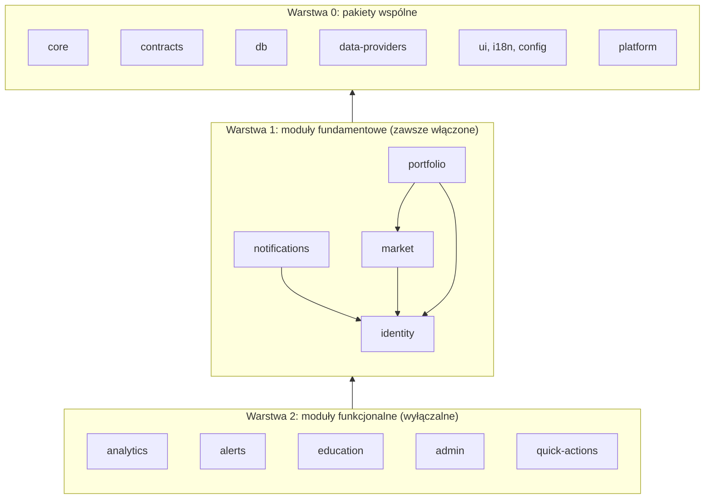

# Moduły: granice, kontrakty, zależności

**Cel:** zdefiniować podział OligInvest na moduły — co każdy posiada (tabele, API, zdarzenia, zadania, uprawnienia, flagi), od czego może zależeć i jak dodać lub usunąć moduł bez modyfikowania pozostałych (NFR-02).

Powiązane: [`przeglad-architektury.md`](przeglad-architektury.md), [ADR-002](../09-decyzje/ADR-002-monorepo.md), [ADR-003](../09-decyzje/ADR-003-hybryda-obliczen-i-kolejki.md), `docs/02-api/` i `docs/03-dane/` (Krok 4).

## 1. Struktura repozytorium

```
oliginvest/
├── apps/
│   ├── web/            # Next.js 16 — kompozycja UI; trasy to cienkie re-eksporty z modułów
│   ├── api/            # Hono — kompozycja modułów serwerowych, Better Auth, SSE, OpenAPI
│   ├── jobs/           # BullMQ (Node) — rejestruje handlery zadań z modułów, harmonogram
│   └── analytics/      # Python 3.13 (uv) — MC, optymalizacja, backtest; package.json tylko z poleceniami dla turbo
├── modules/            # moduły domenowe (pakiety @oliginvest/mod-*)
│   ├── identity/  notifications/  market/  portfolio/          # fundamentowe
│   └── analytics/  alerts/  education/  admin/  quick-actions/  # funkcjonalne (wyłączalne)
├── packages/
│   ├── platform/       # jądro: kontrakt modułu, rejestr, kontekst żądania, flagi, audyt, zdarzenia, SSE, uprawnienia
│   ├── core/           # czyste funkcje finansowe (TS, decimal.js): pieniądze, FX, FIFO, TWR/XIRR, wskaźniki, ryzyko
│   ├── contracts/      # wspólne schematy Zod (DTO, zdarzenia, zadania) + eksport JSON Schema dla Pythona
│   ├── db/             # klient Drizzle, helper transakcji RLS, migracje, polityki RLS (SQL)
│   ├── data-providers/ # port DataProvider + adaptery (gpw, yahoo, nbp, frankfurter, finnhub, twelvedata, alphavantage, fred, gdelt, marketaux)
│   ├── ui/             # system projektowy: tokeny, prymitywy, wrappery wykresów (leniwe)
│   ├── i18n/           # komunikaty PL (gotowe na EN), formatery Intl
│   ├── config/         # wspólne tsconfig, biome, schemat zmiennych środowiskowych (Zod)
│   └── test-vectors/   # wektory referencyjne (JSON) dla wzorów — używane przez Vitest i pytest
└── docs/
```

Każdy moduł ma tę samą strukturę wewnętrzną:

```
modules/<nazwa>/
├── package.json        # name: @oliginvest/mod-<nazwa>; "exports": { "./contracts", "./server", "./jobs", "./ui" }
├── src/contracts.ts    # PUBLICZNE: schematy Zod DTO, zdarzenia, zadania, uprawnienia, klucze flag
├── src/domain/         # model domenowy i reguły (czyste funkcje; obliczenia deleguje do packages/core)
├── src/server/         # router Hono, serwisy, repozytoria (Drizzle), trasy admina modułu
├── src/jobs.ts         # handlery zadań i subskrypcje zdarzeń (rejestrowane przez apps/jobs)
├── src/ui/             # komponenty i strony React (Server + Client Components)
├── src/module.ts       # definicja modułu serwerowego (ModuleDefinition)
├── src/ui-module.ts    # definicja modułu UI (nawigacja, panele admina, wyjaśnienia)
├── db/schema.ts        # tabele należące do modułu
├── db/rls.sql          # polityki RLS dla tabel modułu
└── test/               # testy jednostkowe, integracyjne (RLS), fixtures
```

Pole `exports` w `package.json` jest granicą publiczną: import czegokolwiek spoza `contracts`/`server`/`jobs`/`ui` jest niemożliwy (błąd rozwiązywania modułu), a pnpm nie pozwala importować pakietu, którego nie ma w zależnościach.

## 2. Warstwy i reguły zależności



Reguły (egzekwowane skryptem `pnpm check:deps` w CI na podstawie `package.json` wszystkich pakietów workspace):

1. Warstwa 0 nie zależy od modułów. `core` nie zależy od niczego poza `decimal.js` (zero I/O).
2. Moduł fundamentowy może zależeć od warstwy 0 i od modułów fundamentowych niżej w kolejności: `identity` → `notifications` → `market` → `portfolio`.
3. Moduł funkcjonalny może zależeć od warstwy 0 i **kontraktów** (`/contracts`, `/server` — tylko publiczne serwisy) modułów fundamentowych. **Nie zależy od innych modułów funkcjonalnych.** Interakcje między modułami funkcjonalnymi — wyłącznie przez zdarzenia.
4. Aplikacje (`apps/*`) są korzeniami kompozycji: importują moduły przez rejestry (`apps/api/src/modules.ts`, `apps/jobs/src/modules.ts`, `apps/web/src/modules.ts`).
5. `apps/web` nie importuje `modules/*/server` ani `packages/db` (brak dostępu do bazy z warstwy UI — [ADR-012](../09-decyzje/ADR-012-api-jako-granica-domenowa.md)).

`check:deps` kontroluje wszystkie sekcje zależności manifestów, cykle workspace oraz importy
w kodzie produkcyjnym (`src/`, `db/`, `app/`, `pages/`, `proxy.ts`, `middleware.ts`). Testy,
fixtures, spiki i narzędzia migracyjne nie są kodem produkcyjnym. Parser przypiętego TypeScript
sprawdza także re-eksporty, importy typów, `require` i dynamiczne importy. Specyfikator musi być
literałem; importy workspace wymagają deklaracji i publicznego eksportu. Ścieżki względne nie
mogą przekraczać granicy pakietu; aliasy spoza zadeklarowanych zależności są odrzucane.
Moduły w aplikacjach importuje `src/modules.ts`; dodatkowo cienkie re-eksporty `/ui` w trasach
`apps/web/app/` (lub `src/app/`) realizują § 8.1. Kod web nie importuje również `/jobs`.
Ograniczenie `core` do `decimal.js` dotyczy zależności wykonawczych i importów produkcyjnych;
narzędzia testów/budowania mogą być zależnościami deweloperskimi. Kontrola importów nie zastępuje
przeglądu czystości funkcji (np. użycia globalnych API I/O).

## 3. Kontrakt modułu

```ts
// packages/platform/src/module.ts — fragment ilustracyjny (≤ 30 linii)
export interface ModuleDefinition {
  id: ModuleId;                          // np. 'portfolio'
  layer: 'foundation' | 'feature';
  version: string;                       // semver kontraktu modułu
  featureFlag?: FlagKey;                 // brak = zawsze włączony (fundamentowe)
  permissions: PermissionDef[];          // np. { key: 'portfolio:write', roles: ['user','pro','admin'] }
  routes(app: OpenAPIHono<AppEnv>, ctx: PlatformContext): void;       // montowane pod /api/v1/<id>
  adminRoutes?(app: OpenAPIHono<AppEnv>, ctx: PlatformContext): void; // pod /api/v1/admin/<id>
  quickRoutes?(app: OpenAPIHono<AppEnv>, ctx: PlatformContext): void; // pod /api/v1/quick/... (PAT)
  sseEvents?: EventKey[];                // zdarzenia przekazywane do przeglądarki
}

export interface JobsModuleDefinition {
  id: ModuleId;
  queues: QueueDef[];                    // kolejki, które moduł konsumuje (nazwa, współbieżność, limity)
  handlers: Record<JobName, JobHandler>; // walidacja payloadu schematem z contracts
  subscriptions?: Record<EventKey, EventHandler>;
  schedules?: ScheduleDef[];             // np. { job: 'market.gpw-eod', cron: '30 18 * * 1-5', tz: 'Europe/Warsaw' }
}

export interface UiModuleDefinition {
  id: ModuleId;
  nav?: NavItem[];                       // pozycje menu (filtrowane flagami i uprawnieniami)
  adminPanels?: AdminPanelDef[];         // panele doklejane do /admin (leniwe)
  explainers?: ExplainerKey[];           // klucze wyjaśnień kontekstowych (FR-06.02)
}
```

### 3.1 Fundament rejestrów M0 (BL-006)

`packages/platform` zawiera niezależny od frameworka `ModuleCatalog` (metadane), `ApiModuleRegistry`, `JobsModuleRegistry` i `UiModuleRegistry`. API ma generyczny parametr routera: korzeń `apps/api` użyje `OpenAPIHono<AppEnv>` z ilustracji powyżej (BL-009). W BL-006 nie montujemy endpointów ani nie uruchamiamy kolejek. Rejestracje walidują metadane przez Zod `.strict()`, odrzucają duplikaty, nieznane moduły i niespójne definicje; nie przechowują instancji bazy.

Katalog przyjmuje evaluator flag jako port; domyślny evaluator zwraca false, więc moduły funkcjonalne zaczynają jako wyłączone. Cztery moduły fundamentowe nie mają flagi, `admin` jest dostępny tylko roli admin, pozostałe moduły mają `module.<id>`. `require` rejestru API ocenia flagę przy każdym wywołaniu i zgłasza `NOT_FOUND`; adapter HTTP w BL-009 musi użyć tej bramki dla każdego żądania, także tras admin/quick modułu. Nie wolno ocenić flagi tylko podczas startu serwera. Pamięć DB/cache flag i autoryzacja HTTP pozostają do BL-117/M1.

Rejestr jobs pomija wyłączone moduły przed wywołaniem handlera, subskrypcji lub zwróceniem harmonogramu; handler ma jawny kontekst korelacji i waliduje nieznany payload przez `createBoundaryHandler`; rejestr odrzuca funkcje nieutworzone przez ten walidujący adapter. Rejestr UI filtruje nawigację po fladze i uprawnieniu/roli, zwraca opisy leniwych paneli wyłącznie administratorowi; nie wywołuje loaderów. Osobne wejście `@oliginvest/platform/modules` pozwala użyć kontraktów bez importowania loggera Node do web. Rejestry nie zastępują autoryzacji, bramek MFA/PAT ani RLS.

## 4. Katalog modułów

### 4.1 Moduły fundamentowe

| | `identity` | `notifications` | `market` | `portfolio` |
|---|---|---|---|---|
| **Odpowiedzialność** | Konta, zaproszenia, sesje, 2FA, role, tokeny PAT, preferencje, RODO (eksport/usunięcie) | Subskrypcje Web Push, preferencje kanałów, wysyłka i dziennik doręczeń | Katalog instrumentów, notowania, historia EOD, FX, indeksy, sektory, kalendarz, newsy, watchlisty, screener, status dostawców | Rachunki, operacje, import, partie FIFO, pozycje, gotówka, wyceny, wyniki (TWR/XIRR), dywidendy, dziennik transakcji, alokacja docelowa, rebalancing |
| **Tabele (własność)** | tabele Better Auth (`user`, `session`, `account`, `verification`, `twoFactor`, `apikey`), `invitations`, `user_preferences`, `deletion_requests` | `push_subscriptions`, `notification_preferences`, `notification_deliveries` | `instruments`, `instrument_provider_symbols`, `bars_daily`, `bars_intraday`, `quotes_latest`, `fx_rates`, `corporate_actions`, `trading_calendar`, `sector_memberships`, `calendar_events`, `news_items`, `macro_series`, `data_quality_issues`, `watchlists`, `watchlist_items`, `screener_presets` | `accounts`, `transactions`, `import_batches`, `import_files`, `import_rows`, `lots`, `lot_consumptions`, `positions_daily`, `valuations_daily`, `cash_balances_daily`, `journal_entries`, `journal_postmortems`, `target_allocations` |
| **API** | `/api/auth/*` (Better Auth), `/api/v1/me/*` | `/api/v1/notifications/*` | `/api/v1/market/*` | `/api/v1/portfolio/*` |
| **Kolejki** | — | `notify` | `ingest` | `import`, `recompute` |
| **Zdarzenia publikowane** | `identity.user.registered`, `identity.user.deletion_requested`, `identity.user.deleted`, `identity.export.ready` | `notifications.delivery.failed` | `market.quotes.updated`, `market.bars.eod_ingested`, `market.fx.published`, `market.corporate_action.detected`, `market.provider.status_changed` | `portfolio.import.parsed`, `portfolio.transactions.changed`, `portfolio.valuation.updated` |
| **Subskrypcje** | — | — | — | `market.bars.eod_ingested`, `market.fx.published`, `market.corporate_action.detected`, `market.quotes.updated` (tylko wycena dla podłączonych) |
| **Uprawnienia** | `self:*`, `admin:users` | `self:notifications` | `market:read`, `watchlists:write`, `admin:market` | `portfolio:read`, `portfolio:write`, `transactions:write` |
| **RLS** | preferencje/tokeny per `user_id` | per `user_id` | watchlisty i presety per `user_id`; dane rynkowe globalne (odczyt dla wszystkich, zapis tylko rola `jobs`/admin) | wszystkie tabele per `user_id` |

### 4.2 Moduły funkcjonalne

| | `analytics` | `alerts` | `education` | `admin` | `quick-actions` |
|---|---|---|---|---|---|
| **Odpowiedzialność** | Uruchamianie i przechowywanie analiz: Monte Carlo, optymalizacja, testy skrajne, „co jeśli”, backtest, kalkulator celu | Reguły alertów, ewaluacja, historia wyzwoleń | Onboarding, wyjaśnienia kontekstowe, glosariusz, tryb demo, ścieżki nauki | Powłoka panelu admina: użytkownicy, sesje, flagi, audyt, kolejki, health, limity (panele innych modułów doklejane) | Uproszczone endpointy dla automatyzacji (tekst/JSON) nad danymi portfela |
| **Tabele** | `analytics_runs`, `stress_scenarios`, `strategy_definitions` | `alert_rules`, `alert_events` | `learning_progress`, `onboarding_state` (treści: pliki MDX w repo) | — (korzysta z tabel platformy: `feature_flags`, `audit_log`) | — |
| **API** | `/api/v1/analytics/*` | `/api/v1/alerts/*` (+ quick: `/api/v1/quick/alerts`) | `/api/v1/education/*` | `/api/v1/admin/*` | `/api/v1/quick/*` |
| **Kolejki** | `analytics` (Python), `analytics-results` (Node) | `alerts` | — | — | — |
| **Zdarzenia publikowane** | `analytics.run.progress`, `analytics.run.completed`, `analytics.run.failed` | `alerts.alert.triggered` | `education.onboarding.completed` | — | — |
| **Subskrypcje** | — | `market.quotes.updated`, `market.bars.eod_ingested`, `portfolio.valuation.updated` | `portfolio.import.parsed` (podpowiedź samouczka) | — | — |
| **Zależności** | `portfolio`, `market` (kontrakty) | `market`, `portfolio`, `notifications` | `portfolio` (tworzenie rachunku demo) | `identity`, `platform` | `portfolio`, `market` |
| **Flaga** | `module.analytics` (+ `module.analytics.backtest`) | `module.alerts` | `module.education` (+ `module.education.demo`) | zawsze dla roli admin | `module.quick-actions` |
| **Uprawnienia** | `analytics:run:light` (user), `analytics:run:heavy` (pro, admin) | `alerts:manage` | `education:use` | `admin:*` | zakresy PAT |

Moduły z wyświetlaniem danych rynkowych i wyników analiz korzystają ze wspólnych komponentów zgodności (`packages/ui`: `<DataFreshness/>`, `<AssumptionsBlock/>`, `<Disclaimer/>`) — wymóg NFR-07.01.

## 5. Zdarzenia i kolejki

### 5.1 Model

- Zdarzenia domenowe są definiowane w `contracts.ts` modułu (schemat Zod + wersja) i publikowane **po zatwierdzeniu transakcji** (`ctx.events.publishAfterCommit`).
- Dostarczanie: publikacja = dodanie zadań do kolejek subskrybentów (fan-out w `platform`) + dla SSE: wpis w strumieniu użytkownika `sse:{userId}` (z odtwarzaniem) albo — dla notowań i flag — pub/sub w `valkey-cache` ([`realtime.md`](../02-api/realtime.md) § 5).
- Handlery są **idempotentne** (klucz idempotencji w payloadzie, np. `batchId`, `date`); ponowienia z wykładniczym odstępem; po wyczerpaniu prób zadanie trafia do stanu `failed` widocznego w panelu admina (FR-08.07).
- Siatka bezpieczeństwa: nocne pełne przeliczenie wycen i pozycji (`portfolio.recompute-all`) naprawia skutki ewentualnie utraconych zdarzeń.

### 5.2 Katalog kolejek

| Kolejka | Instancja | Konsument | Współbieżność | Priorytety / uwagi |
|---|---|---|---|---|
| `ingest` | valkey-queue | `jobs` | 2 | intraday > EOD > backfill; kwoty dostawców przed wykonaniem |
| `import` | valkey-queue | `jobs` | 1 | parsowanie plików (SheetJS), limit rozmiaru pliku |
| `recompute` | valkey-queue | `jobs` | 2 | deduplikacja per rachunek (`jobId` = `recompute:{accountId}:{fromDate}`) |
| `alerts` | valkey-queue | `jobs` | 2 | ewaluacja po `market.quotes.updated` i EOD |
| `notify` | valkey-queue | `jobs` | 4 | limit per kanał (e-mail: ≤ 300/dobę — Brevo) |
| `analytics` | valkey-queue | `analytics` (Python) | 1 | limit czasu per typ zadania; kolejność FIFO z priorytetem dla analiz lekkich |
| `analytics-results` | valkey-queue | `jobs` | 2 | zapis wyników w kontekście RLS właściciela |
| `events` | valkey-queue | `jobs` | 4 | fan-out zdarzeń do kolejek subskrybentów |

### 5.3 Zdarzenia przekazywane do przeglądarki (SSE)

`portfolio.valuation.updated`, `portfolio.import.parsed`, `market.quotes.updated` (tylko instrumenty z pozycji/watchlist/otwartych ekranów użytkownika), `alerts.alert.triggered`, `analytics.run.progress`, `analytics.run.completed`, `analytics.run.failed`, `identity.export.ready`, `flags.changed`, `auth.session.revoked` oraz techniczne `ready`, `ping`, `resync`. Kontrakty strumienia: [`../02-api/realtime.md`](../02-api/realtime.md).

## 6. Uprawnienia (RBAC) i zakresy PAT

| Uprawnienie | user | pro | admin | Zakres PAT |
|---|---|---|---|---|
| `market:read` | ✅ | ✅ | ✅ | `market:read` |
| `watchlists:write` | ✅ | ✅ | ✅ | — |
| `portfolio:read` | ✅ (własne) | ✅ (własne) | ✅ (własne) | `portfolio:read` |
| `portfolio:write`, `transactions:write` | ✅ | ✅ | ✅ | `transactions:write` |
| `alerts:manage` | ✅ | ✅ | ✅ | `alerts:read` (tylko odczyt) |
| `analytics:run:light` (rebalancing, „co jeśli”) | ✅ | ✅ | ✅ | — |
| `analytics:run:heavy` (MC, optymalizacja, backtest, testy skrajne) | — | ✅ | ✅ | — |
| `education:use` | ✅ | ✅ | ✅ | — |
| `admin:users`, `admin:flags`, `admin:audit:read`, `admin:queues`, `admin:market`, `admin:system` | — | — | ✅ | — |

Admin **nie ma** uprawnienia do danych finansowych innych użytkowników — RLS nie zawiera polityk dla roli admin na tabelach portfela (FR-08.01). Wtyczka impersonacji Better Auth jest wyłączona.

## 7. Flagi funkcji

- Tabela `feature_flags(key, enabled, rules jsonb, updated_by, updated_at)`; reguły: globalnie, per rola, per użytkownik; ocena w `platform` z cache (TTL 30 s) i unieważnianiem przez pub/sub (`flags.changed`).
- Klucze modułów: `module.<id>`; klucze funkcji: `module.<id>.<funkcja>`, np. `module.market.intraday`, `module.market.screener`, `module.market.news`, `module.market.heatmap`, `module.portfolio.journal`, `module.portfolio.import.mbank`, `module.analytics.backtest`, `module.education.demo`, `auth.oauth`, `auth.passkeys`.
- Wyłączona flaga modułu: brak pozycji w nawigacji, `404` dla tras modułu (nie `403` — nie ujawniamy istnienia funkcji), handlery zadań pomijają pracę, subskrypcje nie są wywoływane.

## 8. Checklisty

### 8.1 Dodanie nowego modułu

1. **Decyzja:** jeśli moduł wprowadza nową zależność zewnętrzną lub zmienia architekturę — ADR (`09-decyzje/`).
2. **Wymagania:** dopisz wymagania z ID do `00-przeglad/wymagania.md` (nowy obszar `FR-XX`) i ewentualne zastrzeżenia.
3. **Szkielet:** `pnpm gen:module <nazwa>` (generator tworzony w M0) → pakiet `modules/<nazwa>` ze strukturą z § 1; warstwa `feature`.
4. **Kontrakty:** `src/contracts.ts` — DTO (Zod), zdarzenia, zadania, uprawnienia, klucze flag; eksport JSON Schema, jeśli zadania trafiają do Pythona.
5. **Dane:** `db/schema.ts` + `db/rls.sql` + migracja (`pnpm db:generate`); każda tabela z danymi użytkownika ma `user_id` i politykę RLS; testy izolacji RLS.
6. **Serwer:** router Hono (`/api/v1/<nazwa>`) z `@hono/zod-openapi`; zaktualizuj `docs/02-api/openapi.yaml` (test spójności w CI).
7. **Zadania:** `src/jobs.ts` — handlery, subskrypcje, harmonogramy; idempotencja.
8. **UI:** komponenty w `src/ui`; trasy w `apps/web/app/(app)/<nazwa>/…` jako cienkie re-eksporty; ciężkie części przez dynamiczny import; pozycje nawigacji w `ui-module.ts`.
9. **Rejestracja:** dodaj moduł do `apps/api/src/modules.ts`, `apps/jobs/src/modules.ts`, `apps/web/src/modules.ts`.
10. **Flaga i uprawnienia:** `module.<nazwa>` domyślnie wyłączona; uprawnienia dopisane do macierzy w § 6.
11. **Wydajność:** budżet trasy w `04-frontend/wydajnosc.md` i konfiguracji `size-limit`.
12. **Bezpieczeństwo:** sekcja STRIDE modułu w `06-bezpieczenstwo/model-zagrozen.md`.
13. **Edukacja i zgodność:** wyjaśnienia dla nowych metryk (FR-06.02); disclaimery i blok założeń, jeśli moduł pokazuje analizy (NFR-07).
14. **Testy:** jednostkowe, integracyjne z RLS, e2e ścieżki krytycznej; zadanie CI „build bez modułu” nadal zielone.
15. **Dokumentacja:** katalog w § 4, [`../00-przeglad/macierz-pokrycia.md`](../00-przeglad/macierz-pokrycia.md), [`../08-plan/backlog.md`](../08-plan/backlog.md).

Generator realizuje krok 3: tworzy wyłącznie nowy pakiet (nie nadpisuje plików ani rejestrów).
Nazwa musi być małymi literami w `kebab-case`; nazwy fundamentowe i `admin` są zarezerwowane.
Szkielet zawiera metadane `feature`, flagę `module.<nazwa>`, definicje API/jobs/UI zgodne
z `packages/platform` i test rejestracji z domyślnie wyłączoną flagą. Nie tworzy fikcyjnych
endpointów, tabel ani uprawnień; `README.md` modułu prowadzi przez pozostałe kroki checklisty.
Pakiet korzysta wyłącznie z istniejącego `@oliginvest/platform` (`workspace:*`);
generator formatuje pliki zainstalowanym Biome według konfiguracji repozytorium.

Po generacji zaktualizuj lockfile lokalnego workspace bez pobierania nowych wersji:
`pnpm install --lockfile-only --offline`, potem `pnpm install --frozen-lockfile`.
Sprawdź `pnpm check:deps` oraz
`pnpm turbo run lint typecheck test build --filter=@oliginvest/mod-<nazwa>`.
Test integracyjny `pnpm test:module-generator` wykonuje ten przepływ w odizolowanej kopii
pod `.git/` i usuwa ją po zakończeniu. Nie modyfikuje lockfile ani modułów głównego checkoutu.

### 8.2 Usunięcie modułu funkcjonalnego

1. Wyłącz flagę `module.<nazwa>` na produkcji; odczekaj cykl (brak ruchu, puste kolejki modułu).
2. `pnpm check:deps` potwierdza brak zależności innych pakietów od modułu.
3. Usuń wpisy z trzech rejestrów w `apps/*` i trasy `apps/web/app/(app)/<nazwa>`.
4. Wyeksportuj dane użytkowników modułu (jeśli są) i dodaj migrację archiwizującą lub usuwającą tabele (decyzja w ADR).
5. Usuń pakiet `modules/<nazwa>`, zaktualizuj `openapi.yaml`, dokumentację i macierz pokrycia.

## 9. Wersjonowanie kontraktów

- API: prefiks `/api/v1`; zmiany niekompatybilne tylko w nowej wersji ścieżki lub po okresie przejściowym ≥ 90 dni z nagłówkami `Deprecation`/`Sunset` (NFR-02.05, szczegóły w `02-api/konwencje-api.md`).
- Zdarzenia i zadania: pole `v` w payloadzie; konsument obsługuje wersję bieżącą i poprzednią; nowa wersja = nowy schemat w `contracts`.
- Moduł: pole `version` (semver) w definicji; zmiana major kontraktu modułu wymaga wpisu w changelogu.
