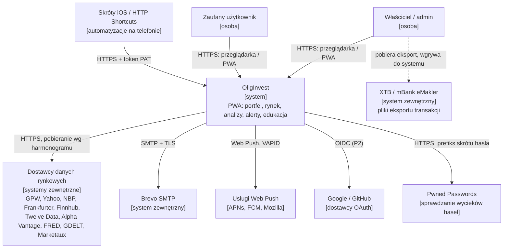
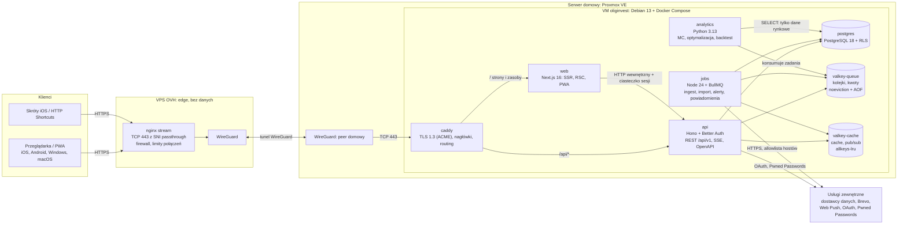
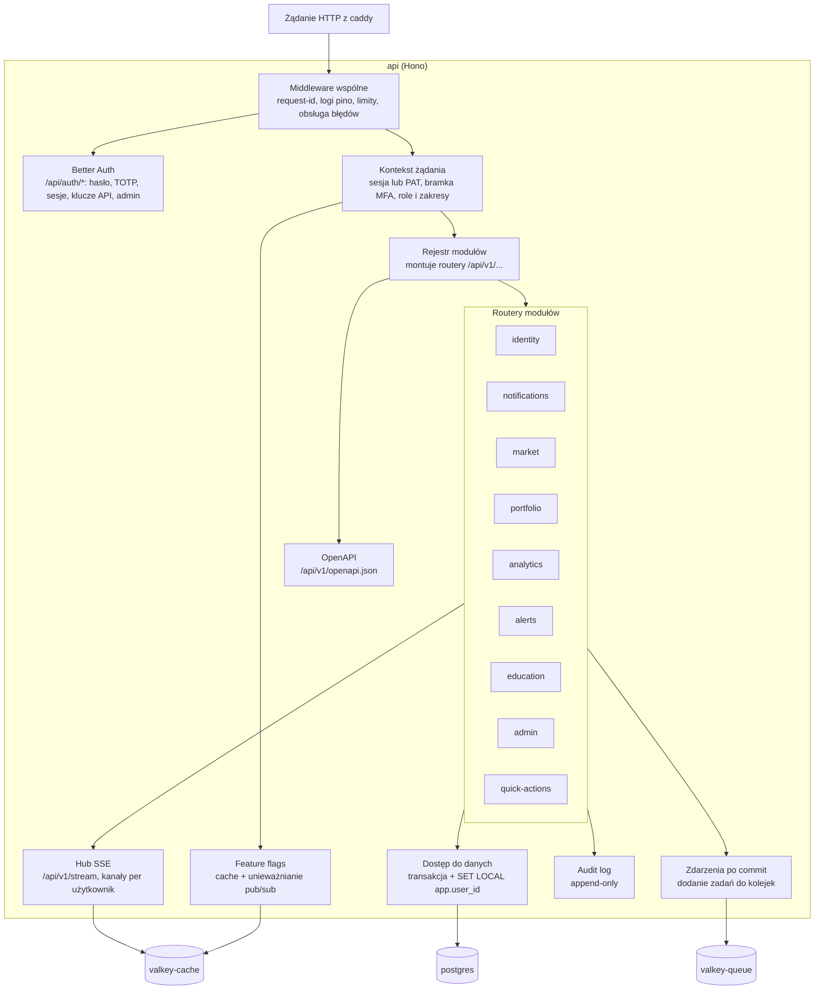
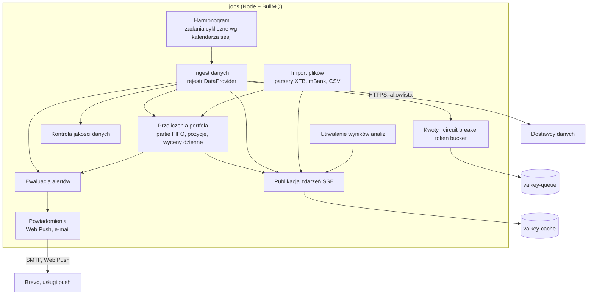
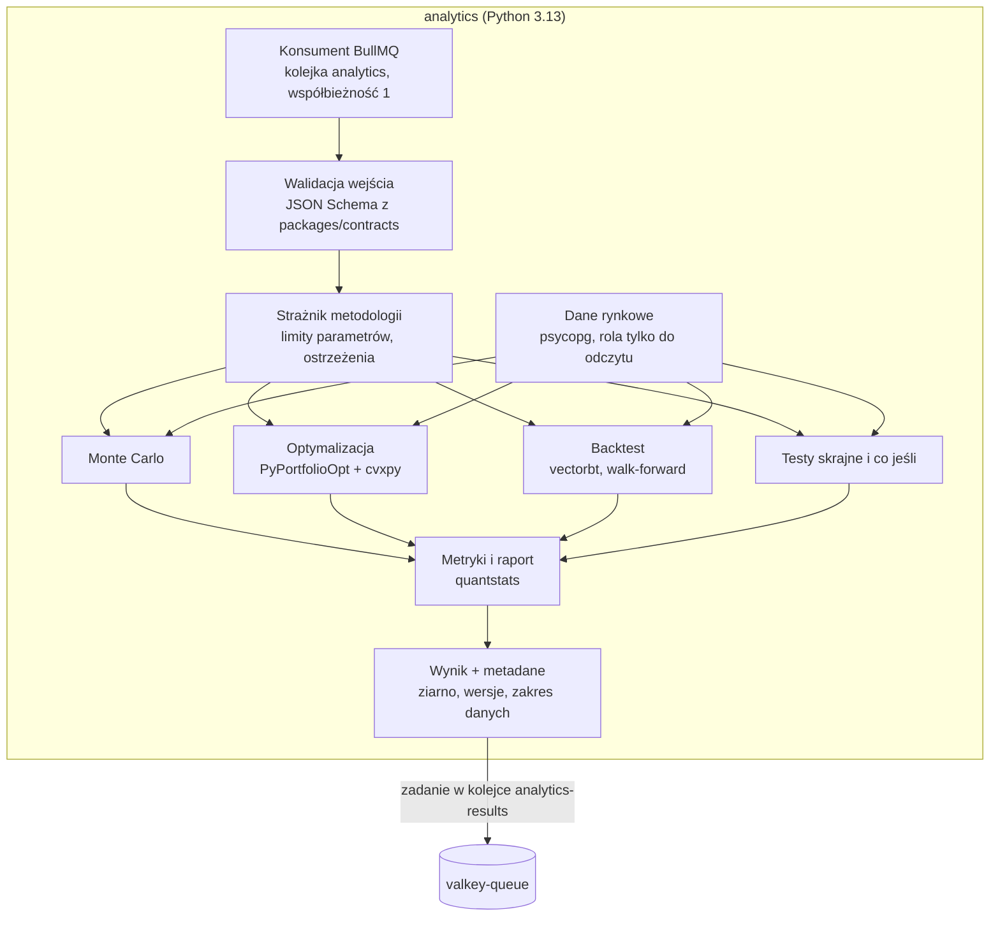

# Przegląd architektury

**Cel:** pokazać, z jakich części składa się OligInvest, jak się komunikują i dlaczego tak — na trzech poziomach modelu C4 (kontekst, kontenery, komponenty) — tak, aby deweloper wiedział, gdzie umieścić każdy nowy kawałek kodu.

Powiązane: [`stack-technologiczny.md`](stack-technologiczny.md), [`moduly.md`](moduly.md), [`przeplywy-danych.md`](przeplywy-danych.md), decyzje w [`../09-decyzje/`](../09-decyzje/).

## 1. Czynniki architektoniczne

| Czynnik | Źródło | Konsekwencja architektoniczna |
|---|---|---|
| Budżet 0 zł, jeden serwer domowy (i5-4590, 16 GB) współdzielony z Immich | NFR-05, NFR-01.08 | Monolit modułowy + 2 workery zamiast mikroserwisów; twarde limity zasobów kontenerów; brak usług płatnych. |
| Wydajność na telefonie (LCP < 2 s, JS < 200 KB) | NFR-01 | SSR/streaming w Next.js, leniwe ładowanie ciężkich bibliotek, żadnych zewnętrznych wywołań w ścieżce żądania. |
| Dane finansowe nie mogą wyciec przez błąd aplikacji | NFR-03.04 | RLS w PostgreSQL jako druga linia obrony; osobne role bazodanowe; izolowany worker analityczny. |
| Limity darmowych API (np. 25 zapytań/dobę) | §2.1, NFR-05.02 | Warstwa `DataProvider` z kwotami, cache i trwałą historią w bazie ([`../03-dane/strategia-cache.md`](../03-dane/strategia-cache.md)). |
| Modułowość: moduły dodawane/usuwane bez zmian w innych | NFR-02 | Pakiety modułów z kontraktami, rejestr modułów, flagi, zdarzenia ([`moduly.md`](moduly.md)). |
| Najlepsze biblioteki quant są w Pythonie; obliczenia portfela muszą być wspólne dla wszystkich platform | Decyzja Kroku 0, NFR-02.06 | `packages/core` (TS) jako jedyne źródło prawdy dla wyników portfela; Python tylko do ciężkich analiz ([ADR-003](../09-decyzje/ADR-003-hybryda-obliczen-i-kolejki.md)). |
| iPhone bez konta Apple Developer | Decyzja Kroku 0 | PWA + API szybkich akcji z tokenami dla Skrótów ([ADR-008](../09-decyzje/ADR-008-pwa-i-integracje-mobilne.md)). |
| Repozytorium publiczne | Decyzja Kroku 2 | Brak sekretów i danych infrastruktury w repo; bezpieczeństwo nie opiera się na ukryciu ([ADR-013](../09-decyzje/ADR-013-repozytorium-publiczne.md)). |

## 2. Styl architektoniczny

**Monolit modułowy w monorepo**: jedna aplikacja API (`api`) złożona z modułów o jawnych granicach, jeden frontend (`web`), dwa procesy robocze (`jobs` w Node, `analytics` w Pythonie) komunikujące się przez kolejki BullMQ. Uzasadnienie: przy ≤ 5 równoczesnych użytkownikach i jednym serwerze mikroserwisy dodałyby koszty operacyjne (sieć, obserwowalność, wdrożenia) bez żadnej korzyści; modułowość osiągamy granicami pakietów i kontraktów, a nie granicami procesów. Jedyny wyjątek to rozdzielenie runtime'ów (Node/Python) i oddzielenie ciężkiej pracy od ścieżki żądania.

## 3. C4 — poziom 1: kontekst systemu

Granice zaufania: przeglądarki i telefony użytkowników są niezaufane (walidacja wszystkiego po stronie serwera); dostawcy danych są niezaufani (sanityzacja i walidacja odpowiedzi); VPS jest traktowany jako niezaufany przekaźnik (nie widzi danych w postaci jawnej — [ADR-011](../09-decyzje/ADR-011-topologia-wdrozenia.md)).

## 4. C4 — poziom 2: kontenery

| Kontener | Technologia | Odpowiedzialność | Sieć / uprawnienia | Limit zasobów (startowy) |
|---|---|---|---|---|
| `caddy` | Caddy 2.11 | Terminacja TLS 1.3, certyfikaty ACME, nagłówki bezpieczeństwa (poza CSP z nonce — ustawia `web`), routing `/api/*` → `api`, reszta → `web`, kompresja | Jedyny kontener z portem wystawionym poza VM | 64 MB |
| `web` | Next.js 16 (Node 24) | Renderowanie UI (RSC + streaming), manifest i service worker PWA, CSP z nonce (`proxy.ts`); **bez dostępu do bazy** | Tylko sieć wewnętrzna; ruch wychodzący wyłącznie do `api` | 512 MB |
| `api` | Hono 4 + Better Auth | Jedyna granica domenowa: REST `/api/v1`, uwierzytelnianie, autoryzacja, RLS, SSE, OpenAPI | Postgres (rola `app` i `auth`), Valkey; wychodzący: OAuth, Pwned Passwords | 384 MB |
| `jobs` | Node 24 + BullMQ | Pobieranie danych (adaptery `DataProvider`), import plików, przeliczenia portfela, ewaluacja alertów, wysyłka powiadomień, utrwalanie wyników analiz | Postgres (rola `app`), Valkey; wychodzący: allowlista hostów dostawców, SMTP, Web Push | 384 MB |
| `analytics` | Python 3.13 | Monte Carlo, optymalizacja, backtest, testy skrajne; **bez internetu**, **bez danych użytkowników w bazie** | Postgres (rola `analytics_ro`: SELECT na tabelach rynkowych), `valkey-queue` | 1,5 GB, CPU ≤ 2 |
| `postgres` | PostgreSQL 18 | Dane trwałe, RLS, historia rynkowa | Tylko sieć wewnętrzna | 1 GB |
| `valkey-queue` | Valkey 9 | Kolejki BullMQ, liczniki kwot dostawców; `maxmemory-policy noeviction`, AOF co 1 s | Tylko sieć wewnętrzna | 128 MB |
| `valkey-cache` | Valkey 9 | Cache L2, strumienie SSE per użytkownik, pub/sub notowań i unieważniania flag; `allkeys-lru`, bez trwałości | Tylko sieć wewnętrzna | 128 MB |

Suma limitów ≈ 4,2 GB + system ≈ 0,8 GB → VM **6 GB RAM, 3 vCPU** (NFR-01.08). Procesy operacyjne w VM (agent CrowdSec, pgBackRest w kontenerze bazy, zadania restic, skrypty sygnałów życia) ≈ 0,3 GB — [`../07-wdrozenie/infrastruktura.md`](../07-wdrozenie/infrastruktura.md) § 4.

## 5. C4 — poziom 3: komponenty

### 5.1 `api`

Kluczowe zasady komponentów `api`:

- **Kontekst żądania** rozstrzyga tożsamość: sesja Better Auth (przeglądarka) albo PAT (`Authorization: Bearer`), następnie **bramka MFA** (sesja bez zweryfikowanego TOTP ma dostęp tylko do tras konfiguracji 2FA), role i zakresy.
- **Dostęp do danych** odbywa się wyłącznie przez helper transakcji, który ustawia `SET LOCAL app.user_id` i `SET LOCAL app.role`; zapytania „na skróty” poza transakcją są zabronione regułą lint i testem.
- **Better Auth** używa osobnej puli połączeń z rolą `auth` (dostęp tylko do tabel uwierzytelniania); rola `app` modułów domenowych nie ma dostępu do hashy haseł ani sekretów TOTP ([ADR-004](../09-decyzje/ADR-004-postgres-better-auth-rls.md)).
- **Zdarzenia** są dodawane do kolejek dopiero po zatwierdzeniu transakcji; obsługa jest idempotentna, a nocne przeliczenie działa jako siatka bezpieczeństwa ([ADR-003](../09-decyzje/ADR-003-hybryda-obliczen-i-kolejki.md)).

### 5.2 `jobs`

Wszystkie obliczenia finansowe (FIFO, wyceny, wskaźniki dla alertów) wywołują funkcje z `packages/core` — `jobs` nie ma własnych wzorów.

### 5.3 `analytics`

`analytics` nie zapisuje niczego w bazie: dane użytkownika (wagi, przepływy, parametry) przychodzą w treści zadania, a wynik wraca kolejką do `jobs`, który zapisuje go w kontekście RLS właściciela. Dzięki temu skompromitowana biblioteka Pythona nie ma skąd odczytać cudzych danych ani dokąd ich wysłać (NFR-03.13).

## 6. Zagadnienia przekrojowe

| Zagadnienie | Rozwiązanie | Szczegóły |
|---|---|---|
| Uwierzytelnianie i autoryzacja | Better Auth (hasło Argon2id + TOTP obowiązkowy), RBAC, zakresy PAT, RLS | [ADR-004](../09-decyzje/ADR-004-postgres-better-auth-rls.md), `06-bezpieczenstwo/` |
| Kontrakty | Zod w `packages/contracts` → OpenAPI (API) i JSON Schema (zadania dla Pythona) | [ADR-012](../09-decyzje/ADR-012-api-jako-granica-domenowa.md), `02-api/` |
| Pieniądze, waluty, czas | `decimal.js` / `NUMERIC`, waluta jawna, kurs NBP D-1 dla widoku podatkowego, UTC w bazie | [ADR-014](../09-decyzje/ADR-014-pieniadze-waluty-czas.md) |
| Dane rynkowe | `DataProvider` + kwoty + cache + trwała historia | [ADR-005](../09-decyzje/ADR-005-strategia-danych-rynkowych.md), `03-dane/strategia-cache.md` |
| Czas rzeczywisty (opóźniony) | SSE z kanałami per użytkownik | [ADR-007](../09-decyzje/ADR-007-sse-zamiast-websocket.md), `02-api/realtime.md` |
| Błędy | `application/problem+json` (RFC 9457) z kodem błędu domenowego | `02-api/konwencje-api.md` |
| Obserwowalność | Logi JSON (pino / structlog), identyfikator korelacji propagowany do zadań, metryki, health-checki | `07-wdrozenie/monitoring.md` |
| Konfiguracja | Zmienne środowiskowe walidowane schematem Zod przy starcie; sekrety poza repo | `packages/config`, `07-wdrozenie/` |
| Wydajność | SSR + streaming, leniwe moduły, decymacja po stronie serwera, brak zewnętrznych wywołań w ścieżce żądania | `04-frontend/wydajnosc.md` |
| Zgodność regulacyjna | Disclaimery i bloki założeń jako komponenty wspólne, testowane w e2e | [`../11-zgodnosc-prawna.md`](../11-zgodnosc-prawna.md) § 4 |

## 7. Scenariusze atrybutów jakości

| Atrybut | Scenariusz | Jak architektura to zapewnia |
|---|---|---|
| Wydajność | Użytkownik otwiera dashboard na iPhonie przez 4G | HTML renderowany na serwerze z danych w Valkey/Postgres; JS dashboardu bez bibliotek wykresów; brak wywołań zewnętrznych API w żądaniu. |
| Wydajność | Użytkownik przegląda 10 lat notowań | Jedno zapytanie po indeksie `(instrument_id, date)`, decymacja do ≤ 3 000 punktów, wykres canvas ładowany leniwie. |
| Dostępność danych | Yahoo blokuje IP serwera | Circuit breaker otwiera się, dane intraday oznaczone jako nieaktualne, wycena na ostatnich kursach, admin dostaje alert; EOD GPW nadal z archiwum GPW. |
| Bezpieczeństwo | Błąd w zapytaniu modułu pomija filtr `user_id` | RLS zwraca wyłącznie wiersze użytkownika z `app.user_id`; test izolacji wykrywa błąd w CI. |
| Bezpieczeństwo | Złośliwa aktualizacja biblioteki Pythona | `analytics` nie ma internetu ani dostępu do danych użytkowników; widzi tylko dane rynkowe. |
| Modułowość | Wyłączenie modułu `education` | Flaga ukrywa nawigację i zwraca 404; CI buduje aplikację bez modułu (NFR-02.02). |
| Obciążenie | Właściciel uruchamia symulację 10 000 ścieżek | Zadanie w kolejce z postępem przez SSE; współbieżność 1; limity CPU kontenera chronią Immich i `api`. |

## 8. Indeks decyzji

| ADR | Decyzja |
|---|---|
| [ADR-001](../09-decyzje/ADR-001-baza-projektu.md) | Budujemy własną aplikację; zapożyczamy projekty z Ghostfolio, OpenBB, Wealthfolio, rotki |
| [ADR-002](../09-decyzje/ADR-002-monorepo.md) | Monorepo Turborepo + pnpm; `apps/`, `modules/`, `packages/` |
| [ADR-003](../09-decyzje/ADR-003-hybryda-obliczen-i-kolejki.md) | `packages/core` (TS) + izolowany worker Python; BullMQ na dwóch instancjach Valkey |
| [ADR-004](../09-decyzje/ADR-004-postgres-better-auth-rls.md) | PostgreSQL 18 + Better Auth; RLS; Argon2id; bramka MFA; osobne role bazodanowe |
| [ADR-005](../09-decyzje/ADR-005-strategia-danych-rynkowych.md) | Archiwum GPW (EOD), Yahoo (intraday best effort), NBP (FX); bez płatnych źródeł |
| [ADR-006](../09-decyzje/ADR-006-panel-administratora.md) | Minimalny panel admina w aplikacji; moduły dokładają własne panele |
| [ADR-007](../09-decyzje/ADR-007-sse-zamiast-websocket.md) | SSE zamiast WebSocket |
| [ADR-008](../09-decyzje/ADR-008-pwa-i-integracje-mobilne.md) | PWA z własnym service workerem; Skróty iOS i HTTP Shortcuts przez API z PAT |
| [ADR-009](../09-decyzje/ADR-009-wykresy.md) | Lightweight Charts + uPlot; heatmapa w CSS |
| [ADR-010](../09-decyzje/ADR-010-kanaly-powiadomien.md) | Web Push + e-mail (Brevo SMTP) |
| [ADR-011](../09-decyzje/ADR-011-topologia-wdrozenia.md) | VM na Proxmoxie; VPS jako przekaźnik TLS passthrough |
| [ADR-012](../09-decyzje/ADR-012-api-jako-granica-domenowa.md) | `api` jako jedyna granica domenowa; `web` bez dostępu do bazy |
| [ADR-013](../09-decyzje/ADR-013-repozytorium-publiczne.md) | Publiczne repozytorium: higiena, CI, skanowanie |
| [ADR-014](../09-decyzje/ADR-014-pieniadze-waluty-czas.md) | Reprezentacja pieniędzy, walut i czasu |
