# Przepływy danych — kluczowe scenariusze

**Cel:** pokazać krok po kroku, jak dane przepływają przez kontenery i moduły w najważniejszych scenariuszach (logowanie, import, wycena, batch EOD, wyniki, alerty, analizy, Skróty, administracja, RODO), wraz z obsługą błędów — jako wzorzec dla implementacji i testów e2e.

Oznaczenia uczestników: `web` (Next.js), `api` (Hono), `jobs` (Node + BullMQ), `analytics` (Python), `PG` (PostgreSQL z RLS), `VQ` (valkey-queue), `VC` (valkey-cache). Kontrakty endpointów: `docs/02-api/openapi.yaml`; zdarzeń SSE: `docs/02-api/realtime.md` (Krok 4).

## 1. Logowanie z obowiązkowym TOTP (FR-07.02, FR-07.04)

Warunek wstępny: konto utworzone z zaproszenia (FR-07.01).

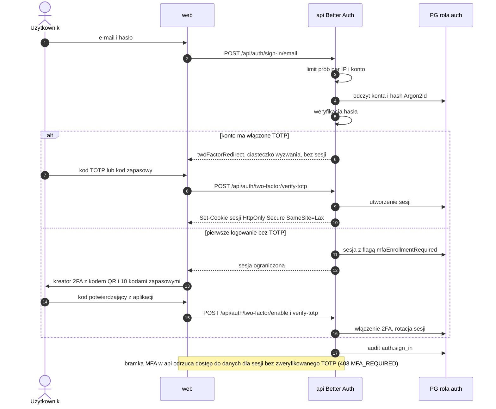

Błędy: złe hasło → 401 bez ujawnienia, czy konto istnieje; przekroczony limit → 429 z `Retry-After`; seria nieudanych prób → blokada czasowa konta i zdarzenie bezpieczeństwa (NFR-03.10).

## 2. Import transakcji z XTB (FR-03.01, NFR-08.03)

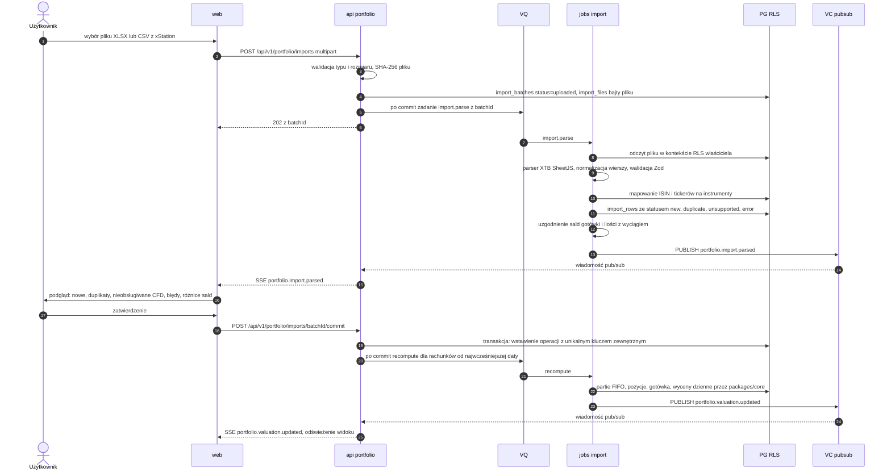

Idempotencja: klucz `(account_id, source, external_id)` lub skrót wiersza, gdy broker nie podaje identyfikatora; ponowny import tego samego pliku → wszystkie wiersze `duplicate`. Retencja surowego pliku: 90 dni (do ponownego parsowania po poprawkach parsera), potem usunięcie (NFR-11.02).

## 3. Wycena „na żywo” przez SSE (FR-02.03, FR-02.09)

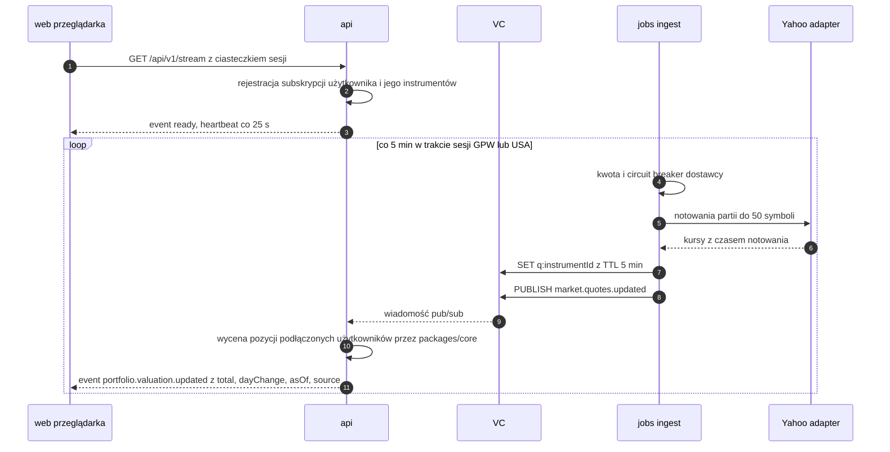

Błędy: dostawca niedostępny → breaker `OPEN`, `api` wysyła wycenę na ostatnich kursach z `stale=true`; zerwane połączenie SSE → przeglądarka wznawia z `Last-Event-ID`; brak sesji → strumień zamykany z kodem `401`.

## 4. Nocny batch EOD GPW i przeliczenie wycen (ADR-005)

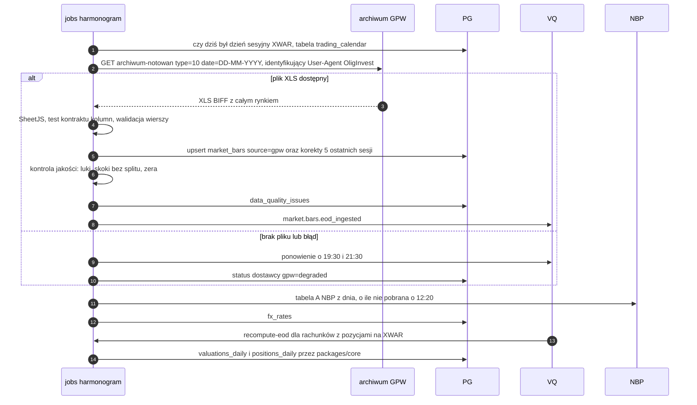

Po 2 kolejnych dniach bez danych GPW admin dostaje alert, a UI pokazuje ostrzeżenie o nieaktualnych danych EOD.

## 5. Wyniki historyczne TWR i XIRR (FR-03.06, FR-03.07)

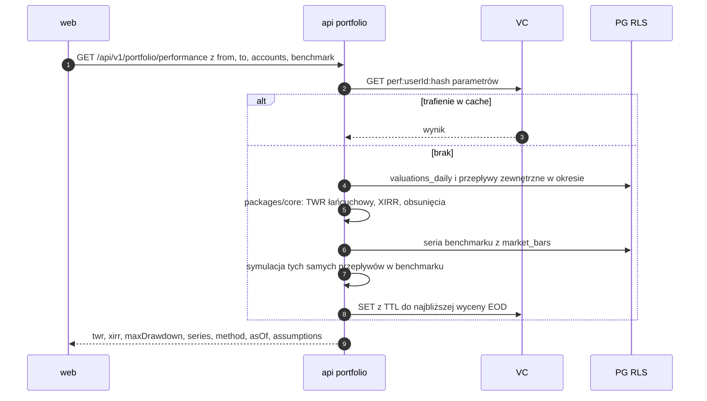

Klucz cache zawiera `userId` (NFR-03.05); unieważnienie następuje po `portfolio.transactions.changed` i po nocnym przeliczeniu.

## 6. Alert cenowy → Web Push lub e-mail (FR-05.01, FR-05.06)

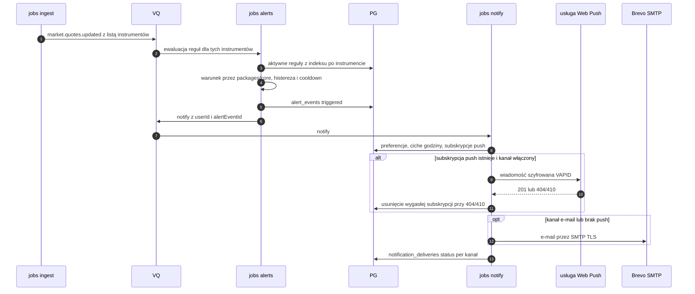

Treść alertu zawiera wartość, próg, czas i źródło danych oraz link głęboki; nie zawiera języka rekomendacji (FR-05.07).

## 7. Symulacja Monte Carlo w workerze Python (FR-04.02, NFR-03.13)

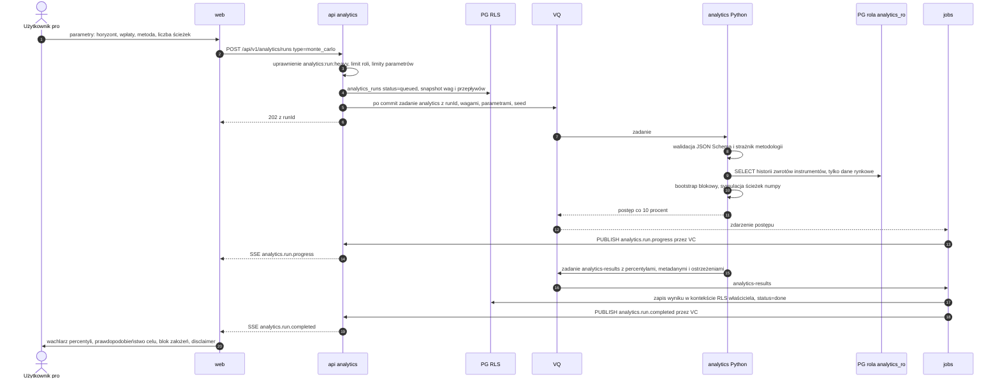

Błędy: przekroczony limit czasu → `failed` z przyczyną; parametry poza limitami → `422` przed kolejkowaniem; wynik zawsze z ziarnem i wersjami (NFR-08.05).

## 8. Skrót iOS „Ile dziś zarobiłem” (FR-09.04, FR-09.05)

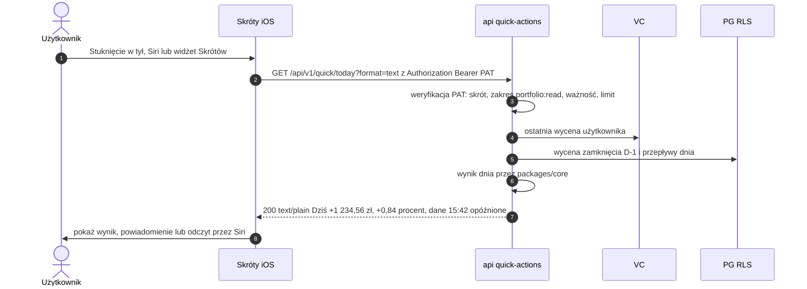

## 9. Skrót „Dodaj transakcję” (FR-09.04, FR-07.07)

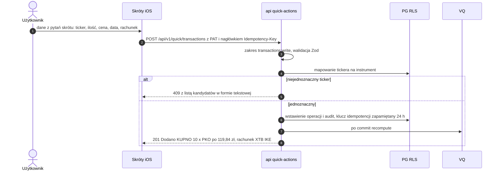

Powtórzenie żądania z tym samym `Idempotency-Key` zwraca pierwotną odpowiedź bez ponownego zapisu.

## 10. Zmiana flagi funkcji przez admina (FR-08.04, FR-08.10)

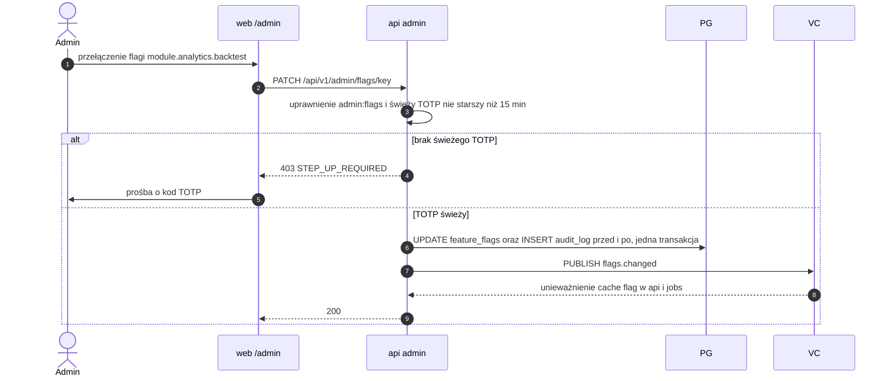

## 11. Eksport danych użytkownika — RODO (FR-07.09)

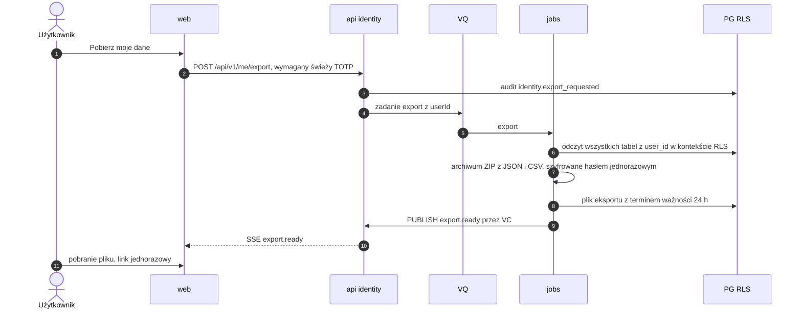

Lista tabel eksportu jest generowana z metadanych schematu (każda tabela z kolumną `user_id`), a test porównuje ją z bazą — nowa tabela nie może „zniknąć” z eksportu (FR-07.09).
