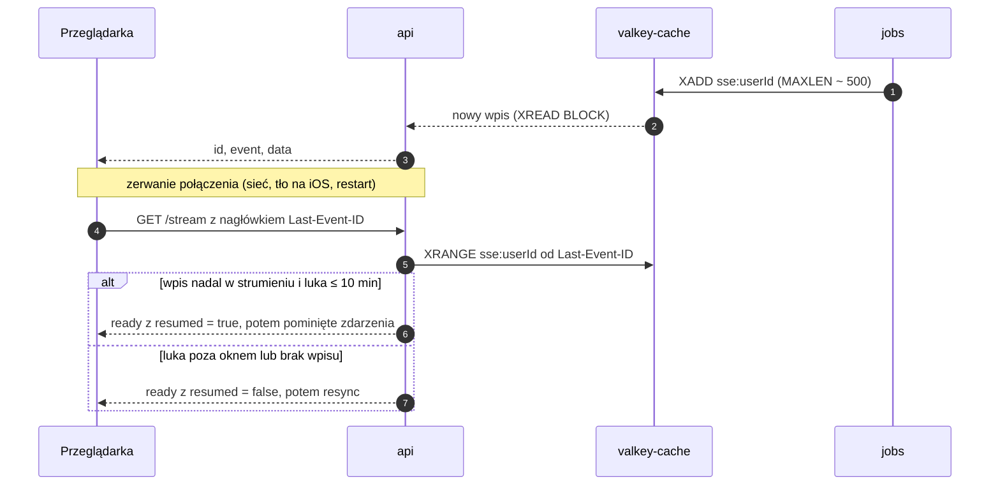

# Realtime — kontrakt strumienia SSE

**Cel:** zdefiniować, jak przeglądarka otrzymuje zmiany (wyceny, notowania, alerty, postęp analiz) przez Server-Sent Events: format ramek, katalog zdarzeń, wznawianie po zerwaniu, limity, zachowanie klienta i tryb awaryjny z odpytywaniem — tak, by `api`, `jobs` i `web` implementowały ten sam kontrakt.

Powiązane: [ADR-007](../09-decyzje/ADR-007-sse-zamiast-websocket.md), [`openapi.yaml`](openapi.yaml) (`GET /stream`, `PUT /stream/connections/{connectionId}/instruments`), [`konwencje-api.md`](konwencje-api.md), [`../01-architektura/moduly.md`](../01-architektura/moduly.md) § 5.3, [`../01-architektura/przeplywy-danych.md`](../01-architektura/przeplywy-danych.md).

## 1. Zasady

1. **SSE to kanał podpowiedzi, nie źródło prawdy.** Zdarzenia niosą identyfikatory i minimalne dane; stan pobiera się przez REST (z `ETag`). Utrata zdarzenia kończy się najwyżej chwilowo nieaktualnym ekranem, nigdy błędnymi danymi.
2. **Jeden strumień na kartę przeglądarki**, wyłącznie dla zalogowanej sesji z 2FA (ciasteczko sesji; PAT nie jest akceptowany).
3. **Izolacja użytkowników:** kanał ma w kluczu `userId`; serwer nie wysyła danych innych użytkowników. Notowania są danymi rynkowymi (nie osobowymi), ale i tak tylko dla instrumentów z pozycji, watchlist lub otwartych ekranów użytkownika.
4. **Dostarczanie „co najmniej raz”:** klient toleruje duplikaty (zdarzenia są idempotentne — powodują ponowne pobranie).

## 2. Połączenie

| Element | Wartość |
|---|---|
| Adres | `GET /api/v1/stream` (`Accept: text/event-stream`) |
| Uwierzytelnianie | ciasteczko sesji Better Auth; bramka MFA jak dla REST (`403 MFA_ENROLLMENT_REQUIRED`) |
| Nagłówki odpowiedzi | `Content-Type: text/event-stream; charset=utf-8`, `Cache-Control: no-store`, `X-Accel-Buffering: no` |
| Heartbeat | zdarzenie `ping` co **25 s** (bez `id`) |
| Maks. czas życia | **60 min** — serwer zamyka strumień, klient łączy się ponownie z `Last-Event-ID` (ponowna weryfikacja sesji i rozkład obciążenia) |
| Limit | **5 równoczesnych strumieni na użytkownika**; szósty → `429 RATE_LIMITED` z `Retry-After` |
| `retry` | pierwsza ramka ustawia `retry: 5000` (ms) |
| Transport | HTTP/2 przez Caddy (TLS w HomeLabie) — wiele strumieni w jednym połączeniu TCP, brak limitu 6 połączeń HTTP/1.1 na origin |
| Proxy | Caddy: `reverse_proxy` z `flush_interval -1` i wyłączoną kompresją dla `text/event-stream` (jawnie, choć Caddy domyślnie opróżnia bufor dla SSE); VPS przekazuje TCP bez terminacji TLS (ADR-011) |
| Implementacja | `streamSSE` z `hono/streaming` w `api`; kanał użytkownika w `valkey-cache` |

**Unieważnienie sesji:** `api` sprawdza ważność sesji każdego otwartego strumienia co ≤ 30 s (oraz natychmiast po komunikacie pub/sub o odwołaniu) i przed zamknięciem wysyła `auth.session.revoked` — spełnia FR-07.05 i FR-08.02 (≤ 60 s).

## 3. Format ramki

Każde zdarzenie domenowe ma `id` (identyfikator wpisu strumienia Valkey, rosnący per użytkownik), nazwę `event` i jednoliniowy JSON w `data` z polem wersji `v`. Przykład ciągu ramek:

```text
retry: 5000
id: 1758202927000-0
event: ready
data: {"v":1,"connectionId":"0192f0c4-7b1e-7c3a-9f00-3d2a1b4c5d6e","heartbeatSeconds":25,"resumed":false}

id: 1758203012000-0
event: portfolio.valuation.updated
data: {"v":1,"accountIds":["0192f0c4-7b1e-7c3a-9f00-3d2a1b4c5d70"],"valuationAsOf":"2026-09-18T13:42:00Z","reason":"quotes"}

event: ping
data: {"ts":"2026-09-18T13:42:25Z"}
```

Schematy `data` są zdefiniowane w `packages/contracts` (Zod, eksport JSON Schema) i objęte testami kontraktowymi. Zmiana niezgodna = nowa wartość `v`; klient obsługuje bieżącą i poprzednią wersję (`moduly.md` § 9).

## 4. Katalog zdarzeń

| Zdarzenie | Źródło | Kiedy | `data` (poza `v`) | Reakcja klienta |
|---|---|---|---|---|
| `ready` | api | po zestawieniu połączenia | `connectionId`, `heartbeatSeconds`, `resumed` | zapamiętuje `connectionId`; przy `resumed = false` po zerwaniu — odświeża aktywne zapytania |
| `ping` | api | co 25 s | `ts` | resetuje licznik czuwania (§ 6) |
| `portfolio.valuation.updated` | jobs lub api | (a) `jobs`: zapisana wycena po EOD, FX, zmianie operacji, imporcie; (b) `api`: bieżąca wycena podłączonego użytkownika po nowych notowaniach (liczona `packages/core`, niezapisywana) | `accountIds[]`, `valuationAsOf`, `reason` (`quotes`, `eod`, `fx`, `transactions`, `import`, `recompute`); dla `quotes` także `summary`: `totalValue`, `dayChange` (`Money`), `dayChangeRatio`, `source` | `quotes` → aktualizuje podsumowanie bez pobierania; pozostałe → unieważnia zapytania portfela dla wskazanych rachunków |
| `portfolio.import.parsed` | jobs | koniec parsowania importu | `importId`, `status`, `counts` (liczby wierszy wg statusu) | odświeża ekran podglądu importu; powiadomienie w aplikacji |
| `market.quotes.updated` | jobs | nowe notowania opóźnione | `quotes[]`: `instrumentId`, `price` (ciąg), `changeRatio`, `asOf`, `delayMinutes`, `stale` | aktualizuje kursy w pamięci podręcznej zapytań bez ponownego pobierania |
| `alerts.alert.triggered` | jobs | wyzwolenie reguły | `eventId`, `ruleId`, `instrumentId?`, `message`, `triggeredAt` | toast w aplikacji (push i e-mail idą osobno — `notifications`) |
| `analytics.run.progress` | jobs | postęp analizy (co ≥ 2 s lub co 10 %) | `runId`, `progress` (0–100), `stage` | pasek postępu |
| `analytics.run.completed` | jobs | analiza zakończona | `runId`, `type` | pobiera `GET /analytics/runs/{runId}` |
| `analytics.run.failed` | jobs | błąd, limit czasu, anulowanie | `runId`, `errorCode` | komunikat z kodem; bez ponawiania automatycznego |
| `identity.export.ready` | jobs | archiwum RODO gotowe | `exportId` | przycisk „Pobierz” (step-up przy pobraniu) |
| `flags.changed` | api | zmiana flagi przez admina | `keys[]` | pobiera `GET /me`, przebudowuje nawigację; ekran wyłączonego modułu → komunikat i powrót |
| `auth.session.revoked` | api | wylogowanie zdalne, zmiana roli, reset 2FA | `reason` (`revoked`, `role_changed`, `mfa_reset`, `password_reset`) | czyści pamięć zapytań, przechodzi do logowania |
| `resync` | api | luka większa niż okno odtwarzania (§ 5) | `reason` (`gap`, `server_restart`) | unieważnia wszystkie zapytania |

**Ograniczenia ilościowe:** `market.quotes.updated` jest łączone — maks. 1 zdarzenie na 5 s na połączenie i maks. 200 notowań w zdarzeniu. Zdarzenia portfela są deduplikowane w oknie 2 s (kilka wycen z rzędu → jedno zdarzenie). Cel opóźnienia od zapisu w bazie do ramki: **< 2 s** (NFR-01.06).

**Zbiór instrumentów połączenia:** serwer śledzi instrumenty z pozycji i watchlist użytkownika. Karta instrumentu spoza tego zbioru dopisuje go wywołaniem `PUT /stream/connections/{connectionId}/instruments` (maks. 50, zbiór zastępowany w całości, ważny do końca połączenia).

## 5. Wznawianie i odtwarzanie



- **Zdarzenia trwałe (z `id`)** — `portfolio.import.parsed`, `portfolio.valuation.updated` z `jobs`, `alerts.alert.triggered`, `analytics.run.*`, `identity.export.ready` — trafiają do strumienia Valkey `sse:{userId}` w instancji `valkey-cache` (limit ok. 500 wpisów, wpisy starsze niż 10 min usuwane przez `XTRIM MINID`). Ta instancja może wypierać klucze (LRU) — utrata strumienia oznacza `resync`, nie błąd.
- **Zdarzenia ulotne (bez `id`, nieodtwarzane)** — `ready`, `ping`, `resync`, `market.quotes.updated` (globalny kanał pub/sub `sse:quotes`, filtrowany per połączenie), `portfolio.valuation.updated` z `reason = quotes` (liczone w `api` per połączenie), `flags.changed` (pub/sub) i `auth.session.revoked`. Po ponownym połączeniu klient i tak pobiera aktualny stan, więc ich odtwarzanie jest zbędne.
- Zdarzenia bez `id` nie przesuwają `Last-Event-ID`.
- Po restarcie `api` klienci łączą się ponownie; odtwarzanie działa, bo strumienie są w Valkey, nie w pamięci procesu.

## 6. Zachowanie klienta (`web`)

1. **Jedno `EventSource` na kartę**, tworzone po zalogowaniu i przejściu bramki MFA; zamykane przy wylogowaniu.
2. **Czuwanie:** brak jakiejkolwiek ramki przez 60 s → klient zamyka połączenie i łączy się ponownie (wykrywa połączenia „półotwarte”, których przeglądarka sama nie zamyka).
3. **Karta w tle:** po 5 min ukrycia (`visibilitychange`) klient zamyka strumień; po powrocie łączy się z `Last-Event-ID` i odświeża zapytania starsze niż 60 s. W zainstalowanej PWA na iOS system i tak wstrzymuje stronę w tle — powrót zawsze przechodzi tę ścieżkę.
4. **Ponawianie:** przy błędach sieci — mechanizm `EventSource` z `retry: 5000`; przy `401` — przejście do logowania; przy `403 MFA_*` — ekran 2FA; przy `429` — tryb odpytywania (§ 7) i ponowna próba SSE po `Retry-After`.
5. **Aktualizacja danych:** zdarzenia wywołują unieważnienie zapytań TanStack Query (`invalidateQueries`) lub bezpośrednią aktualizację kursów (`setQueryData` dla `market.quotes.updated`). Żadnej logiki biznesowej w obsłudze zdarzeń.
6. **Wiele kart:** każda karta ma własny strumień (limit 5 wystarcza przy typowym użyciu). Współdzielenie jednego strumienia przez `BroadcastChannel` z wyborem lidera jest opcją na później, jeśli pomiary pokażą potrzebę.

## 7. Tryb awaryjny — odpytywanie

Włączany, gdy: przeglądarka nie obsługuje `EventSource`, serwer zwrócił `429`, albo 3 kolejne próby połączenia zawiodły w ciągu 2 min.

| Dane | Zapytanie | Interwał |
|---|---|---|
| Podsumowanie portfela i wynik dnia | `GET /portfolio/summary`, `GET /portfolio/day-change` (z `If-None-Match`) | 60 s w trakcie sesji giełdowej, 15 min poza nią |
| Kursy na ekranie | `GET /market/quotes?instrumentId=…` | 60 s |
| Status analizy w toku | `GET /analytics/runs/{runId}` | 5 s (minimum z `konwencje-api.md` § 9) |
| Status importu | `GET /portfolio/imports/{importId}` | 5 s do zakończenia parsowania |
| Flagi i sesja | `GET /me` | 5 min |

UI pokazuje dyskretny wskaźnik „aktualizacje co minutę” zamiast „na żywo”; co 5 min klient próbuje wrócić do SSE.

## 8. Bezpieczeństwo

- Brak CORS i brak PAT dla `/stream`; CSP `connect-src 'self'`.
- Ciasteczko `SameSite=Lax` + ten sam origin; `GET /stream` nie zmienia stanu, więc nie wymaga ochrony CSRF. `PUT /stream/connections/{connectionId}/instruments` sprawdza `Origin` jak każda metoda modyfikująca, a `connectionId` musi należeć do sesji wywołującego.
- `message` w `alerts.alert.triggered` jest generowany z szablonu po stronie serwera (bez treści użytkownika) — brak ryzyka wstrzyknięcia HTML; klient i tak renderuje go jako tekst.
- Strumień zawiera wyłącznie identyfikatory, znaczniki czasu, notowania rynkowe i sumy bieżącej wyceny **własnego** portfela (`summary` przy `reason = quotes`) — bez list pozycji i operacji.
- Limity połączeń i czas życia chronią `api` przed wyczerpaniem zasobów; próby otwarcia ponad limit trafiają do logów bezpieczeństwa (NFR-03.10).

## 9. Testy

| Test | Poziom | Kryterium |
|---|---|---|
| Schematy `data` każdego zdarzenia | kontraktowy (Vitest) | walidacja Zod dla przykładów z tego dokumentu |
| Opóźnienie zapis → ramka | integracyjny | p95 < 2 s (NFR-01.06) |
| Wznawianie z `Last-Event-ID` | integracyjny | pominięte zdarzenia odtworzone w kolejności; luka > 10 min → `resync` |
| Limit strumieni | integracyjny | szósty strumień → `429` z `Retry-After` |
| Odwołanie sesji | integracyjny | `auth.session.revoked` i zamknięcie w ≤ 60 s |
| Izolacja | integracyjny | użytkownik B nie otrzymuje zdarzeń użytkownika A (także po zgadnięciu `connectionId`) |
| Tryb odpytywania | e2e (Playwright) | przy zablokowanym `/stream` dashboard aktualizuje się co 60 s |
| Karta w tle (iOS) | ręczny na iPhonie | po powrocie do PWA dane odświeżone w ≤ 3 s |
