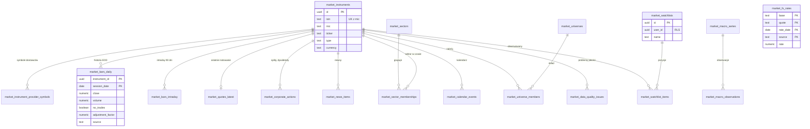
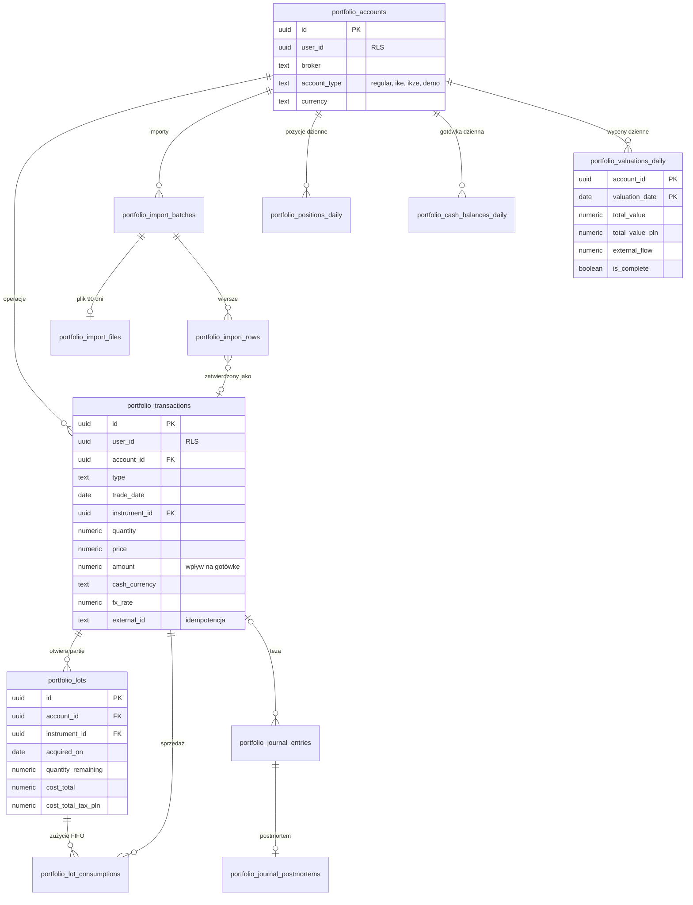
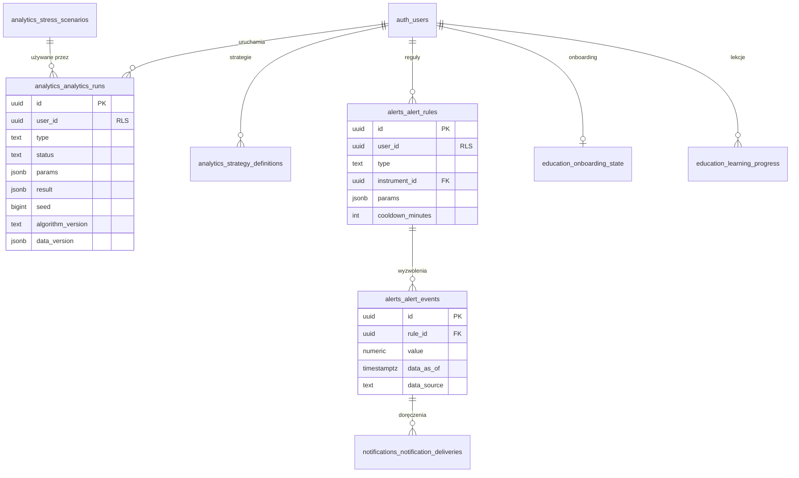

# Model danych

**Cel:** pokazać strukturę danych OligInvest — schematy per moduł, encje i relacje (ERD), własność danych, izolację RLS, dane pochodne i retencję — jako przewodnik po [`schema.sql`](schema.sql), który jest normatywną definicją DDL.

Powiązane: [`schema.sql`](schema.sql) (DDL, role, RLS — zweryfikowane na PostgreSQL 18.4), [`testy-rls.sql`](testy-rls.sql) (scenariusze izolacji), [`obliczenia-finansowe.md`](obliczenia-finansowe.md), [ADR-004](../09-decyzje/ADR-004-postgres-better-auth-rls.md), [ADR-014](../09-decyzje/ADR-014-pieniadze-waluty-czas.md).

## 1. Zasady

1. **Schemat PostgreSQL per moduł** (`auth`, `identity`, `platform`, `notifications`, `market`, `portfolio`, `analytics`, `alerts`, `education`) — granica modułu widoczna w bazie; usunięcie modułu funkcjonalnego = migracja usuwająca jego schemat (po eksporcie danych).
2. **Źródło prawdy vs dane pochodne.** Operacje (`portfolio.transactions`) i historia rynkowa (`market.bars_daily`, `market.fx_rates`) są źródłem prawdy. Partie, pozycje, gotówka i wyceny dzienne są **pochodne** — odtwarzalne w całości zadaniem `recompute` (nigdy nie edytowane ręcznie).
3. **Każda tabela z danymi użytkownika** ma kolumnę `user_id`, politykę RLS `owner_all` i `FORCE ROW LEVEL SECURITY`; relacje między tabelami użytkownika to **złożone klucze obce `(id, user_id)`** — nawet błędny kod nie połączy danych dwóch użytkowników (zweryfikowane testem).
4. **Identyfikatory:** UUIDv7 (`uuidv7()`), kwoty `NUMERIC` + waluta `CHAR(3)`, czas `timestamptz` w UTC, daty sesyjne `date` (ADR-014).
5. **Typy wyliczeniowe** jako `text` + `CHECK` (łatwiejsza ewolucja niż `ENUM`).
6. **Role bazodanowe:** `oliginvest_owner` (migracje, funkcje DEFINER), `oliginvest_auth` (Better Auth, tylko `auth.*`), `oliginvest_app` (moduły; RLS), `oliginvest_analytics_ro` (tylko dane rynkowe), `oliginvest_backup` (kopie, `BYPASSRLS`).

## 2. Mapa schematów

| Schemat | Moduł | Najważniejsze tabele | RLS |
|---|---|---|---|
| `auth` | identity (Better Auth) | `users`, `sessions`, `accounts`, `verifications`, `two_factors`, `api_keys`, `rate_limits` | brak (dostęp wyłącznie rola `oliginvest_auth`) |
| `identity` | identity | `invitations`, `user_preferences`, `deletion_requests`, `data_exports`, `consent_events`, widok `user_directory` | tak (zaproszenia: tylko admin + funkcje DEFINER; zgody: append-only) |
| `platform` | jądro | `feature_flags`, `role_limits`, `audit_log`, `idempotency_keys`, `web_vitals`, `erasure_log` | konfiguracja: zapis admin/system; audyt: append-only; `erasure_log`: tylko system |
| `notifications` | notifications | `push_subscriptions`, `notification_preferences`, `notification_deliveries` | tak |
| `market` | market | `instruments`, `instrument_provider_symbols`, `bars_daily`, `bars_intraday`, `quotes_latest`, `fx_rates`, `corporate_actions`, `trading_calendar`, `sectors`, `sector_memberships`, `universes`, `universe_members`, `calendar_events`, `news_items`, `macro_series`, `macro_observations`, `fundamentals_snapshots`, `data_quality_issues` + dane użytkownika: `watchlists`, `watchlist_items`, `screener_presets` | tylko tabele użytkownika |
| `portfolio` | portfolio | `accounts`, `transactions`, `import_*`, `instrument_overrides`, pochodne: `lots`, `lot_consumptions`, `positions_daily`, `cash_balances_daily`, `valuations_daily`; `journal_entries`, `journal_postmortems`, `target_allocations` | tak (wszystkie) |
| `analytics` | analytics | `analytics_runs`, `strategy_definitions`, `stress_scenarios` (globalne) | tak (scenariusze: zapis admin) |
| `alerts` | alerts | `alert_rules`, `alert_events` | tak |
| `education` | education | `onboarding_state`, `learning_progress` | tak |

Mapowanie Better Auth → tabele: model `user` → `auth.users`, `session` → `auth.sessions`, `account` → `auth.accounts`, `verification` → `auth.verifications`, `twoFactor` → `auth.two_factors`, `apikey` → `auth.api_keys`, `rateLimit` → `auth.rate_limits`; pola camelCase → kolumny snake_case (definicje tabel w Drizzle przekazywane do adaptera). Kanoniczny schemat generuje `npx @better-auth/cli generate` (M1); test CI porównuje go z `schema.sql`.

## 3. Diagramy ERD

### 3.1 Tożsamość, platforma, powiadomienia

```mermaid
erDiagram
  auth_users ||--o{ auth_sessions : "ma"
  auth_users ||--o{ auth_accounts : "logowania"
  auth_users ||--o| auth_two_factors : "TOTP"
  auth_users ||--o{ auth_api_keys : "tokeny PAT"
  auth_users ||--o| identity_user_preferences : "preferencje"
  auth_users ||--o{ identity_invitations : "wystawia"
  auth_users ||--o{ identity_data_exports : "eksporty RODO"
  auth_users ||--o{ identity_consent_events : "zgody"
  auth_users ||--o{ notifications_push_subscriptions : "urządzenia"
  auth_users ||--o{ notifications_notification_deliveries : "doręczenia"
  auth_users ||--o{ platform_idempotency_keys : "klucze"
  auth_users {
    uuid id PK
    text email UK
    text role "user, pro, admin"
    boolean two_factor_enabled
    boolean banned
  }
  auth_sessions {
    uuid id PK
    uuid user_id FK
    text token UK
    timestamptz expires_at
    timestamptz mfa_verified_at "step-up"
  }
  auth_api_keys {
    uuid id PK
    uuid reference_id FK
    text key "SHA-256"
    text permissions "zakresy"
    timestamptz expires_at
  }
  identity_consent_events {
    uuid id PK
    uuid user_id FK
    text document "terms, privacy_notice, diagnostics"
    text version
    text action "accepted, acknowledged, granted, withdrawn"
    timestamptz recorded_at
  }
  identity_invitations {
    uuid id PK
    text token_hash UK
    text role
    timestamptz expires_at
    timestamptz used_at
  }
  platform_audit_log {
    uuid id PK
    uuid actor_user_id
    text actor_ref "pseudonim"
    text action
    jsonb before
    jsonb after
  }
  platform_feature_flags {
    text key PK
    boolean enabled
    jsonb rules
  }
```

### 3.2 Dane rynkowe

### 3.3 Portfel

### 3.4 Analizy, alerty, edukacja

## 4. Cykl życia i retencja danych

| Dane | Retencja | Mechanizm | Uwagi |
|---|---|---|---|
| Operacje, rachunki, dziennik, alokacje | do usunięcia konta | — | eksport RODO (FR-07.09) |
| Dane pochodne portfela | odtwarzalne | zadanie `recompute` | w kopii fizycznej razem z resztą bazy (pgBackRest nie wyklucza tabel); po odtworzeniu i tak przeliczane nocą |
| Pliki importu (`import_files`) | 90 dni | zadanie czyszczące (codziennie) | NFR-11.02 |
| Wiersze importu (`import_rows`) | 1 rok po zatwierdzeniu | zadanie czyszczące | audyt importu |
| `bars_intraday` | 90 dni | zadanie czyszczące | EOD trwałe |
| `news_items` | 90 dni | zadanie czyszczące | |
| `notification_deliveries` | 180 dni | zadanie czyszczące | |
| `idempotency_keys` | 24 h | zadanie czyszczące | |
| `web_vitals` | 90 dni | zadanie czyszczące | bez danych osobowych |
| `audit_log` | 2 lata ([`../06-bezpieczenstwo/prywatnosc-rodo.md`](../06-bezpieczenstwo/prywatnosc-rodo.md) § 6) | partycjonowanie miesięczne przy wzroście > 1 mln wierszy | pseudonim `actor_ref` po usunięciu konta (Z-21) |
| Eksporty RODO (`data_exports`) | 24 h lub do pierwszego pobrania | zadanie czyszczące | pobranie wymaga sesji z 2FA i step-up |
| Konto usunięte | 14 dni karencji, potem kasowanie kaskadowe | `deletion_requests` | audyt zostaje z pseudonimem; UUID trafia do `erasure_log` |
| Zgody i akceptacje (`consent_events`) | do usunięcia konta | kasowanie kaskadowe | append-only — dowód akceptacji i zgody (art. 7 ust. 1 RODO) |
| `erasure_log` | 40 dni (dłużej niż najdłuższa retencja kopii — 35 dni) | zadanie czyszczące po `purge_after` | ponowne usunięcie kont po odtworzeniu kopii ([`../07-wdrozenie/backup-dr.md`](../07-wdrozenie/backup-dr.md) § 7) |

## 5. Migracje i ewolucja schematu

- **Drizzle** (`packages/db`): definicje tabel w modułach (`modules/*/db/schema.ts`), polityki RLS i funkcje w plikach SQL (`db/rls.sql`) dołączanych do migracji; `drizzle-kit generate` + ręczny przegląd każdej migracji.
- **Zasada expand/contract** (NFR-09.05): najpierw dodaj (kolumna nullable, nowa tabela), wdroż kod, potem usuń stare — wdrożenia bez przestoju i z możliwością wycofania.
- **Każda nowa tabela z `user_id`** w tej samej migracji: polityka RLS, `FORCE ROW LEVEL SECURITY`, złożony klucz obcy do tabeli rodzica, scenariusz w `testy-rls.sql`. Test CI wykrywa tabelę z `user_id` bez polityki.
- **Funkcje `SECURITY DEFINER`** działają jako `oliginvest_owner` — przy `FORCE ROW LEVEL SECURITY` wymagają jawnej polityki dla właściciela (patrz `identity.invitations`); każda taka funkcja ma `SET search_path` i odebrane `EXECUTE` od `PUBLIC`.
- **Migracje danych** (backfill) na tabelach z FORCE RLS: wykonywane w kontekście właściwego użytkownika (`SET LOCAL app.user_id`) lub zadaniem aplikacyjnym — nigdy przez wyłączenie RLS na produkcji.
- **Test spójności:** CI stawia PostgreSQL 18, stosuje migracje Drizzle i porównuje wynik z `schema.sql` (np. przez `pg_dump --schema-only` obu wersji), następnie uruchamia `testy-rls.sql`.
