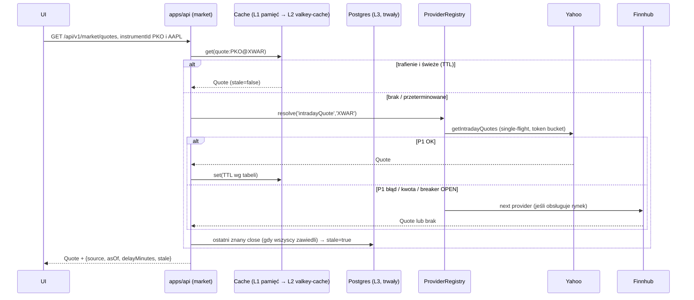

# Warstwa `DataProvider` i strategia cache

**Cel:** zaprojektować wymienną warstwę dostawców danych (port/adapter) z łańcuchem fallbacków, budżetowaniem kwot i wielopoziomowym cache tak, aby limity typu „25 zapytań/dobę” były obsłużone architektonicznie, a użytkownik zawsze widział dane ze znacznikiem czasu i źródłem.

Powiązane: `zrodla-danych.md` (role dostawców), `model-danych.md` (tabele `market.bars_daily`, `fx_rates`, `instruments`), `01-architektura/moduly.md` (moduł `market`), NFR-01 (wydajność), NFR-02 (adaptery wymienne).

## 1. Zasady

1. **Baza danych jest źródłem prawdy dla historii.** Dostawcy uzupełniają luki; raz pobrany bar EOD nie jest pobierany ponownie (poza oknem korekt).
2. **Każda odpowiedź niesie metadane:** `source`, `asOf` (czas danych), `fetchedAt`, `stale: boolean`, `delayMinutes`. UI pokazuje je zawsze (wymóg z `11-zgodnosc-prawna.md`).
3. **Kwoty są zasobem planowanym**, nie limitem do „zderzenia się”: każdy dostawca ma budżet dzienny/minutowy w `valkey-queue` (trwałe liczniki); zadania deklarują koszt przed wykonaniem.
4. **Degradacja zamiast błędu:** brak świeżych danych → serwujemy ostatnie znane z flagą `stale` i komunikatem; alert dla admina po N minutach niedostępności.
5. **Jedna kanoniczna tożsamość instrumentu:** `instrument_id` (ISIN + MIC, np. `PLPKO0000016@XWAR`) ↔ symbole dostawców (`PKO.WA` Yahoo, `PKO` GPW, `PKO.WAR` Alpha Vantage) w tabeli `instrument_provider_symbols`.

## 2. Interfejs (kontrakt) — `packages/data-providers`

```ts
// Fragment ilustracyjny (≤ 30 linii) — pełna definicja powstanie w kodzie wg tego kontraktu.
export type Capability = 'eodBars' | 'intradayQuote' | 'fxRate' | 'symbolSearch'
  | 'fundamentals' | 'news' | 'earningsCalendar' | 'macroSeries';

export interface ProviderMeta { id: string; capabilities: Capability[];
  markets: Array<'XWAR' | 'XNYS' | 'XNAS' | 'ARCX' | 'FX' | 'CRYPTO' | '*'>;
  quota: { perMinute?: number; perDay?: number }; delayMinutes: number; license: string; }

export interface DataProvider {
  meta: ProviderMeta;
  getEodBars(id: InstrumentId, range: DateRange): Promise<Result<Bar[]>>;
  getIntradayQuotes(ids: InstrumentId[]): Promise<Result<Quote[]>>;
  getFxRate(base: Ccy, quote: Ccy, date: ISODate): Promise<Result<FxRate>>;
  searchSymbols(query: string): Promise<Result<SymbolHit[]>>;
  // metody opcjonalne zależnie od capabilities: getFundamentals, getNews, getEarningsCalendar, getMacroSeries
}

export interface Result<T> { data: T; source: string; asOf: string; fetchedAt: string; stale: boolean; }
```

Rejestr (`ProviderRegistry`) trzyma listę adapterów uporządkowaną per `(capability, market)` zgodnie z tabelą ról w `zrodla-danych.md` § 4. Dodanie dostawcy = nowy plik adaptera + wpis w rejestrze + fixture testowe; zero zmian w modułach domenowych (kryterium NFR-02).

## 3. Łańcuch fallbacków, limity, circuit breaker



- **Token bucket per dostawca** w `valkey-queue` (`quota:{provider}:{day}` i `:{minute}`; instancja z trwałością AOF, więc restart nie zeruje zużycia kwot), atomowe `INCR` z TTL. Zadanie, które nie ma pokrycia w kwocie, jest odkładane (BullMQ `delay`) zamiast odrzucane.
- **Circuit breaker per dostawca:** `CLOSED → OPEN` po 5 błędach w 2 min lub HTTP 429; `HALF_OPEN` po 5 min (1 próba). Stan widoczny w panelu admina (status integracji).
- **Single-flight / coalescing:** równoległe żądania tej samej serii czekają na jedno pobranie (klucz `inflight:{key}` w `valkey-cache` z TTL 30 s).
- **Stale-while-revalidate:** UI dostaje natychmiast dane z cache i (przez SSE) aktualizację po odświeżeniu w tle.

## 4. Poziomy cache i TTL per typ danych

| Typ danych | L1 (pamięć procesu) | L2 `valkey-cache` (TTL) | L3 Postgres | Odświeżanie / źródło zdarzenia |
|---|---|---|---|---|
| Bary EOD (akcje, ETF, indeksy) | 60 s | 24 h (klucz per instrument+rok) | **trwałe** (`market.bars_daily`); okno korekt: ostatnie 5 sesji nadpisywane przy każdym batchu | Batch nocny: GPW 18:30 CET (po publikacji archiwum), USA 23:30 CET; backfill historii dla nowych instrumentów |
| Notowania intraday (opóźnione) | 15 s | **5 min** w godzinach sesji (GPW 09:00–17:05 CET; USA 15:30–22:00 CET; kalendarz z `pandas-market-calendars`/własna tabela `trading_calendar`), 60 min poza sesją | ostatnia wartość w `market.quotes_latest` (do trybu stale) | Job cykliczny co 5 min dla: pozycji użytkowników ∪ watchlist ∪ otwartych ekranów (heartbeat SSE); nic dla instrumentów nieobserwowanych |
| Kursy NBP (A/C) i złoto | 5 min | 24 h; klucz per data | **trwałe** (`fx_rates`), tabela per dzień | Job 12:20 CET (NBP publikuje ~12:15) + retry co 10 min do 14:00; brak tabeli w święta → kurs z ostatniego dnia roboczego (zgodnie z zasadą podatkową D-1) |
| Kursy Frankfurter | — | 24 h | `fx_rates` z `source='ECB'` | tylko gdy NBP zawiedzie 3× |
| Profil instrumentu (nazwa, sektor, waluta, ISIN) | 10 min | 7 dni | **trwałe** (`instruments`) | ręczna edycja admina lub odświeżenie na żądanie |
| Fundamenty (USA) | — | 7 dni | `fundamentals_snapshots` (historia kwartalna) | po publikacji raportu (kalendarz) lub na żądanie użytkownika, z budżetu FMP |
| Newsy + ton (GDELT/Marketaux) | 60 s | 30 min per zapytanie | `news_items` 90 dni, potem czyszczenie | Job co 30 min dla tickerów z pozycji/watchlist; budżet Marketaux 100/dobę = max ~4 tickery/godz. |
| Wyszukiwanie symboli | — | 30 dni | `instrument_provider_symbols` | na żądanie (wpisanie w wyszukiwarkę) |
| Kalendarz earnings/makro | — | 24 h | `calendar_events` | Job dzienny 06:00 CET |
| Makro FRED | — | 24 h | `macro_series` trwałe | Job tygodniowy + na żądanie |

Klucze w `valkey-cache`: `q:{instrumentId}` (quote), `b:{instrumentId}:{yyyy}` (bary), `fx:{base}{quote}:{date}`, `news:{instrumentId}`; dane per użytkownik zawsze z prefiksem `u:{userId}:` (NFR-03.05). Klucze w `valkey-queue`: `quota:{provider}:{window}`, `breaker:{provider}`. Instancja cache ma politykę `allkeys-lru` — utrata wpisu oznacza tylko ponowne pobranie z L3 (ADR-003). Wszystkie wartości z `fetchedAt` w payloadzie, by UI liczył wiek danych lokalnie.

## 5. Warm-up i planowanie kwot

Dobowy plan (czas CET), realizowany przez BullMQ z priorytetami:

1. 06:00 — kalendarze (earnings USA z Alpha Vantage: 1 zapytanie; makro FRED: ≤ 5).
2. 12:20 — NBP tabela A + złoto (2 zapytania) → przeliczenie wycen w PLN.
3. 09:00–17:05 co 5 min — intraday GPW (Yahoo, 1 zapytanie na partię ≤ 50 symboli).
4. 15:30–22:00 co 5 min — intraday USA (Yahoo; fallback Finnhub 1 zapytanie/symbol).
5. 18:30 — archiwum GPW (1 XLS = cały rynek) → `market.bars_daily` + korekty 5 sesji.
6. 23:30 — EOD USA dla pozycji ∪ watchlist (Yahoo; fallback Alpha Vantage z rezerwą 10 zapytań).
7. 02:00 — backfill historii (nowe instrumenty, luki wykryte przez `data-scrub`), maks. 20 % kwoty dziennej każdego dostawcy.
8. Rezerwa: Alpha Vantage 25/dobę = 1 kalendarz + ≤ 10 `NEWS_SENTIMENT` + ≤ 10 EOD fallback + 4 bufor.

Budżety są konfigurowalne w panelu admina (feature flag + liczby), a zużycie widoczne na dashboardzie „status integracji”.

## 6. Invalidacja i jakość danych

- **Zdarzenia:** nowy dzień sesyjny (czyści L1/L2 intraday), publikacja NBP, korekta/split (`SPLITS` Alpha Vantage lub ręcznie) → przeliczenie `adjustment_factor` w `market.bars_daily` i cache `b:*`.
- **Ręcznie:** przycisk „Odśwież” (user: 1/min per instrument) i „Wymuś ponowne pobranie” (admin).
- **Polityka cen skorygowanych:** przechowujemy *surowe* OHLCV + osobne współczynniki korekt; wykresy używają cen skorygowanych, a wyceny i P/L — surowych cen i realnych przepływów (TWR/XIRR nie mogą korzystać z cen skorygowanych wstecz). Szczegóły w `obliczenia-finansowe.md`.
- **Kontrola jakości (skill `data-scrub`):** przy każdym batchu: luki w kalendarzu sesji, duplikaty timestampów, zera w wolumenie przy zmianie ceny, skoki > 40 % bez splitu → wpis do `data_quality_issues` i oznaczenie serii jako „do weryfikacji” w UI.
- **Retencja:** intraday 5-minutowe bary — 90 dni (potem agregacja do dziennych); newsy — 90 dni; logi kwot — 30 dni.

## 7. Konsekwencje dla wydajności (NFR-01)

- Ekrany ładują dane z L2/L3 w < 50 ms; żadne żądanie użytkownika nie czeka na zewnętrzne API (pobrania są asynchroniczne, wynik dociera SSE).
- Wykres 10-letni = 1 zapytanie do `market.bars_daily` (indeks `(instrument_id, date)`), decymacja po stronie serwera do ≤ 3 000 punktów dla interwałów > 1D.
- Brak polling’u z przeglądarki: jeden strumień SSE per karta.

## 8. Ryzyka i mitygacje

| Ryzyko | Mitygacja |
|---|---|
| Yahoo blokuje IP serwera | wykładniczy backoff, breaker, fallback Finnhub/Twelve Data dla USA; dla GPW intraday: tryb „EOD only” z komunikatem; opcja płatna EODHD w `10-ograniczenia.md` |
| GPW zmienia format XLS lub blokuje pobieranie | test kontraktowy parsera (fixture z 2026-09-16), alert po 2 dniach bez danych, ręczny import Stooq/XLS przez admina |
| NBP niedostępny w dniu wyceny | Frankfurter + oznaczenie „kurs ECB, nie NBP” w wycenie; ponowne przeliczenie po powrocie NBP |
| Przekroczenie kwot przez backfill | limit 20 % kwoty na backfill, kolejka z priorytetami (intraday > EOD > backfill) |
