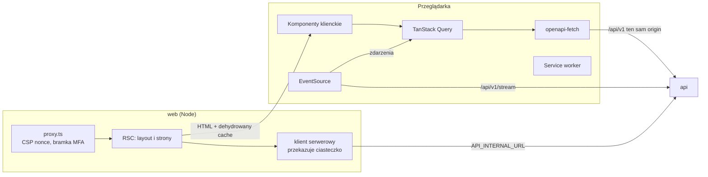

# Architektura UI (`apps/web`)

**Cel:** opisać, jak zbudowana jest warstwa prezentacji OligInvest — struktura tras i katalogów, podział na serwer i klienta, pobieranie danych z API, integracja z SSE, service worker, dozwolone prymitywy UI i obsługa błędów — tak, aby każdy ekran powstawał według tych samych reguł i mieścił się w budżetach z [`wydajnosc.md`](wydajnosc.md).

Powiązane: [`system-projektowy.md`](system-projektowy.md), [`mapa-ekranow.md`](mapa-ekranow.md), [`wydajnosc.md`](wydajnosc.md), [`dostepnosc.md`](dostepnosc.md), [`../01-architektura/stack-technologiczny.md`](../01-architektura/stack-technologiczny.md) § 4, [`../01-architektura/moduly.md`](../01-architektura/moduly.md), [`../02-api/konwencje-api.md`](../02-api/konwencje-api.md), [`../02-api/realtime.md`](../02-api/realtime.md), [ADR-008](../09-decyzje/ADR-008-pwa-i-integracje-mobilne.md), [ADR-009](../09-decyzje/ADR-009-wykresy.md), [ADR-012](../09-decyzje/ADR-012-api-jako-granica-domenowa.md).

## 1. Zasady

1. **`web` tylko komponuje i prezentuje.** Brak dostępu do bazy, brak logiki biznesowej; wszystkie dane przez `api` (ADR-012) klientem typowanym z [`openapi.yaml`](../02-api/openapi.yaml).
2. **Najpierw serwer.** React Server Components renderują powłokę i pierwszy widok danych (streaming przez `Suspense`); JavaScript w przeglądarce tylko dla wysp interaktywnych.
3. **Każda trasa ma budżet JS.** Biblioteki wykresów, onboarding, panel admina i widoki analiz ładowane wyłącznie dynamicznym importem na trasach, które ich używają (NFR-01.03).
4. **Pieniądze tylko się formatuje.** Kwoty przychodzą z API jako ciągi (`Money`); UI nie wykonuje na nich arytmetyki zmiennoprzecinkowej. Wyjątek: serie do wykresów (liczby — `konwencje-api.md` § 3).
5. **Zgodność i dostępność są komponentami, nie dopiskami.** `<DataFreshness/>`, `<AssumptionsBlock/>`, `<Disclaimer/>` i `<ChangeValue/>` są obowiązkowe tam, gdzie wskazuje [`mapa-ekranow.md`](mapa-ekranow.md) (NFR-07.01, NFR-06.02).

## 2. Struktura katalogów

```text
apps/web/
├── proxy.ts                  # CSP z nonce, nagłówki bezpieczeństwa, przekierowania bramek MFA i regulaminu
├── app/
│   ├── layout.tsx            # <html lang="pl">, motyw, nonce
│   ├── manifest.ts           # manifest PWA (FR-09.01, skróty Androida FR-09.06)
│   ├── (auth)/…              # logowanie, rejestracja z zaproszenia, reset hasła, 2FA
│   ├── (app)/layout.tsx      # powłoka: nawigacja, QueryClient, dostawca SSE
│   ├── (app)/…               # trasy modułów = cienkie re-eksporty z modules/*/src/ui
│   ├── admin/…               # osobny układ, wyłącznie leniwe chunki
│   └── offline/page.tsx      # strona awaryjna service workera
├── public/sw.js              # service worker: push, notificationclick, cache zasobów statycznych
└── src/
    ├── modules.ts            # rejestr modułów UI (nawigacja, panele admina, wyjaśnienia)
    ├── api/                  # schema.d.ts (generowany), klient serwerowy i przeglądarkowy
    ├── query/                # QueryClient, fabryki kluczy, mapowanie zdarzeń SSE na unieważnienia
    └── sse/                  # EventSource, czuwanie, tryb odpytywania
```

Adresy URL są po polsku, bez znaków diakrytycznych (`/portfel`, `/rynek`, `/analizy`, `/alerty`, `/nauka`, `/ustawienia`) — pełna lista w [`mapa-ekranow.md`](mapa-ekranow.md). Identyfikatory w kodzie są po angielsku.

## 3. Przepływ danych w warstwie UI



- **Serwer:** `src/api/server.ts` tworzy klienta z nagłówkami bieżącego żądania (`cookie`, `x-request-id`, `accept-language`) i adresem wewnętrznym z `API_INTERNAL_URL`; `fetch` z `cache: 'no-store'` (dane użytkownika), deduplikacja w obrębie żądania przez `React.cache`.
- **Hydratacja:** strona serwerowa pobiera dane pierwszego widoku, przekazuje je przez `dehydrate` i `HydrationBoundary` — klient startuje z danymi, bez kaskady żądań.
- **Klient:** TanStack Query 5.103 z fabrykami kluczy per zasób (np. `['portfolio', 'summary', { accountIds }]`).

| Rodzaj danych | `staleTime` | Odświeżanie |
|---|---|---|
| Wycena i wynik dnia | 30 s | zdarzenie SSE `portfolio.valuation.updated`; tryb odpytywania 60 s |
| Kursy | 60 s | zdarzenie `market.quotes.updated` (`setQueryData`) |
| Karta instrumentu, benchmarki, sektory | 5 min | ręczne |
| Wykres EOD | 15 min | po `market.bars.eod_ingested` (przez unieważnienie wyceny) |
| Profil, preferencje, flagi | do mutacji | `flags.changed`, zapis preferencji |

**Typowany klient:** `openapi-typescript` 7.13 generuje `src/api/schema.d.ts` z `docs/02-api/openapi.yaml`; `openapi-fetch` 0.17 wykonuje żądania z typami ścieżek, parametrów i odpowiedzi. CI sprawdza, że wygenerowany plik jest aktualny.

## 4. Mutacje i błędy

- **Idempotencja:** formularz generuje `Idempotency-Key` (`crypto.randomUUID()`) przy pierwszym wysłaniu i używa go przy ponowieniach (np. po utracie sieci na telefonie).
- **Aktualizacje optymistyczne** tylko dla operacji bez skutków finansowych (kolejność watchlisty, notatka). Operacje, import, analizy — zawsze po odpowiedzi serwera.
- **Mapowanie błędów** (`Problem.code` → zachowanie UI):

| `code` | Zachowanie |
|---|---|
| `UNAUTHENTICATED` | przejście do logowania z `returnTo` |
| `MFA_ENROLLMENT_REQUIRED`, `MFA_REQUIRED` | ekran konfiguracji lub weryfikacji TOTP |
| `TERMS_ACCEPTANCE_REQUIRED` | ekran `/akceptacja-regulaminu` (FR-07.12) |
| `STEP_UP_REQUIRED` | okno z kodem TOTP → `POST /me/step-up` → automatyczne ponowienie żądania |
| `VALIDATION_FAILED`, `PARAMETERS_OUT_OF_BOUNDS` | błędy przy polach według `errors[].path` |
| `INSTRUMENT_AMBIGUOUS` | lista `candidates` do wyboru |
| `IDEMPOTENCY_CONFLICT`, `CONFLICT` | komunikat i odświeżenie danych |
| `RECONCILIATION_REQUIRED` | przejście do uzgodnienia importu |
| `RATE_LIMITED`, `QUOTA_EXCEEDED` | komunikat z czasem z `Retry-After` |
| `NOT_FOUND` | `not-found.tsx` (także dla modułu wyłączonego flagą) |
| `INTERNAL`, `SERVICE_UNAVAILABLE` | `error.tsx` z identyfikatorem żądania (`instance`) do zgłoszenia |

- **Stany ekranu:** każdy segment ma `loading.tsx` (szkielet o wymiarach docelowych — CLS), `error.tsx`, `not-found.tsx`; widoki danych rynkowych pokazują `<DataFreshness/>` z przyczyną nieaktualności (FR-01.15).

## 5. Renderowanie

- **Wszystkie strony są dynamiczne.** CSP z nonce (wymóg NFR-03.06) wymusza renderowanie dynamiczne każdej strony; statyczna optymalizacja, ISR i Partial Prerendering są wtedy niedostępne (dokumentacja Next.js 16, przewodnik „Content Security Policy”). Koszt jest mały, bo prawie każdy ekran zależy od zalogowanego użytkownika. Alternatywa na przyszłość: eksperymentalne SRI (CSP oparte na skrótach, zgodne z generowaniem statycznym) — decyzja ADR, jeśli pomiary TTFB tego wymagają.
- **Streaming:** każda sekcja zależna od wolniejszych danych ma własną granicę `Suspense` (np. dashboard: podsumowanie → pozycje → wykres historii).
- **Macierz SSR/CSR/strumień per trasa:** [`wydajnosc.md`](wydajnosc.md) § 4.

## 6. Stan aplikacji

| Rodzaj | Gdzie |
|---|---|
| Dane serwera | TanStack Query (jedyne źródło w przeglądarce) |
| Filtry, zakresy dat, zakładki, wybrane rachunki | parametry URL (`useSearchParams`) — linki głębokie i przycisk „wstecz” działają (FR-09.07) |
| Stan komponentu | `useState` / `useReducer` |
| Preferencje urządzenia (ostatnio wybrany rachunek) | `localStorage` — bez danych finansowych |
| Migawka offline portfela (FR-09.02) | IndexedDB — tylko w zainstalowanej aplikacji i po jednorazowej zgodzie, czyszczona przy wylogowaniu (§ 8) |

Bez biblioteki stanu globalnego (stos § 4).

## 7. Realtime

`SseProvider` w `(app)/layout.tsx` otwiera jedno `EventSource` na kartę po przejściu bramki MFA, mapuje zdarzenia na unieważnienia zapytań i przełącza się na odpytywanie według [`realtime.md`](../02-api/realtime.md) § 6–7. Karta instrumentu zgłasza dodatkowe instrumenty przez `PUT /stream/connections/{connectionId}/instruments`.

## 8. PWA i service worker

- **Manifest** (`app/manifest.ts`): `name` „OligInvest”, `display: standalone`, `start_url: /`, ikony 192/512 i `maskable`, `theme_color` z tokenów, `shortcuts` dla Androida: „Dodaj transakcję”, „Wynik dnia”, „Alerty” (FR-09.06).
- **`public/sw.js`** (bez bibliotek, wg przewodnika PWA Next.js 16):
  - cache `/_next/static/*` (pliki niezmienne z hashem) i strony `/offline`;
  - **brak cache odpowiedzi `/api/*`** i stron HTML z danymi (konwencje § 8);
  - `push` → `showNotification` z `data.url`; `notificationclick` → fokus otwartego okna lub otwarcie linku głębokiego (FR-09.07);
  - nowa wersja → komunikat „Dostępna nowa wersja — odśwież”; `skipWaiting` dopiero po geście użytkownika.
- **Tryb offline (FR-09.02) — decyzja właściciela z 2026-09-19 („ustaw najlepiej”):** migawka powstaje wyłącznie w **zainstalowanej aplikacji** (tryb `standalone`) i **wyłącznie na żądanie** — przy pierwszym uruchomieniu po instalacji aplikacja raz pyta „Zapamiętywać ostatni stan portfela do podglądu bez internetu na tym urządzeniu?” (Tak/Nie; zmiana w Ustawienia → Dane). W zwykłej karcie przeglądarki (możliwy komputer współdzielony) funkcji nie ma. Zakres: podsumowanie, wynik dnia i lista pozycji — bez operacji, dziennika i analiz. Migawka jest nadpisywana przy każdej synchronizacji, **nie jest pokazywana po 30 dniach** bez synchronizacji i jest kasowana przy wylogowaniu, odpowiedzi `401` (np. sesja odwołana zdalnie) i wyłączeniu opcji. Strona `/offline` pokazuje ją tylko do odczytu z datą „dane z …”. Uzasadnienie: dane finansowe w pamięci urządzenia to świadome odstępstwo od ASVS V14.3.3, a zapis w urządzeniu końcowym, który nie jest niezbędny do świadczenia usługi, wymaga wyraźnego żądania użytkownika (art. 399 Prawa komunikacji elektronicznej) — [`../06-bezpieczenstwo/kontrole-bezpieczenstwa.md`](../06-bezpieczenstwo/kontrole-bezpieczenstwa.md) § 8.
- **Wylogowanie:** czyści cache TanStack Query, IndexedDB, cache service workera z danymi i powiadamia inne karty przez `BroadcastChannel`.

## 9. Nawigacja i moduły UI

- Pozycje menu pochodzą z `UiModuleDefinition.nav` modułów (`moduly.md` § 3) i są filtrowane przez `GET /me` (`features`, `permissions`). Wyłączony moduł znika z menu w ≤ 60 s (zdarzenie `flags.changed`).
- **Telefon:** dolny pasek kart (Start, Portfel, Rynek, Alerty, Więcej) z obsługą `safe-area-inset-bottom`; **desktop (≥ 1024 px):** boczny panel nawigacji.
- Panel admina (`/admin`) ma osobny układ i jest niedostępny w nawigacji dla ról innych niż admin.

## 10. Prymitywy UI — lista dozwolonych

Najpierw HTML natywny, Radix tylko tam, gdzie natywne elementy nie zapewniają dostępności — i **nigdy w początkowym JS trasy**. Rozmiary zmierzone 2026-09-19 (esbuild, minifikacja, gzip -9, React jako zależność zewnętrzna): sześć komponentów Radix z tabeli łącznie **41,7 KB**, sam `react-dropdown-menu` 30,8 KB — to ponad połowa zapasu budżetu trasy ([`wydajnosc.md`](wydajnosc.md) § 2).

| Potrzeba | Rozwiązanie | Rozmiar gz | Ładowanie |
|---|---|---|---|
| Okna modalne, potwierdzenia, step-up | `<dialog>` + `showModal()` (natywna pułapka fokusu i `inert` tła; na telefonie styl „arkusza od dołu”) | 0 | — |
| Wyjaśnienia „?” przy metrykach, proste podpowiedzi | atrybut `popover` + pozycjonowanie CSS względem wyzwalacza | 0 | — |
| Akordeony (FAQ, szczegóły założeń) | `<details>` / `<summary>` | 0 | — |
| Proste listy wyboru, daty | `<select>`, `<input type="date">` (natywne pickery na telefonie) | 0 | — |
| Menu z nawigacją klawiaturą (akcje wiersza, przełącznik rachunku) | `@radix-ui/react-dropdown-menu` | 30,8 KB | dynamiczny import przy pierwszym otwarciu menu |
| Wyszukiwarka instrumentów (combobox) | `@radix-ui/react-popover` + wzorzec combobox z WAI-ARIA APG | 23,6 KB | przy pierwszym fokusie pola wyszukiwania |
| Zakładki | `@radix-ui/react-tabs` | 9,0 KB | tylko na trasach analiz i admina |
| Powiadomienia w aplikacji | `@radix-ui/react-toast` (`role="status"`, gest przesunięcia) | 11,8 KB | przy pierwszym komunikacie |
| Suwaki (wagi, parametry analiz) | `@radix-ui/react-slider`, zawsze z polem liczbowym obok | 9,5 KB | tylko formularze analiz |

`@radix-ui/react-tooltip` (18,9 KB) nie jest dozwolony — wyjaśnienia realizuje `popover`. Każdy inny pakiet UI wymaga uzasadnienia w PR i przejścia `size-limit`. Import wyłącznie per komponent (`@radix-ui/react-*`), nie pakietu zbiorczego `radix-ui`.

## 11. Formularze

- **Źródłem prawdy walidacji jest `api`** (Zod w `packages/contracts`); odpowiedź `422` z `errors[].path` jest mapowana na pola.
- **W przeglądarce domyślnie walidacja natywna HTML** (`required`, `pattern`, `min`, `max`, `maxlength` zgodne ze schematem) przez Constraint Validation API — 0 KB JS. Pomiar 2026-09-19 (Zod 4.6.5, esbuild, gzip): import przestrzeni nazw `import * as z from 'zod'` ≈ **25,3 KB**, `import { z } from 'zod'` ≈ **89,9 KB** (cała przestrzeń nazw z lokalizacjami), `zod/mini` ≈ **5,2 KB**.
- Schematy Zod w przeglądarce tylko w **leniwie ładowanych, złożonych formularzach** (parametry analiz, mapowanie importu, reguły alertów) — jako osobny chunk. Import `{ z }` z `zod` w kodzie klienckim jest zablokowany regułą lintera (`noRestrictedImports` w Biome).
- Kwoty i ilości: `inputmode="decimal"`, akceptacja przecinka i kropki, normalizacja do ciągu z kropką; bez `parseFloat` na kwotach.
- TOTP: `inputmode="numeric"`, `autocomplete="one-time-code"`, wklejanie dozwolone.
- Każde pole ma etykietę; opis błędu powiązany przez `aria-describedby` ([`dostepnosc.md`](dostepnosc.md) § 5).

## 12. Bezpieczeństwo warstwy UI

- `proxy.ts` generuje nonce per żądanie i ustawia CSP: `script-src 'self' 'nonce-…' 'strict-dynamic'`, `style-src 'self' 'nonce-…'`, `object-src 'none'`, `base-uri 'none'`, `frame-ancestors 'none'`, `form-action 'self'`, `connect-src 'self'`; pełna polityka i pozostałe nagłówki: [`../06-bezpieczenstwo/kontrole-bezpieczenstwa.md`](../06-bezpieczenstwo/kontrole-bezpieczenstwa.md) § 2.
- Zakaz `dangerouslySetInnerHTML` (reguła lintera); treści edukacyjne MDX kompilowane w czasie budowania z repozytorium (zaufane źródło).
- Brak skryptów stron trzecich, analityki zewnętrznej i fontów z CDN; RUM przez własny endpoint (`POST /rum/web-vitals`) wyłącznie przy zgodzie na diagnostykę (FR-07.12) — bez zgody moduł `web-vitals` w ogóle się nie ładuje.
- Tokeny zaproszenia i resetu hasła przychodzą we fragmencie adresu (`#t=…`); strona odczytuje je raz, usuwa z paska adresu (`history.replaceState`) i wysyła w treści żądania.
- Wylogowanie: nagłówek `Clear-Site-Data` z API oraz czyszczenie po stronie klienta (pamięć zapytań, IndexedDB, cache service workera, `BroadcastChannel` do innych kart) — także bez połączenia z serwerem (ASVS V14.3.1).
- Token PAT i kody zapasowe pokazywane jednorazowo, kopiowane przez `navigator.clipboard`, usuwane z pamięci komponentu po zamknięciu okna.
- Linki zewnętrzne (źródła newsów) z `rel="noopener noreferrer"` i ikoną „link zewnętrzny”.

## 13. Testy warstwy UI

| Rodzaj | Narzędzie | Zakres |
|---|---|---|
| Jednostkowe | Vitest + Testing Library | formatery pl-PL, `<ChangeValue/>`, `<MoneyValue/>`, mapowanie błędów, reduktory stanu |
| E2E ścieżek krytycznych | Playwright 1.63 | logowanie z TOTP, import pliku XTB (fixture syntetyczny), dashboard, dodanie operacji, alert, uruchomienie analizy |
| Dostępność | `@axe-core/playwright` 4.13 w testach E2E | zero naruszeń poziomów `serious` i `critical` ([`dostepnosc.md`](dostepnosc.md) § 9) |
| Wizualne | zrzuty Playwright | szerokości 360, 768, 1280 px (NFR-04.02), motyw jasny i ciemny |
| Wydajność | size-limit, Lighthouse | [`wydajnosc.md`](wydajnosc.md) § 6 |

## 14. Zastrzeżenia

- **CSP z nonce a renderowanie statyczne:** świadomie rezygnujemy ze statycznej optymalizacji i PPR (§ 5). Konflikt zapisany zgodnie z NFR-01.09.
- **Migawka offline tylko na żądanie:** FR-09.02 działa po jednym potwierdzeniu w zainstalowanej aplikacji; brak zgody = brak migawki (ASVS V14.3.3, art. 399 PKE).
- **Rozmiary bibliotek** (Radix per komponent, `openapi-fetch`) nie są tu podawane — mierzy je `size-limit` w CI względem budżetów tras.
