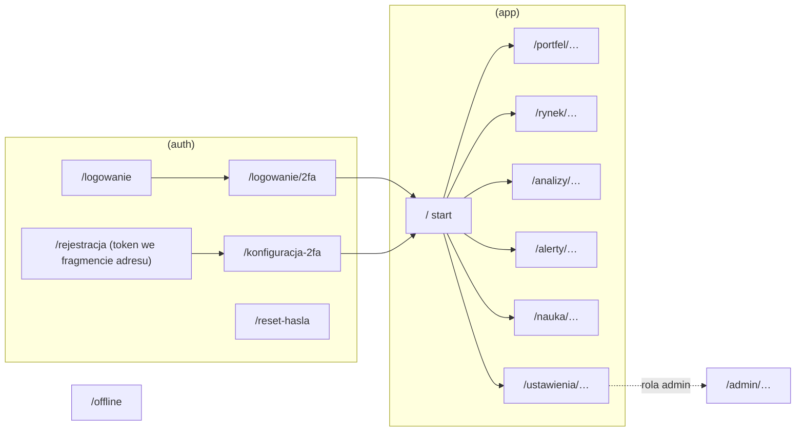

# Mapa ekranów

**Cel:** wymienić wszystkie ekrany OligInvest z adresem, wymaganiami, operacjami API, obowiązkowymi komponentami zgodności i uwagami dla telefonu oraz opisać nawigację i ścieżki kluczowe — jako kontrakt między wymaganiami, [`openapi.yaml`](../02-api/openapi.yaml) i implementacją `web`.

Powiązane: [`architektura-ui.md`](architektura-ui.md), [`system-projektowy.md`](system-projektowy.md), [`wydajnosc.md`](wydajnosc.md) § 4 (renderowanie i budżety per trasa), [`dostepnosc.md`](dostepnosc.md), [`../05-mobile/strategia-mobilna.md`](../05-mobile/strategia-mobilna.md).

Oznaczenia komponentów zgodności: **F** = `<DataFreshness/>`, **Z** = `<AssumptionsBlock/>`, **D** = `<Disclaimer/>`, **W** = `<Explainer/>` przy metrykach.

## 1. Mapa tras

## 2. Uwierzytelnianie

| Trasa | Ekran | Wymagania | Operacje API | Uwagi |
|---|---|---|---|---|
| `/logowanie` | e-mail i hasło; OAuth za flagą | FR-07.02, FR-07.03 | `authSignInEmail`, `authSignInSocial` | menedżery haseł: `autocomplete="username"` / `current-password` |
| `/logowanie/2fa` | kod TOTP lub kod zapasowy | FR-07.04 | `authTwoFactorVerifyTotp`, `authTwoFactorVerifyBackupCode` | `autocomplete="one-time-code"`, wklejanie dozwolone |
| `/rejestracja` (token w `#t=…`) | rejestracja z zaproszenia: dane konta, akceptacja regulaminu (wymagana), potwierdzenie zapoznania się z informacją o przetwarzaniu danych, zgoda na diagnostykę (opcjonalna, niezaznaczona) | FR-07.01, FR-07.02, FR-07.12 | `previewInvitation`, `authSignUpEmail` | token usuwany z paska adresu po odczytaniu; nieważne zaproszenie → ten sam komunikat dla każdej przyczyny |
| `/konfiguracja-2fa` | kod QR, ręczny sekret, weryfikacja, 10 kodów zapasowych | FR-07.04 | `authTwoFactorEnable`, `authTwoFactorVerifyTotp` | cel bramki MFA; kody do pobrania jako plik TXT i do skopiowania |
| `/reset-hasla`, `/reset-hasla/nowe` | prośba o link, nowe hasło | FR-07.10 | `authRequestPasswordReset`, `authResetPassword` | odpowiedź identyczna niezależnie od istnienia konta |
| `/akceptacja-regulaminu` | ponowna akceptacja po istotnej zmianie regulaminu (bramka `TERMS_ACCEPTANCE_REQUIRED`) ze streszczeniem zmian | FR-07.12 | `getLegalStatus`, `acceptLegalDocuments` | do czasu akceptacji dostępne są tylko ten ekran, wylogowanie oraz eksport danych i usunięcie konta (`/ustawienia/dane`) |
| `/regulamin`, `/prywatnosc`, `/zrodla-danych` | regulamin, informacja o przetwarzaniu danych oraz źródła danych i licencje — publiczne, wersjonowane, do pobrania i wydruku | FR-07.12, NFR-07.03 | — (treść statyczna) | link w stopce każdego ekranu i w e-mailu z zaproszeniem; strona źródeł bez danych rynkowych ([`../11-zgodnosc-prawna.md`](../11-zgodnosc-prawna.md) § 6) |

## 3. Start i portfel

| Trasa | Ekran | Wymagania | Operacje API | Zgodność | Uwagi dla telefonu |
|---|---|---|---|---|---|
| `/` | **Start**: wartość portfela, wynik dnia, P/L, historia wartości, alokacja (mini), ostatnie alerty, stan danych | FR-02.03, FR-02.09, FR-02.10, FR-01.15 | `getPortfolioSummary`, `getDayChange`, `getPortfolioHistory`, `getAllocation`, `listAlertEvents` | F, W | kafelki w jednej kolumnie; wykres historii leniwie pod linią zgięcia |
| `/portfel` | **Pozycje**: tabela z kosztem, wartością, udziałem, P/L (cena/kurs) | FR-02.02, FR-02.06 | `listPositions`, `listAccounts` | F, W | wiersz jako karta; szczegóły po dotknięciu |
| `/portfel/operacje` | lista operacji z filtrami | FR-03.03 | `listTransactions` | — | przycisk „+” (FAB) w prawym dolnym rogu |
| `/portfel/operacje/nowa`, `/portfel/operacje/[transactionId]` | formularz operacji (typ decyduje o polach) | FR-03.03 | `createTransaction`, `updateTransaction`, `deleteTransaction`, `searchInstruments` | — | arkusz od dołu; klawiatura dziesiętna |
| `/portfel/import` | wybór rachunku i pliku, formaty i instrukcja eksportu z XTB/mBank | FR-03.01, FR-03.02, FR-03.04 | `uploadImport`, `listImports`, `listImportTemplates` | — | wybór pliku z aplikacji Pliki (iOS) / menedżera plików |
| `/portfel/import/[importId]` | podgląd: wiersze wg statusu, mapowanie instrumentów, uzgodnienie sald, zatwierdzenie | FR-03.01, NFR-08.03 | `getImport`, `listImportRows`, `resolveImportRow`, `commitImport`, `discardImport` | — | lista wierszy wirtualizowana; filtr „do rozstrzygnięcia” domyślnie |
| `/portfel/wyniki` | TWR, XIRR, okresy, benchmark, P/L zrealizowany | FR-03.06, FR-03.07, FR-02.07 | `getPerformance`, `getRealizedPl`, `listBenchmarks` | F, W | przełącznik widoku ekonomiczny/podatkowy; w podatkowym koszty przewalutowania jako osobna pozycja |
| `/portfel/ryzyko` | obsunięcia, metryki ryzyka, atrybucja | FR-03.08, FR-03.09, FR-03.10 | `getDrawdown`, `getRiskMetrics`, `getAttribution` | F, W, Z | założenia (stopa wolna od ryzyka, okno) zawsze widoczne |
| `/portfel/alokacja` | alokacja wg wymiaru, ekspozycja walutowa, alokacje docelowe | FR-02.05, FR-02.06, FR-04.06 | `getAllocation`, `listTargetAllocations`, `createTargetAllocation`, `upsertInstrumentOverride` | F | wykres pierścieniowy + tabela |
| `/portfel/dywidendy` | dywidendy brutto/podatek/netto, szacowana dopłata | FR-02.08 | `listDividends` | W | — |
| `/portfel/partie` | partie FIFO/średnia z historią zużycia | FR-03.05 | `listLots` | W | — |
| `/portfel/dziennik`, `/portfel/dziennik/[entryId]` | dziennik, postmortem, statystyki decyzji | FR-03.11, FR-03.12 | `listJournalEntries`, `createJournalEntry`, `upsertJournalPostmortem`, `getDecisionStats` | W | ocena procesu oddzielnie od wyniku |
| `/portfel/rachunki`, `/portfel/rachunki/[accountId]` | rachunki, status uzgodnienia | FR-02.01 | `listAccounts`, `createAccount`, `updateAccount`, `deleteAccount` | — | usunięcie wymaga step-up |

## 4. Rynek

| Trasa | Ekran | Wymagania | Operacje API | Zgodność | Uwagi dla telefonu |
|---|---|---|---|---|---|
| `/rynek` | indeksy i benchmarki, stan danych, skróty do heatmapy i screenera | FR-01.09, FR-01.15 | `listBenchmarks`, `getQuotes`, `getMarketDataStatus` | F | — |
| `/rynek/szukaj` | wyszukiwarka (na desktopie także pole w nagłówku) | FR-01.01 | `searchInstruments` | — | pole na górze ekranu, klawiatura od razu |
| `/rynek/[instrumentId]` | **karta instrumentu**: kurs, zmiana, zakres 52 tyg., wykres świecowy z wolumenem, wskaźniki, newsy, kalendarz | FR-01.02–FR-01.07, FR-01.13 | `getInstrument`, `getInstrumentChart`, `getInstrumentIndicators`, `listNews`, `getMarketCalendar`, `setStreamInstruments` | F, W | wykres na pełną szerokość, gesty (przesuwanie, szczypanie); wskaźniki w arkuszu |
| `/rynek/heatmapa` | heatmapa sektorowa GPW/USA | FR-01.10 | `getSectorHeatmap` | F | lista sektorów jako alternatywa dla wąskich ekranów |
| `/rynek/screener` | kryteria, wyniki z listą spełnionych warunków, zestawy | FR-01.11, FR-04.07 | `runScreener`, `listScreenerPresets`, `createScreenerPreset` | F, D | kryteria w arkuszu; wyniki wirtualizowane |
| `/rynek/kalendarz` | wyniki spółek, makro; filtr „moje” | FR-01.12 | `getMarketCalendar` | F | — |
| `/rynek/watchlisty`, `/rynek/watchlisty/[watchlistId]` | watchlisty z kursami, notatki, kolejność | FR-01.08 | `listWatchlists`, `getWatchlist`, `addWatchlistItem`, `updateWatchlistItem` | F | zmiana kolejności przyciskami (alternatywa dla przeciągania) |
| `/rynek/waluty` | kursy NBP i historia | FR-01.14 | `getFxRates`, `getMacroSeries` | F | — |

## 5. Analizy, alerty, nauka

| Trasa | Ekran | Wymagania | Operacje API | Zgodność | Uwagi |
|---|---|---|---|---|---|
| `/analizy` | lista analiz, limity, wybór typu | FR-04.01 | `listAnalyticsRuns`, `getAnalyticsLimits` | D | typy ciężkie widoczne dla roli user z wyjaśnieniem braku dostępu |
| `/analizy/nowa/[typ]` | formularz parametrów + podgląd założeń przed uruchomieniem (`monte-carlo`, `optymalizacja`, `testy-skrajne`, `co-jesli`, `backtest`, `cel`, `rebalancing`) | FR-04.02–FR-04.09 | `createAnalyticsRun`, `listStressScenarios`, `listStrategies`, `listTargetAllocations` | Z, D | formularz etapowy; Zod leniwie (architektura-ui § 11) |
| `/analizy/[runId]` | postęp, wynik jako rozkład, „jak czytać ten wynik”, ostrzeżenia, odtwarzalność | FR-04.01, FR-06.06, NFR-07.02 | `getAnalyticsRun`, `cancelAnalyticsRun` | Z, D, W | lewy ogon pokazywany jako pierwszy (obliczenia § 12.1) |
| `/analizy/strategie` | definicje strategii do backtestu | FR-04.08 | `listStrategies`, `createStrategy`, `replaceStrategy` | D | — |
| `/alerty` | reguły i ostatnie wyzwolenia | FR-05.01–FR-05.06 | `listAlertRules`, `listAlertEvents` | D | — |
| `/alerty/nowy`, `/alerty/[ruleId]` | kreator reguły (typ → parametry → kanały → podgląd treści) | FR-05.01–FR-05.07 | `createAlertRule`, `updateAlertRule`, `deleteAlertRule` | D | podgląd przykładowego powiadomienia |
| `/alerty/historia` | historia wyzwoleń i doręczeń | FR-05.06 | `listAlertEvents`, `listNotificationDeliveries` | F | — |
| `/nauka` | onboarding (powtórz), glosariusz, ścieżki, demo | FR-06.01–FR-06.05 | `getOnboardingState`, `listLearningProgress`, `getDemoPortfolio` | — | treści statyczne MDX |
| `/nauka/slownik`, `/nauka/slownik/[termin]` | glosariusz z wyszukiwaniem po fragmencie i synonimie | FR-06.03 | — (indeks statyczny) | — | — |
| `/nauka/lekcje/[lessonKey]` | lekcja z ćwiczeniem na danych demo | FR-06.05 | `upsertLearningProgress` | D | — |
| `/nauka/demo` | tryb demo (odizolowany rachunek demo) | FR-06.04 | `createDemoPortfolio`, `deleteDemoPortfolio` | D | stały baner „tryb demo” |

## 6. Ustawienia i panel administratora

| Trasa | Ekran | Wymagania | Operacje API |
|---|---|---|---|
| `/ustawienia` | profil i preferencje (waluta bazowa, metoda kosztu, widok P/L, ustawienia widoku podatkowego — dzień przychodu i koszt przewalutowania, strefa, język, motyw, paleta) | FR-07.08 | `getMe`, `updateMe`, `getPreferences`, `updatePreferences` |
| `/ustawienia/bezpieczenstwo` | hasło, 2FA (nowe kody, zmiana urządzenia), sesje i urządzenia | FR-07.04, FR-07.05 | `authChangePassword`, `authTwoFactorGenerateBackupCodes`, `authListSessions`, `authRevokeSession`, `authRevokeOtherSessions` |
| `/ustawienia/tokeny` | tokeny PAT (tworzenie ze step-up, odwołanie) | FR-07.07 | `listPersonalAccessTokens`, `createPersonalAccessToken`, `revokePersonalAccessToken`, `verifyStepUp` |
| `/ustawienia/powiadomienia` | urządzenia push, test, kanały, ciche godziny | FR-05.06, FR-09.03 | `listPushSubscriptions`, `createPushSubscription`, `sendTestPush`, `getNotificationPreferences`, `replaceNotificationPreferences` |
| `/ustawienia/integracje` | instrukcje Skrótów iOS i HTTP Shortcuts, linki do gotowych skrótów | FR-09.05, FR-09.06, FR-09.08 | — (treść) |
| `/ustawienia/dane` | eksport RODO, usunięcie konta, migawka offline, eksport CSV/JSON | FR-07.09, FR-09.02, FR-03.13 | `createDataExport`, `getDataExport`, `downloadDataExport`, `requestAccountDeletion`, `exportPortfolioData` |
| `/ustawienia/prywatnosc` | zgody opcjonalne (diagnostyka), wersje zaakceptowanych dokumentów, historia akceptacji, kontakt do administratora danych | FR-07.12, FR-07.09 | `getLegalStatus`, `updateConsent` |
| `/admin` | stan systemu, skróty | FR-08.08 | `adminGetSystemHealth` |
| `/admin/uzytkownicy`, `/admin/uzytkownicy/[userId]`, `/admin/zaproszenia`, `/admin/sesje` | użytkownicy (bez danych finansowych), zaproszenia, sesje | FR-08.01, FR-08.02, FR-07.01 | `adminListUsers`, `adminUpdateUser`, `adminResetTwoFactor`, `adminCreateInvitation`, `adminListSessions`, `adminRevokeSession` |
| `/admin/flagi`, `/admin/limity` | flagi funkcji, limity ról | FR-08.04, FR-08.03 | `adminListFeatureFlags`, `adminUpdateFeatureFlag`, `adminListRoleLimits`, `adminReplaceRoleLimits` |
| `/admin/audyt` | dziennik audytu z filtrami i eksportem | FR-08.05 | `adminListAuditLog`, `adminExportAuditLog` |
| `/admin/kolejki`, `/admin/dostawcy` | kolejki zadań, stan dostawców i kwot | FR-08.06, FR-08.07 | `adminListQueues`, `adminListQueueJobs`, `adminRetryQueueJob`, `adminListProviders`, `adminUpdateProvider`, `adminRefreshProvider` |
| `/admin/dane-rynkowe` | ręczny import notowań, korekty instrumentów, zdarzenia korporacyjne, jakość danych, wpisy kalendarza | FR-08.09 | `adminUploadMarketData`, `adminCorrectInstrument`, `adminCreateCorporateAction`, `adminListDataQualityIssues`, `adminCreateCalendarEvent` |
| `/admin/scenariusze`, `/admin/rum` | scenariusze testów skrajnych, Web Vitals | FR-04.04, NFR-01.01 | `adminUpsertStressScenario`, `adminGetRumSummary` |

## 7. Nawigacja

| Kontekst | Wzorzec |
|---|---|
| Telefon (< 1024 px) | dolny pasek: **Start**, **Portfel**, **Rynek**, **Alerty**, **Więcej** (Analizy, Nauka, Ustawienia, Admin); nagłówek z tytułem, przyciskiem „wstecz” i wyszukiwaniem |
| Desktop (≥ 1024 px) | panel boczny z sekcjami i podsekcjami; wyszukiwarka instrumentów w nagłówku (skrót klawiszowy `/`) |
| Przełącznik rachunków | w nagłówku portfela: „Wszystkie rachunki” lub wybór (parametr URL `accountId`) |
| Linki głębokie (FR-09.07) | `/rynek/[instrumentId]`, `/portfel/rachunki/[accountId]`, `/alerty/[ruleId]`, `/analizy/[runId]` — w powiadomieniach, e-mailach i Skrótach; otwierają zainstalowaną PWA, gdy system na to pozwala ([`../05-mobile/strategia-mobilna.md`](../05-mobile/strategia-mobilna.md)) |

## 8. Ścieżki kluczowe

1. **Pierwsze uruchomienie:** link z zaproszenia (token we fragmencie adresu) → `/rejestracja` z akceptacją regulaminu → `/konfiguracja-2fa` (bramka MFA) → onboarding: utworzenie rachunku → import pliku XTB **albo** tryb demo → `/` z objaśnieniem kafelków (FR-06.01).
2. **Import XTB:** `/portfel/import` → wgranie pliku → zdarzenie `portfolio.import.parsed` → `/portfel/import/[importId]` → rozstrzygnięcie wierszy do zmapowania → uzgodnienie sald (różnica 0,00 PLN) → zatwierdzenie → aktualizacja wyceny na `/`.
3. **Dodanie transakcji na telefonie:** FAB „+” → arkusz z typem, instrumentem (wyszukiwarka), ilością, ceną → zapis → wynik dnia zaktualizowany zdarzeniem SSE. Alternatywa: Skrót iOS / HTTP Shortcuts (`05-mobile`).
4. **Analiza scenariuszowa:** `/analizy` → typ → parametry → **podgląd założeń i disclaimer przed uruchomieniem** → postęp → wynik z „jak czytać” i ograniczeniami → opcjonalnie przejście do rebalancingu (świadome kliknięcie, koszty widoczne).
5. **Alert:** `/alerty/nowy` → typ → próg → kanały → podgląd treści → zapis; wyzwolenie → push/e-mail z linkiem głębokim → `/rynek/[instrumentId]`.

## 9. Stany każdego ekranu

| Stan | Zachowanie |
|---|---|
| Ładowanie | szkielet o wymiarach treści (bez przesunięć układu) |
| Brak danych | `<EmptyState/>` z następnym krokiem (np. „Zaimportuj plik z XTB” / „Wypróbuj tryb demo”) |
| Dane nieaktualne | `<DataFreshness/>` z przyczyną; wartości nadal widoczne (NFR-09.02) |
| Offline | baner „brak połączenia”; `/offline` z migawką, jeśli włączona (FR-09.02) |
| Błąd | komunikat z identyfikatorem żądania i akcją „spróbuj ponownie” |
| Moduł wyłączony | ekran 404 bez ujawniania funkcji (FR-08.04) |
