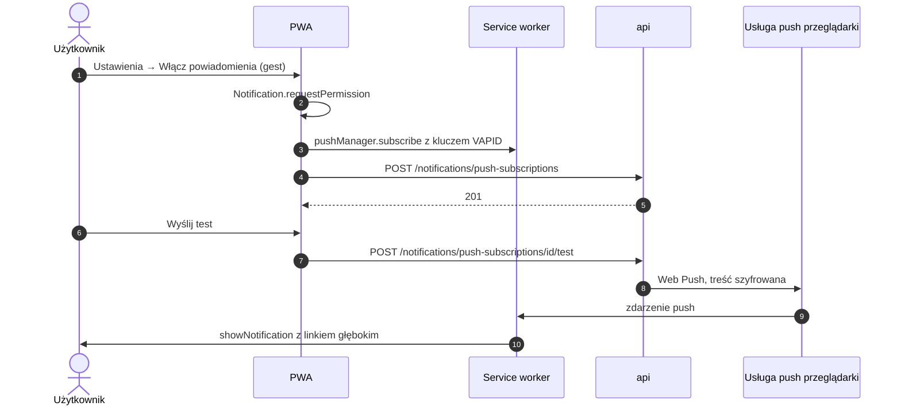

# Strategia mobilna

**Cel:** opisać, jak OligInvest działa na iPhonie (platforma główna), Androidzie i komputerach bez sklepów z aplikacjami i bez kont deweloperskich — jakie możliwości daje PWA na każdej platformie, jak działają instalacja, powiadomienia, linki głębokie, tryb offline i szybkie akcje, oraz jakie są ograniczenia i ryzyka.

Powiązane: [ADR-008](../09-decyzje/ADR-008-pwa-i-integracje-mobilne.md), [`ios-integracje.md`](ios-integracje.md), [`android-integracje.md`](android-integracje.md), [`../04-frontend/architektura-ui.md`](../04-frontend/architektura-ui.md) § 8, [`../02-api/openapi.yaml`](../02-api/openapi.yaml) (tag `quick`), FR-09.01–FR-09.08, NFR-04.01–NFR-04.04.

## 1. Decyzja

- **Jedna aplikacja: PWA** z `apps/web` — instalowana z przeglądarki na iPhonie, Androidzie, Windows i macOS. Bez App Store, Google Play i kont deweloperskich (NFR-04.03, koszt 0 zł).
- **Szybkie akcje bez otwierania aplikacji** — Skróty iOS i HTTP Shortcuts na Androidzie wywołują `/api/v1/quick/*` z tokenem PAT (FR-09.04–FR-09.06).
- **Cała logika po stronie serwera** — PWA i skróty tylko wyświetlają wyniki; obliczenia w `packages/core` i workerze Python (NFR-04.04, NFR-02.06).

## 2. Możliwości platform

| Możliwość | iPhone / iPad (Safari, aplikacja z ekranu początkowego) | Android (Chrome, WebAPK) | Desktop (Chrome/Edge; Safari na macOS) | Zastosowanie w OligInvest |
|---|---|---|---|---|
| Instalacja | ręcznie: Udostępnij → „Do ekranu początkowego” (brak `beforeinstallprompt`) | monit instalacji lub menu → „Zainstaluj aplikację” | Chrome/Edge: ikona instalacji; Safari 17+: Plik → „Dodaj do Docka” | instrukcja w aplikacji dopasowana do platformy (§ 3) |
| Tryb samodzielny (`standalone`) | tak | tak | tak | pełny ekran bez paska przeglądarki |
| Web Push | tak, iOS ≥ 16.4, **tylko po instalacji**, zgoda wyłącznie po geście | tak | tak | alerty (FR-09.03); zapas e-mail (FR-05.06) |
| Plakietka na ikonie (Badging API) | tak (iOS ≥ 16.4, aplikacje z ekranu początkowego) | zależy od launchera (❓) | Chrome/Edge: tak | liczba nieprzeczytanych alertów |
| Skróty w manifeście (przytrzymanie ikony) | nie | tak | Chrome/Edge: tak | „Dodaj transakcję”, „Wynik dnia”, „Alerty” (FR-09.06) |
| Otwieranie linków w zainstalowanej aplikacji | **nie** — linki z poczty, Skrótów i innych aplikacji otwierają Safari | tak (WebAPK rejestruje adresy z zakresu aplikacji) | częściowo (❓ zależne od przeglądarki) | linki z powiadomień push otwierają PWA na każdej platformie (§ 5) |
| Udostępnianie plików do aplikacji (Web Share Target) | nie | tak (❓ do weryfikacji w M4) | ❓ | propozycja: „Udostępnij → OligInvest” dla pliku eksportu XTB (poza zakresem MVP) |
| Pamięć (ciasteczka, IndexedDB, cache) | **oddzielna od Safari**; aplikacje z ekranu początkowego nie podlegają 7-dniowemu limitowi usuwania danych | wspólna z profilem Chrome | wspólna z profilem przeglądarki | na iOS osobne logowanie w Safari i w PWA (§ 8) |
| Praca w tle (Background Sync, Periodic Sync) | nie | ograniczona | ograniczona | **nie używamy** — dane odświeżane przy otwarciu i przez SSE |
| Passkeys (WebAuthn) | tak | tak | tak | FR-07.11 (P3) |
| Wybór pliku do importu | tak (aplikacja Pliki) | tak | tak | import XTB/mBank (FR-03.01) |

Wspierane wersje: Safari iOS/iPadOS ≥ 17, Chrome i Edge (2 ostatnie wersje), Firefox desktop (2 ostatnie), Safari macOS ≥ 17 (NFR-04.01).

## 3. Instalacja

- **Wykrywanie kontekstu:** `matchMedia('(display-mode: standalone)')` i `navigator.standalone` (iOS) rozróżniają przeglądarkę od zainstalowanej aplikacji.
- **iPhone w Safari (niezainstalowana):** baner „Zainstaluj OligInvest, aby otrzymywać powiadomienia” z instrukcją: przycisk Udostępnij → „Do ekranu początkowego” → „Dodaj”. Baner można zamknąć; wraca po 30 dniach.
- **Android i desktop:** przechwycenie `beforeinstallprompt` i własny przycisk „Zainstaluj” w ustawieniach i na ekranie startowym.
- **Ikony:** manifest (192, 512, `maskable`) oraz `apple-touch-icon` 180 × 180 px dla iOS; kolor paska stanu z tokenu `bg` (motyw jasny i ciemny).
- Pierwsze uruchomienie po instalacji na iOS wymaga ponownego zalogowania z TOTP (pamięć odizolowana od Safari).

## 4. Powiadomienia push

Zasady:
1. **Każde zdarzenie push kończy się widocznym powiadomieniem** (`userVisibleOnly`) — Safari może cofnąć subskrypcję, jeśli service worker nie pokaże powiadomienia.
2. Prośba o zgodę **tylko po geście** (przycisk), nigdy przy wejściu na stronę; na iOS przycisk jest aktywny dopiero w zainstalowanej aplikacji (w Safari wyjaśnienie „najpierw zainstaluj”).
3. Treść powiadomienia widoczna na ekranie blokady nie zawiera kwot portfela: alert cenowy podaje kurs i próg („PKO: kurs 58,34 zł poniżej progu 58,50 zł”), alert portfelowy tylko zmianę procentową („Portfel: -3,2% od wczoraj”); kwoty wyłącznie w aplikacji.
4. Brak aktywnej subskrypcji albo 3 nieudane doręczenia → e-mail jako zapas (FR-05.06); alerty bezpieczeństwa zawsze także e-mailem.
5. Każde urządzenie to osobna subskrypcja (lista w `/ustawienia/powiadomienia`); nieważne subskrypcje (HTTP 404/410 z usługi push) usuwane automatycznie.

## 5. Linki głębokie (FR-09.07)

| Źródło linku | iPhone | Android | Desktop |
|---|---|---|---|
| Powiadomienie push | otwiera PWA na właściwym ekranie (`notificationclick` → fokus okna lub `clients.openWindow`) | jw. | jw. |
| E-mail, komunikator | Safari (osobna sesja — może wymagać logowania) | zainstalowana aplikacja (WebAPK) | przeglądarka |
| Skrót iOS / HTTP Shortcuts | Safari | aplikacja | — |

Format: `https://<host>/rynek/<instrumentId>`, `/portfel/rachunki/<accountId>`, `/alerty/<ruleId>`, `/analizy/<runId>`. Własny schemat URL (`oliginvest://`) nie istnieje — PWA nie może go zarejestrować na iOS (zmiana względem planu z Kroku 0, ADR-008).

## 6. Offline i aktualizacje

- Service worker przechowuje wyłącznie zasoby statyczne i stronę `/offline`; odpowiedzi API nie są cache'owane.
- Migawka portfela offline (FR-09.02) tylko po włączeniu w ustawieniach, w IndexedDB, czyszczona przy wylogowaniu ([`architektura-ui.md`](../04-frontend/architektura-ui.md) § 8).
- Nowa wersja aplikacji: komunikat „Dostępna nowa wersja — odśwież”; aktualizacja po geście użytkownika, bez przerywania wpisywania formularza.
- Po powrocie aplikacji z tła (iOS wstrzymuje stronę) — ponowne połączenie SSE z `Last-Event-ID` i odświeżenie danych starszych niż 60 s ([`realtime.md`](../02-api/realtime.md) § 6).

## 7. Szybkie akcje (bez otwierania aplikacji)

| Akcja | Endpoint | Zakres PAT | iOS | Android |
|---|---|---|---|---|
| Pokaż mój portfel | `GET /quick/portfolio?format=text` | `portfolio:read` | Skrót, Siri, widżet Skróty, Centrum sterowania | HTTP Shortcuts: skrót, widżet, kafelek |
| Ile dziś zarobiłem | `GET /quick/today?format=text` | `portfolio:read` | Skrót, Stuknięcie w tył, automatyzacja o 17:15 | kafelek Szybkich ustawień |
| Dodaj transakcję | `POST /quick/transactions` | `transactions:write` | Skrót z pytaniami | skrót z okienkami wyboru |
| Moje alerty | `GET /quick/alerts?format=text` | `alerts:read` | Skrót | skrót |
| Kurs instrumentu | `GET /quick/quote?ticker=…&format=text` | `market:read` | Skrót z pytaniem o ticker | skrót |

Zasady kontraktu: odpowiedzi tekstowe pl-PL zawsze z czasem i statusem danych; kontrakt `/quick/*` zamrożony (tylko zmiany addytywne, NFR-02.05); limity 30 żądań/min i 2 000/dobę na token; osobny token na urządzenie, minimalne zakresy, ważność domyślnie 90 dni.

## 8. Ograniczenia i ryzyka

| Ograniczenie / ryzyko | Skutek | Łagodzenie |
|---|---|---|
| iOS nie otwiera linków w zainstalowanej PWA | link z e-maila otwiera Safari z osobną sesją | e-maile z alertami zawierają krótką treść; baner w Safari „otwórz aplikację z ekranu początkowego” |
| Oddzielna pamięć Safari i PWA na iOS | dwa logowania z TOTP | sesja w PWA długa (odświeżana przy użyciu), Safari traktowany jako awaryjny |
| Brak pracy w tle na iOS | dane widoczne po otwarciu aplikacji, nie wcześniej | SSE + odświeżenie przy powrocie; skróty jako szybki podgląd |
| Doręczalność Web Push nie jest gwarantowana | spóźniony lub utracony alert | e-mail dla alertów krytycznych i bezpieczeństwa; historia alertów w aplikacji |
| Polityka Apple wobec PWA w UE (DMA) | w 2024 r. Apple zapowiedział, a następnie wycofał wyłączenie aplikacji z ekranu początkowego w UE | monitorowanie; plan awaryjny: aplikacja w Safari + e-mail (rejestr ryzyk, Krok 6) |
| OAuth w trybie samodzielnym iOS (FR-07.03, P2) | przekierowanie do dostawcy może wyjść do Safari | test na urządzeniu przed włączeniem flagi `auth.oauth`; logowanie hasłem + TOTP pozostaje domyślne |
| Widżety z danymi zależą od aplikacji zewnętrznych | Scriptable (iOS) bez aktualizacji od 2024-09 | funkcja opcjonalna (FR-09.08, P3); Android: widżety HTTP Shortcuts |

## 9. Testy na urządzeniach

| Poziom | Zakres |
|---|---|
| CI (każdy PR) | Playwright: WebKit i Chromium z emulacją telefonu (360 × 800, 390 × 844), manifest, rejestracja service workera, tryb offline |
| Ręcznie, koniec M4 i M6 | iPhone z najstarszym wspieranym iOS (17) i najnowszym: instalacja, push, plakietka, powrót z tła, Skróty (4 gotowe), Stuknięcie w tył, Centrum sterowania; Android (Chrome, średnia półka): instalacja, skróty w manifeście, linki głębokie, HTTP Shortcuts (widżet, kafelek); Windows i macOS: instalacja, push |
| RUM | Web Vitals z urządzeń użytkowników ([`../04-frontend/wydajnosc.md`](../04-frontend/wydajnosc.md) § 7) |
