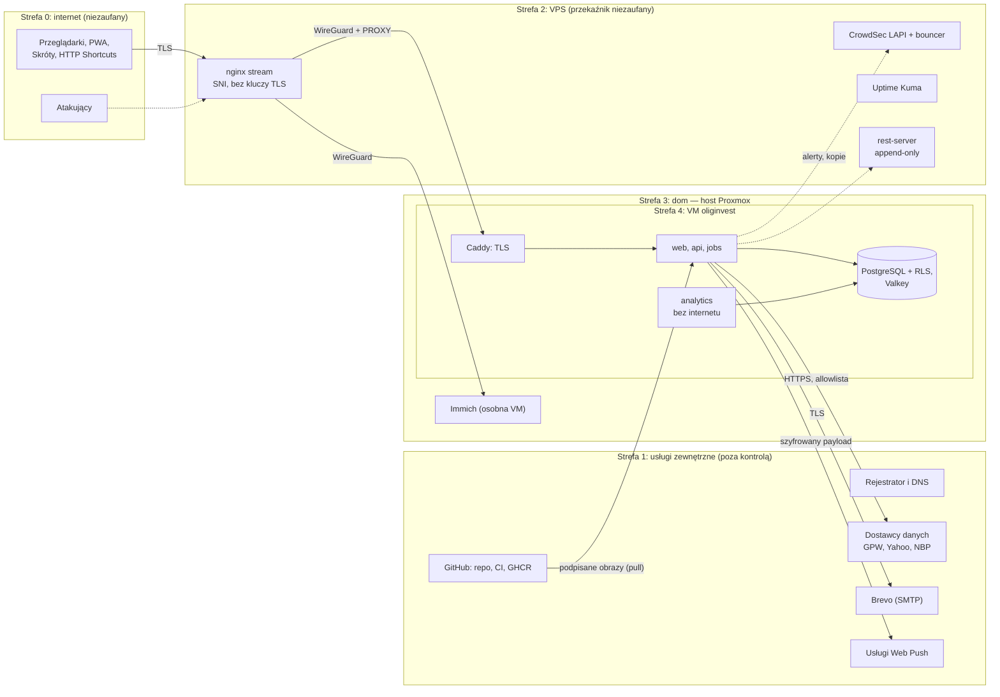

# Model zagrożeń (STRIDE)

**Cel:** zidentyfikować, co w OligInvest trzeba chronić, przed kim i na jakich granicach zaufania, a następnie dla każdego modułu i elementu infrastruktury wymienić zagrożenia STRIDE z kontrolami i oceną ryzyka po ich zastosowaniu — tak, aby priorytety zabezpieczeń wynikały z ryzyka, a nie z listy życzeń (NFR-03.01).

Powiązane: [`kontrole-bezpieczenstwa.md`](kontrole-bezpieczenstwa.md), [`uwierzytelnianie-autoryzacja.md`](uwierzytelnianie-autoryzacja.md), [`prywatnosc-rodo.md`](prywatnosc-rodo.md), [`plan-reagowania.md`](plan-reagowania.md), [`../01-architektura/przeglad-architektury.md`](../01-architektura/przeglad-architektury.md), [`../01-architektura/moduly.md`](../01-architektura/moduly.md), [ADR-011](../09-decyzje/ADR-011-topologia-wdrozenia.md), [ADR-013](../09-decyzje/ADR-013-repozytorium-publiczne.md).

## 1. Zakres i założenia

- **System:** aplikacja webowa (PWA) dla właściciela i kilku zaufanych osób; serwer domowy (Proxmox, VM `oliginvest`) za VPS pełniącym rolę przekaźnika TCP; dane rynkowe z darmowych źródeł; repozytorium publiczne.
- **Założenia:** właściciel jest zarazem administratorem aplikacji i infrastruktury (ma techniczny dostęp do bazy — użytkownicy są o tym informowani, [`prywatnosc-rodo.md`](prywatnosc-rodo.md) § 3); użytkownicy są zaufani, ale ich konta i urządzenia mogą zostać przejęte; urządzenia mają blokadę ekranu; sieć domowa może zawierać niezaufane urządzenia; VPS, dostawca DNS, dostawcy danych i usługi e-mail/push są poza kontrolą właściciela.
- **Poza zakresem:** atakujący z zasobami państwowymi, fizyczne włamanie z przymusem, błędy w sprzęcie i firmware procesora, bezpieczeństwo urządzeń użytkowników poza aplikacją.

## 2. Aktywa

| Aktywo | Dlaczego ważne | Poziom ochrony ([`kontrole-bezpieczenstwa.md`](kontrole-bezpieczenstwa.md) § 1.2) |
|---|---|---|
| Dane finansowe użytkowników (operacje, pozycje, wyceny, pliki importu, dziennik, analizy) | poufność majątku, ryzyko szantażu lub oszustwa | 2 |
| Poświadczenia i sekrety (hasła, TOTP, kody zapasowe, sesje, PAT, klucze serwera, klucze kopii) | przejęcie kont i systemu | 3 |
| Dane osobowe (e-maile, adresy IP, zgody, audyt) | obowiązki RODO | 2 |
| Integralność danych rynkowych i obliczeń | błędne wyceny i alerty prowadzą do złych decyzji | 0 (integralność krytyczna) |
| Dostępność usługi | cel 99 % miesięcznie (NFR-09.01) | — |
| Kopie zapasowe | jedyna droga odtworzenia po awarii lub ataku | 3 |
| Łańcuch budowania (repozytorium, CI, obrazy) | podmiana kodu uruchamianego z dostępem do danych | — |
| Reputacja domeny `oligi.pl` (e-mail, certyfikaty) | phishing w imieniu aplikacji | — |

## 3. Granice zaufania

Granice o największym znaczeniu: **Z0 → Z2** (publiczny ruch), **Z2 → Z4** (niezaufany VPS dostarcza ruch do domu), **Z4 ↔ Z1** (dane od dostawców i łańcuch dostaw wchodzą do strefy z danymi), **aplikacja ↔ baza** (RLS jako ostatnia linia obrony), **api ↔ analytics** (worker bez internetu i bez danych użytkowników).

## 4. Źródła zagrożeń

| Źródło | Motywacja | Możliwości |
|---|---|---|
| Automatyczne skanery i boty | masowe przejmowanie serwerów | skanowanie, znane podatności, stuffing |
| Atakujący celowany (np. znajomy znajomego) | wiedza o majątku, szantaż | phishing, przejęcie skrzynki e-mail lub telefonu |
| Złośliwy pakiet w łańcuchu dostaw | kradzież sekretów, koparki | wykonanie kodu w CI lub na serwerze |
| Operator lub przejęty VPS / DNS | podsłuch, MITM | kontrola ruchu i rekordów, próba wydania certyfikatu |
| Przejęta aplikacja obok (Immich) | ruch boczny | dostęp do sieci domowej |
| Złodziej urządzenia | dane i sesje na telefonie lub laptopie | dostęp fizyczny |
| Wadliwe dane dostawcy | brak (przypadek) | błędne ceny, brak splitów |
| Agent AI budujący kod | brak (błąd) | podatność lub sekret w kodzie |

## 5. Skala oceny ryzyka

- **Prawdopodobieństwo (P):** 1 — rzadkie (wiele warunków lub zaawansowany atakujący), 2 — mało prawdopodobne (raz na kilka lat), 3 — możliwe (raz na rok–dwa), 4 — prawdopodobne (kilka razy w roku), 5 — prawie pewne.
- **Wpływ (W):** 1 — pomijalny, 2 — niski (krótka niedostępność, dane jednego użytkownika bez kwot), 3 — średni (błędne dane lub decyzje, niedostępność kilku dni, dane finansowe jednego użytkownika), 4 — wysoki (dane finansowe wielu osób, przejęcie konta), 5 — krytyczny (przejęcie systemu, utrata wszystkich danych, podsłuch wszystkich).
- **Ryzyko = P × W po kontrolach:** 1–4 niskie (akceptacja), 5–9 średnie (akceptacja z monitoringiem), 10–16 wysokie (działania przed M6), 20–25 krytyczne (blokuje wdrożenie).

Litery STRIDE: **S** podszycie, **T** manipulacja, **R** wyparcie się, **I** ujawnienie informacji, **D** odmowa usługi, **E** podniesienie uprawnień.

## 6. Zagrożenia per obszar

### 6.1 Krawędź: VPS, DNS, TLS

| ID | STRIDE | Zagrożenie | Kontrole | P×W | Ryzyko |
|---|---|---|---|---|---|
| T-EDGE-01 | S, I | Przejęty VPS uzyskuje certyfikat dla `invest.oligi.pl` (ruch ACME przechodzi przez VPS) i wykonuje MITM | CAA z `accounturi` i `validationmethods`; monitoring CT; klucze TLS tylko w domu | 1×5 | 5 średnie |
| T-EDGE-02 | I, T | VPS podsłuchuje lub modyfikuje ruch — przychodzący i wychodzący (ruch homelabu wychodzi przez VPS) | przekazywanie TLS bez terminacji; widoczne tylko metadane (IP, SNI, czas); ruch wychodzący: TLS z weryfikacją certyfikatów, czas z NTS, DNS-over-TLS | 2×2 | 4 niskie |
| T-EDGE-03 | E | Przejęty VPS wysyła ruch w tunelu do usług domowych (SSH, panel Proxmox) | zapora po stronie domu: peer VPS dociera wyłącznie do portu 443 Caddy i proxy Immicha; WireGuard administracyjny kończy się w domu | 2×4 | 8 średnie |
| T-EDGE-04 | S | Sfałszowany adres IP klienta (nagłówek PROXY lub `X-Forwarded-For`) | Caddy przyjmuje PROXY tylko od adresu VPS w tunelu (`fallback_policy reject`); `api` ufa tylko Caddy | 1×2 | 2 niskie |
| T-EDGE-05 | D | DDoS lub nasycenie łącza domowego | limity połączeń na VPS, CrowdSec; brak ochrony wolumetrycznej (0 zł) — akceptowane | 2×3 | 6 średnie |
| T-EDGE-06 | T | Przejęcie konta rejestratora lub DNS | 2FA na koncie, blokada transferu domeny, CAA, monitoring CT, DNSSEC (bezpłatny w home.pl, włączany w M0) | 1×5 | 5 średnie |

### 6.2 identity — konta, logowanie, sesje

| ID | STRIDE | Zagrożenie | Kontrole | P×W | Ryzyko |
|---|---|---|---|---|---|
| T-ID-01 | S | Credential stuffing i zgadywanie haseł | obowiązkowe TOTP, HIBP, limity, narastające opóźnienia, CrowdSec | 2×2 | 4 niskie |
| T-ID-02 | S | Phishing w czasie rzeczywistym (hasło + TOTP przez fałszywą stronę) | e-maile bez linków logowania, e-mail o nowym urządzeniu, step-up dla działań wrażliwych, passkeys (P3) odporne na phishing | 2×4 | 8 średnie |
| T-ID-03 | S | Kradzież lub podrzucenie ciasteczka sesji (XSS, złośliwe rozszerzenie, sąsiednia subdomena) | `HttpOnly`, CSP z nonce, `__Host-`, rotacja przy step-upie, lista sesji ze zdalnym wylogowaniem | 2×4 | 8 średnie |
| T-ID-04 | S | Przechwycenie linku z zaproszeniem | 72 h, jednorazowe, powiązane z e-mailem, token we fragmencie adresu; po rejestracji obowiązkowe TOTP | 1×3 | 3 niskie |
| T-ID-05 | S | Reset hasła z przejętej skrzynki e-mail | reset nie omija TOTP; powiadomienie; unieważnienie sesji | 2×2 | 4 niskie |
| T-ID-06 | I | Enumeracja kont | jednolite odpowiedzi i czasy (logowanie, reset, zaproszenie) | 2×1 | 2 niskie |
| T-ID-07 | I | Wyciek bazy: sekrety TOTP, tokeny sesji, skróty haseł | TOTP zaszyfrowane kluczem spoza bazy; ciasteczko wymaga podpisu HMAC sekretem spoza bazy; Argon2id; szyfrowane kopie | 1×4 | 4 niskie |
| T-ID-08 | E | Obejście bramki MFA (nowa trasa bez middleware, OAuth) | bramka globalna z allowlistą, test wszystkich tras, spike Z-04 przed OAuth | 1×5 | 5 średnie |
| T-ID-09 | E | Podniesienie roli (mass assignment, trasy administracyjne Better Auth) | `.strict()`, rola tylko przez admina ze step-upem, impersonacja wyłączona, audyt | 1×5 | 5 średnie |
| T-ID-10 | R | Użytkownik zaprzecza operacji (np. usunięciu danych) | audyt append-only z `request_id`, IP i klientem | 2×1 | 2 niskie |
| T-ID-11 | D | Złośliwa blokada konta ofiary | wyłącznie blokady czasowe; opóźnienia per konto | 2×2 | 4 niskie |
| T-ID-12 | I, T | Wyciek tokenu PAT (synchronizacja iCloud, eksport HTTP Shortcuts, zgubiony telefon) | minimalne zakresy, osobny token do zapisu, wygasanie, limity, e-mail przy nowej sieci, tylko `/quick/*`, odwołanie jednym kliknięciem | 3×3 | 9 średnie |

### 6.3 notifications

| ID | STRIDE | Zagrożenie | Kontrole | P×W | Ryzyko |
|---|---|---|---|---|---|
| T-NT-01 | I | Kwoty portfela na ekranie blokady i w e-mailach (Brevo widzi treść) | treść bez kwot (decyzja właściciela 2026-09-19) | 2×2 | 4 niskie |
| T-NT-02 | E | SSRF przez adres subskrypcji push wskazujący sieć wewnętrzną | allowlista hostów usług push, HTTPS, bez przekierowań, blokada adresów prywatnych | 1×3 | 3 niskie |
| T-NT-03 | S | Podszywanie się pod e-maile OligInvest | SPF, DKIM, DMARC (`quarantine`, docelowo `reject`); e-maile bez linków z parametrami logowania | 2×3 | 6 średnie |
| T-NT-04 | D | Burza alertów wyczerpuje limit e-maili Brevo | cooldown, deduplikacja, limit per użytkownik, rezerwa kwoty na e-maile bezpieczeństwa | 2×2 | 4 niskie |

### 6.4 market — dane rynkowe

| ID | STRIDE | Zagrożenie | Kontrole | P×W | Ryzyko |
|---|---|---|---|---|---|
| T-MK-01 | T | Błędne lub zmanipulowane dane dostawcy (zła cena, brak splitu) → złe wyceny i alerty | walidacja schematów, bramki jakości (skok bez zdarzenia korporacyjnego → blokada), porównanie źródeł, flaga `stale`, korekta admina | 3×3 | 9 średnie |
| T-MK-02 | S | Podszycie się pod dostawcę (DNS, MITM) | HTTPS z walidacją certyfikatów, allowlista hostów | 1×3 | 3 niskie |
| T-MK-03 | D | Wyczerpanie kwot lub blokada przez dostawcę (Yahoo) | kubki tokenów, cache, circuit breaker, degradacja do EOD, uczciwy User-Agent | 3×2 | 6 średnie |
| T-MK-04 | I | Zapytania do dostawców ujawniają instrumenty posiadane przez użytkowników | zapytania zbiorcze bez identyfikatorów użytkowników | 2×1 | 2 niskie |
| T-MK-05 | T | Złośliwy plik w imporcie notowań (admin) | limity rozmiaru, parser w zadaniu z limitami, bramki jakości, podgląd przed zatwierdzeniem | 1×3 | 3 niskie |
| T-MK-06 | R | Naruszenie licencji danych (redystrybucja) | dane tylko dla zalogowanych, brak publicznych stron z danymi, atrybucje | 2×3 | 6 średnie |

### 6.5 portfolio

| ID | STRIDE | Zagrożenie | Kontrole | P×W | Ryzyko |
|---|---|---|---|---|---|
| T-PF-01 | I | Wyciek danych innego użytkownika przez błąd w kodzie | RLS z `FORCE`, złożone klucze obce, testy izolacji, cudzy zasób → 404, cache i SSE per użytkownik | 1×5 | 5 średnie |
| T-PF-02 | T, D | Złośliwy plik importu (bomba ZIP, XXE, miliony wierszy) | kontrola sygnatury, katalogu ZIP i rozmiarów, parser bez encji zewnętrznych, limity wierszy, czasu i pamięci | 2×3 | 6 średnie |
| T-PF-03 | T | Wstrzyknięcie formuł do eksportu CSV | neutralizacja formuł | 1×3 | 3 niskie |
| T-PF-04 | I | Wyciek przez plik eksportu RODO | step-up, jednorazowe pobranie w 24 h, `no-store`, audyt | 1×4 | 4 niskie |
| T-PF-05 | T | Zduplikowane operacje z ponowień (sieć mobilna, Skróty) | `Idempotency-Key`, deduplikacja importu, ostrzeżenie o duplikacie w `/quick` | 2×2 | 4 niskie |
| T-PF-06 | I | Dane finansowe w pamięci zgubionego urządzenia | `no-store`, brak danych w `localStorage`, migawka tylko na żądanie (30 dni, kasowana przy `401`), `Clear-Site-Data` | 2×3 | 6 średnie |
| T-PF-07 | D | Import lub przeliczenia blokują zasoby | kolejka importu ze współbieżnością 1, limity, deduplikacja zadań | 2×2 | 4 niskie |

### 6.6 analytics

| ID | STRIDE | Zagrożenie | Kontrole | P×W | Ryzyko |
|---|---|---|---|---|---|
| T-AN-01 | E | Złośliwe parametry lub strategia → wykonanie kodu w workerze | strategie jako deklaratywny JSON + JSON Schema, brak `eval`/`pickle`, worker bez internetu i danych użytkowników, kontener bez roota, FS tylko do odczytu | 1×4 | 4 niskie |
| T-AN-02 | D | Kosztowne analizy wyczerpują CPU (Immich obok) | granice parametrów, kwoty ról, współbieżność 1, limity CPU, RAM i czasu, anulowanie | 2×2 | 4 niskie |
| T-AN-03 | T | Wynik zapisany innemu użytkownikowi | worker nie pisze do bazy; `jobs` zapisuje w kontekście właściciela ustalonym przy utworzeniu zadania | 1×4 | 4 niskie |
| T-AN-04 | — (zgodność) | Wynik odebrany jako prognoza lub rekomendacja | rozkłady zamiast wartości punktowych, blok założeń, disclaimery, przegląd metodologiczny (NFR-07) | 2×3 | 6 średnie |

### 6.7 alerts

| ID | STRIDE | Zagrożenie | Kontrole | P×W | Ryzyko |
|---|---|---|---|---|---|
| T-AL-01 | T | Fałszywy alert z błędnych danych | alert podaje źródło i czas danych, histereza, dane `stale` nie wyzwalają alertów cenowych, bramki jakości | 2×3 | 6 średnie |
| T-AL-02 | D | Alert nie dociera (Web Push zawodny na iOS) | e-mail dla alertów krytycznych, historia w aplikacji | 3×2 | 6 średnie |
| T-AL-03 | I | Reguły alertów widoczne dla innych | RLS | 1×2 | 2 niskie |

### 6.8 education

| ID | STRIDE | Zagrożenie | Kontrole | P×W | Ryzyko |
|---|---|---|---|---|---|
| T-ED-01 | I | Tryb demo miesza dane demo z realnymi albo jest publiczny | osobny rachunek typu `demo`, tylko zalogowani, flaga | 1×2 | 2 niskie |
| T-ED-02 | — (jakość) | Błędy merytoryczne w treściach edukacyjnych | przegląd treści, odwołania do wzorów, disclaimery | 2×2 | 4 niskie |

### 6.9 admin

| ID | STRIDE | Zagrożenie | Kontrole | P×W | Ryzyko |
|---|---|---|---|---|---|
| T-AD-01 | E | Przejęcie konta administratora | TOTP, step-up przy każdej mutacji, audyt, e-mail do właściciela po zmianach ról i flag, brak dostępu do danych finansowych przez UI | 1×5 | 5 średnie |
| T-AD-02 | I | Administrator przegląda dane finansowe użytkowników | brak polityk RLS dla admina, panel bez treści zadań, impersonacja wyłączona; dostęp roota do bazy ograniczony organizacyjnie i jawnie opisany w informacji o danych | 2×4 | 8 średnie |
| T-AD-03 | R | Administrator zaprzecza zmianie | audyt append-only kopiowany ciągle poza bazę (WAL) | 1×2 | 2 niskie |
| T-AD-04 | T | Ręczny import notowań zaburza wyceny wszystkich | podgląd przed zatwierdzeniem, bramki jakości, audyt, możliwość wycofania importu | 1×3 | 3 niskie |

### 6.10 quick-actions (PAT)

| ID | STRIDE | Zagrożenie | Kontrole | P×W | Ryzyko |
|---|---|---|---|---|---|
| T-QA-01 | T | Fałszywe transakcje dodane skradzionym tokenem z zakresem `transactions:write` | osobny token do zapisu, limity, e-mail przy nowej sieci, operacje oznaczone `source = quick` i łatwe do usunięcia, audyt | 2×3 | 6 średnie |
| T-QA-02 | D | Pętla automatyzacji | 30 żądań/min i 2 000/dobę na token | 2×1 | 2 niskie |

### 6.11 Infrastruktura: VM, kontenery, baza, kopie

| ID | STRIDE | Zagrożenie | Kontrole | P×W | Ryzyko |
|---|---|---|---|---|---|
| T-INF-01 | E | Ucieczka z kontenera lub przejęcie VM przez podatność | kontenery bez roota, `cap_drop: ALL`, `no-new-privileges`, FS tylko do odczytu, AppArmor i seccomp, aktualizacje | 1×5 | 5 średnie |
| T-INF-02 | E | Ruch boczny z Immicha do OligInvest | osobna VM, zapora Proxmox (tylko 443 z tunelu i SSH od administratora), brak wspólnych sekretów i ciasteczek (`__Host-`) | 2×4 | 8 średnie |
| T-INF-03 | E | Przejęcie hosta Proxmox | panel niewystawiony poza sieć administracyjną, 2FA, aktualizacje, SSH kluczem | 1×5 | 5 średnie |
| T-INF-04 | I | Kradzież serwera lub dysku | kopie szyfrowane; dysk VM nieszyfrowany (restart bez obsługi) — akceptowane decyzją właściciela 2026-09-19 (użytek prywatny); ścieżka włączenia szyfrowania w [`../10-ograniczenia.md`](../10-ograniczenia.md) § 2 | 1×4 | 4 niskie |
| T-INF-05 | D | Awaria sprzętu, zasilania lub łącza (Z-27) | kopie 3-2-1, RTO ≤ 4 h, monitoring z zewnątrz; brak UPS (potwierdzone 2026-09-19) — samoczynny start po zaniku prądu, archiwizacja WAL i sumy kontrolne stron (domyślne w PostgreSQL 18) | 3×3 | 9 średnie |
| T-INF-06 | T, D | Ransomware lub zniszczenie danych na hoście | kopia poza domem w trybie append-only, klucze kopii poza serwerem, test odtworzenia | 1×5 | 5 średnie |
| T-INF-07 | I | Wyciek sekretów z serwera | pliki `0600`, montowanie tylko do właściwego kontenera, redakcja logów, rotacja | 1×4 | 4 niskie |
| T-INF-08 | I, T | Nieuwierzytelniony dostęp do Valkey (treść zadań) | ACL per usługa, sieć wewnętrzna, brak publikacji portów | 1×3 | 3 niskie |
| T-INF-09 | T | Rozjechany zegar (TOTP, znaczniki czasu) | chrony, alert przy odchyłce > 2 s | 2×2 | 4 niskie |

### 6.12 Łańcuch dostaw, CI/CD, repozytorium

| ID | STRIDE | Zagrożenie | Kontrole | P×W | Ryzyko |
|---|---|---|---|---|---|
| T-SC-01 | T, E | Złośliwa zależność npm lub PyPI (przejęte konto opiekuna) | [`kontrole-bezpieczenstwa.md`](kontrole-bezpieczenstwa.md) § 4: opóźnienie wydań, `trustPolicy`, blokada skryptów instalacyjnych, osv-scanner, mało zależności, kontenery bez wyjścia do internetu (`web`, `analytics`) | 2×5 | **10 wysokie** |
| T-SC-02 | I | Sekret w publicznym repozytorium | push protection, skan sekretów, przegląd PR, `.gitignore`, zasady z ADR-013 | 2×4 | 8 średnie |
| T-SC-03 | T | Złośliwy PR lub przejęta akcja GitHub podmienia obraz | akcje przypięte SHA, brak `pull_request_target`, minimalne uprawnienia, podpisy i attestations weryfikowane przy wdrożeniu, wdrożenie ściągane przez serwer | 1×5 | 5 średnie |
| T-SC-04 | E | Przejęcie konta GitHub właściciela | 2FA z kluczem sprzętowym lub passkeyem, ochrona gałęzi, ręczne wdrożenie z weryfikacją wersji | 1×5 | 5 średnie |
| T-SC-05 | I | Rekonesans dzięki publicznej dokumentacji (Z-23) | bezpieczeństwo nie opiera się na ukryciu; brak IP, hostów, portów i konfiguracji VPN w repozytorium | 3×1 | 3 niskie |
| T-SC-06 | T | Agent AI (Codex, Claude) wprowadza podatność lub sekret | przegląd każdego PR przez właściciela, testy bezpieczeństwa w CI, CodeQL, reguły w `AGENTS.md` | 2×3 | 6 średnie |

## 7. Macierz ryzyk (po kontrolach)

| Wpływ ↓ / Prawdopodobieństwo → | 1 rzadkie | 2 mało prawdopodobne | 3 możliwe | 4 prawdopodobne | 5 prawie pewne |
|---|---|---|---|---|---|
| **5 krytyczny** | EDGE-01, EDGE-06, ID-08, ID-09, PF-01, AD-01, INF-01, INF-03, INF-06, SC-03, SC-04 | **SC-01** | — | — | — |
| **4 wysoki** | ID-07, PF-04, AN-01, AN-03, INF-04, INF-07 | EDGE-03, ID-02, ID-03, AD-02, INF-02, SC-02 | — | — | — |
| **3 średni** | ID-04, NT-02, MK-02, MK-05, PF-03, AD-04, INF-08 | EDGE-05, NT-03, MK-06, PF-02, PF-06, AN-04, AL-01, QA-01, SC-06 | ID-12, MK-01, INF-05 | — | — |
| **2 niski** | EDGE-04, AL-03, ED-01, AD-03 | EDGE-02, ID-01, ID-05, ID-11, NT-01, NT-04, PF-05, PF-07, AN-02, ED-02, INF-09 | MK-03, AL-02 | — | — |
| **1 pomijalny** | — | ID-06, ID-10, MK-04, QA-02 | SC-05 | — | — |

Podsumowanie: 65 zagrożeń; po kontrolach 1 wysokie, 31 średnich, 33 niskich; brak krytycznych.

## 8. Ryzyka wymagające uwagi

| Ryzyko | Postępowanie | Kiedy |
|---|---|---|
| **T-SC-01 złośliwa zależność (10)** | konfiguracja pnpm z [`kontrole-bezpieczenstwa.md`](kontrole-bezpieczenstwa.md) § 4.3 od pierwszego commita; minimalizm zależności (NFR-10.05); sieci bez wyjścia dla `web` i `analytics` ograniczają wyciek; kwartalny przegląd drzewa zależności; w rejestrze ryzyk ([`../08-plan/ryzyka.md`](../08-plan/ryzyka.md), R-01) z właścicielem | M0 i stale |
| T-ID-12 / T-QA-01 tokeny PAT | domyślnie tokeny tylko do odczytu; zapis osobnym tokenem; instrukcje w [`../05-mobile/ios-integracje.md`](../05-mobile/ios-integracje.md) § 6 | M4 |
| T-MK-01 dane rynkowe | bramki jakości przed zapisem; porównanie źródeł dla instrumentów z pozycji | M2 |
| T-INF-05 dostępność | kopie i test odtworzenia ([`../07-wdrozenie/backup-dr.md`](../07-wdrozenie/backup-dr.md)); UPS jako koszt w [`../10-ograniczenia.md`](../10-ograniczenia.md) | M1 i M6 |
| T-ID-02, T-ID-03 phishing i sesje | e-mail o nowym urządzeniu (M1), passkeys (P3) | M1, później |
| T-EDGE-03, T-INF-02 ruch boczny | reguły zapory po stronie domu i Proxmoxa przed udostępnieniem aplikacji | M0 |
| T-AD-02 dostęp administratora | jawna informacja w [`prywatnosc-rodo.md`](prywatnosc-rodo.md) § 3; brak narzędzi UI do podglądu danych | M1 |

## 9. Utrzymanie modelu

- Nowy moduł: sekcja STRIDE w § 6 przed scaleniem pierwszego PR modułu (lista kontrolna [`../01-architektura/moduly.md`](../01-architektura/moduly.md) § 8.1, krok 12).
- Zmiana granicy zaufania (nowy dostawca, nowa usługa zewnętrzna, zmiana topologii): aktualizacja § 3 i ocena ryzyk.
- Po każdym incydencie: nowe lub przeszacowane zagrożenia ([`plan-reagowania.md`](plan-reagowania.md) § 8).
- Przegląd całości: koniec każdego etapu (M1–M6) i raz w roku.
