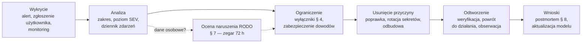

# Plan reagowania na incydenty

**Cel:** dać administratorowi OligInvest gotowy sposób postępowania na wypadek incydentu bezpieczeństwa lub awarii — klasyfikację, wyłączniki awaryjne, playbooki dla najbardziej prawdopodobnych scenariuszy, procedurę oceny i zgłaszania naruszeń ochrony danych (RODO art. 33–34) oraz zasady wyciągania wniosków — tak, aby w stresie działać według listy, a nie improwizować (NFR-03.10).

Powiązane: [`model-zagrozen.md`](model-zagrozen.md) (identyfikatory zagrożeń), [`kontrole-bezpieczenstwa.md`](kontrole-bezpieczenstwa.md) § 5 (zdarzenia i alerty), [`prywatnosc-rodo.md`](prywatnosc-rodo.md) § 10, [`uwierzytelnianie-autoryzacja.md`](uwierzytelnianie-autoryzacja.md) § 9, [`../07-wdrozenie/monitoring.md`](../07-wdrozenie/monitoring.md), [`../07-wdrozenie/backup-dr.md`](../07-wdrozenie/backup-dr.md), [ADR-013](../09-decyzje/ADR-013-repozytorium-publiczne.md). Struktura procesu nawiązuje do [NIST SP 800-61 Rev. 3](https://csrc.nist.gov/pubs/sp/800/61/r3/final) (kwiecień 2025, profil CSF 2.0).

## 1. Założenia

- **Jedna osoba odpowiada za wszystko:** właściciel jest kierującym incydentem, technikiem i osobą kontaktową. Opcjonalnie wskazuje zaufaną osobę zastępczą z zapieczętowaną instrukcją awaryjną (bez dostępu na co dzień).
- **Materiały awaryjne poza systemem** (menedżer haseł właściciela + wydruk w bezpiecznym miejscu): instrukcja „break-glass” (P13), klucze kopii zapasowych, klucz SSH awaryjny, kontakty (OVHcloud, rejestrator domeny, Brevo, GitHub), formularz zgłoszenia naruszenia na stronie UODO, adres zgłoszeń CERT Polska. **Nic z tego nie trafia do repozytorium.**
- **Repozytorium jest publiczne:** szczegóły incydentu nigdy w publicznych issue — wyłącznie prywatne security advisory GitHub (ADR-013).

## 2. Klasyfikacja

| Poziom | Przykłady | Start reakcji | Cel ograniczenia |
|---|---|---|---|
| **SEV1 — krytyczny** | potwierdzony nieuprawniony dostęp do danych finansowych lub sekretów; przejęcie serwera, VPS lub konta administratora; naruszenie RLS z ujawnieniem danych; ransomware; nieuprawniony certyfikat TLS | natychmiast (≤ 1 h) | ≤ 4 h |
| **SEV2 — wysoki** | przejęte konto użytkownika; wyciek tokenu PAT; sekret w repozytorium bez dowodu użycia; złośliwa zależność w lockfile bez wdrożenia; niedostępność > 4 h | ≤ 4 h | ≤ 24 h |
| **SEV3 — średni i niski** | podejrzana aktywność bez skutków, skanowanie, błędne dane rynkowe bez szkody, awaria dostawcy danych | ≤ 24 h | wg potrzeby |

W razie wątpliwości przyjmujemy wyższy poziom i obniżamy go po analizie.

## 3. Przebieg

**Zasady w trakcie:**

1. **Dziennik zdarzeń od pierwszej minuty** — czas (UTC), co zauważono, co zrobiono, kto; w pliku lokalnym poza serwerem objętym incydentem.
2. **Najpierw dowody, potem sprzątanie** — migawka VM w Proxmoxie (z pamięcią, jeśli możliwe), kopia logów (Caddy, aplikacja, system, VPS, CrowdSec) i skróty SHA-256 kopii, zanim cokolwiek zostanie usunięte lub przebudowane.
3. **Ograniczać wąsko** — wyłączyć moduł lub trasę, zanim wyłączy się całą usługę; odciąć VPS, zanim wyłączy się dom.
4. **Nie ufać przejętym systemom** — przejęty host lub VM odbudowuje się z czystego źródła, a nie „czyści”.
5. **Komunikacja z użytkownikami innym kanałem**, jeśli aplikacja lub e-mail mogą być przejęte (telefon, komunikator).

## 4. Wyłączniki awaryjne

| Wyłącznik | Skutek | Jak |
|---|---|---|
| Odcięcie nazwy aplikacji na VPS | `invest.oligi.pl` niedostępne, Immich działa dalej | usunięcie nazwy z mapy SNI w nginx `stream` i przeładowanie |
| Tryb serwisowy | strona 503 z komunikatem, API niedostępne | reguła w Caddy (plik włączany jednym poleceniem) |
| Wyłączenie modułu | moduł znika, trasy zwracają `404` | flaga `module.<id>` w panelu admina lub poleceniem CLI |
| Unieważnienie wszystkich sesji | wszyscy wylogowani (kolejne logowanie z TOTP) | usunięcie wierszy `auth.sessions` poleceniem administracyjnym |
| Odwołanie wszystkich tokenów PAT | Skróty i HTTP Shortcuts przestają działać | wyłączenie kluczy w `auth.api_keys` poleceniem administracyjnym |
| Wstrzymanie kolejek | stop importów, alertów, e-maili i push | pauza kolejek BullMQ (panel `/admin/kolejki` lub CLI) |
| Odcięcie VPS od domu | żaden ruch z VPS nie dociera do domu | usunięcie peera VPS z WireGuard po stronie domu |
| Odcięcie VM od sieci | VM bez sieci, dowody zachowane | odłączenie karty sieciowej VM w Proxmoxie |

Polecenia administracyjne (np. `pnpm admin:revoke-all-sessions`) powstają w M1 w `apps/api` i są opisane w [`../12-dla-uzytkownika/instrukcja-administratora.md`](../12-dla-uzytkownika/instrukcja-administratora.md) § 2; każde zapisuje wpis audytu z aktorem `system` i powodem.

## 5. Kanały wykrywania

Alerty z [`kontrole-bezpieczenstwa.md`](kontrole-bezpieczenstwa.md) § 5.3 i [`../07-wdrozenie/monitoring.md`](../07-wdrozenie/monitoring.md) § 6 (e-mail do administratora), zgłoszenia użytkowników (e-mail o nowym urządzeniu lub resecie, którego nie wykonywali), alerty GitHub (Dependabot, skanowanie sekretów, CodeQL, zgłoszenia prywatne), monitoring Certificate Transparency, decyzje CrowdSec, zgłoszenia od CERT Polska lub dostawców (OVHcloud, Brevo).

## 6. Playbooki

Każdy playbook: **sygnały → pierwsze kroki (ograniczenie) → usunięcie przyczyny i odtworzenie → RODO**. Identyfikatory zagrożeń z [`model-zagrozen.md`](model-zagrozen.md).

### P1. Przejęte konto użytkownika (SEV2; T-ID-01…05, T-ID-03)

- **Sygnały:** użytkownik zgłasza obce logowanie lub reset; alert serii nieudanych logowań; nietypowe operacje lub eksport.
- **Ograniczenie:** unieważnić sesje i tokeny PAT użytkownika; czasowo zablokować konto; skontaktować się z użytkownikiem niezależnym kanałem.
- **Usunięcie i odtworzenie:** po potwierdzeniu tożsamości — reset hasła i 2FA; przegląd audytu konta (eksporty, tokeny, zmiany operacji, zmiany preferencji); przywrócenie zmienionych danych (z historii audytu lub odtworzenia do punktu w czasie na osobnej instancji i selektywnego przeniesienia); odblokowanie.
- **RODO:** jeśli atakujący widział lub pobrał dane — ocena naruszenia (§ 7); użytkownik jest informowany zawsze.

### P2. Przejęte konto administratora (SEV1; T-AD-01)

- **Ograniczenie:** tryb serwisowy; unieważnienie wszystkich sesji administratora; odwołanie wszystkich otwartych zaproszeń.
- **Analiza:** audyt `admin.*` od chwili przejęcia — zmiany ról, blokady, resety 2FA innych kont, flagi, limity, importy notowań, dostawcy.
- **Usunięcie i odtworzenie:** cofnięcie każdej zmiany; reset hasła i 2FA administratora metodą break-glass (P13); jeśli zmieniono dane rynkowe — P11; przegląd, czy przejęcie objęło też serwer (wtedy P7).
- **RODO:** administrator nie ma w UI dostępu do danych finansowych, ale widział listę użytkowników i metadane — ocena naruszenia (§ 7).

### P3. Wyciek sekretu — repozytorium, logi, serwer (SEV2, SEV1 przy dowodzie użycia; T-SC-02, T-INF-07)

- **Zasada:** sekret wypchnięty do publicznego repozytorium jest spalony niezależnie od tego, jak szybko go usunięto — naprawą jest **rotacja**, nie przepisanie historii.
- **Kroki wg rodzaju:** klucze API dostawców i hasło SMTP — unieważnienie w panelu dostawcy i nowy klucz; `BETTER_AUTH_SECRETS` — nowa wersja na początku listy, zadanie ponownego szyfrowania, usunięcie starej wersji, unieważnienie wszystkich sesji; hasła ról bazy i Valkey — zmiana i restart usług; klucz VAPID — nowy klucz i prośba do użytkowników o ponowne włączenie powiadomień; hasła kopii — nowe klucze repozytoriów (`restic key add/remove`, nowe repozytorium pgBackRest); klucze WireGuard i SSH — nowe pary.
- **Analiza:** logi dostawców i aplikacji pod kątem użycia sekretu od chwili wycieku.
- **RODO:** ocena, jeśli sekret dawał dostęp do danych osobowych.

### P4. Utracony telefon lub wyciek tokenu PAT (SEV2; T-ID-12, T-QA-01)

- **Użytkownik sam:** w ustawieniach odwołuje tokeny i sesje innych urządzeń; w razie potrzeby zmienia hasło; nowe urządzenie TOTP kodem zapasowym.
- **Administrator:** na prośbę odwołuje tokeny i sesje; sprawdza audyt `pat.*` i operacje ze `source = quick` od chwili utraty; fałszywe operacje usuwa (przeliczenie portfela automatycznie).
- **RODO:** jeśli token z zakresem odczytu był użyty przez obcą osobę — ocena naruszenia.

### P5. Wyciek bazy danych lub kopii zapasowej (SEV1; T-ID-07, T-PF-01)

- **Sygnały:** alert naruszenia RLS, nietypowe zapytania w logach bazy, informacja z zewnątrz, utrata nośnika z kopią.
- **Ograniczenie:** tryb serwisowy przy aktywnym wycieku; zamknięcie luki (poprawka, wyłączenie modułu).
- **Usunięcie i odtworzenie:** unieważnienie wszystkich sesji i tokenów PAT; rotacja `BETTER_AUTH_SECRETS`; jeśli wyciek objął bazę **i** sekrety serwera — wymuszenie nowej konfiguracji TOTP i zmiany haseł przez wszystkich użytkowników; przegląd dostępu do kopii (klucze repozytoriów, dostęp do VPS).
- **Kopia skradziona bez kluczy:** kopie są zaszyfrowane, a klucze przechowywane oddzielnie — zwykle brak ryzyka dla osób (art. 34 ust. 3 lit. a), wpis w rejestrze naruszeń i rotacja kluczy repozytorium.
- **RODO:** wyciek danych finansowych = wysokie ryzyko → zgłoszenie do UODO w 72 h i zawiadomienie użytkowników (§ 7).

### P6. Kompromitacja VPS (SEV1; T-EDGE-01…03)

- **Sygnały:** nieznane procesy lub konta, zmiany konfiguracji nginx lub WireGuard, alert CT, nietypowy ruch w tunelu, informacja od OVHcloud.
- **Ograniczenie:** odcięcie VPS od domu (usunięcie peera po stronie domu) — aplikacja i Immich chwilowo niedostępne.
- **Usunięcie i odtworzenie:** reinstalacja VPS z czystego obrazu, nowe klucze WireGuard, nowe hasło rest-server i nowe repozytorium kopii poza domem (napastnik z rootem na VPS mógł usunąć kopie mimo trybu append-only — lokalne kopie na HDD pozostają źródłem); sprawdzenie CT i rekordów CAA/DNS; ponowne zestawienie tunelu.
- **Ocena:** przy przekazywaniu TLS bez terminacji treść ruchu pozostaje poufna, chyba że wydano nieuprawniony certyfikat (P12). Ujawnione metadane (adresy IP) — zwykle niskie ryzyko, wpis w rejestrze naruszeń.

### P7. Kompromitacja hosta Proxmox lub Immicha — ruch boczny (SEV1; T-INF-02, T-INF-03)

- **Ograniczenie:** wyłączenie VM Immicha; odcięcie VPS od domu; migawki dowodowe.
- **Analiza:** czy napastnik dotarł do VM `oliginvest` (nowe konta, klucze SSH, zmienione obrazy — porównanie digestów z podpisanymi wydaniami, zmiany w plikach sekretów).
- **Usunięcie i odtworzenie:** przy przejętym hoście — reinstalacja Proxmoxa, odbudowa VM z czystego obrazu, odtworzenie bazy z kopii sprzed incydentu ([`../07-wdrozenie/backup-dr.md`](../07-wdrozenie/backup-dr.md) procedura C), rotacja wszystkich sekretów (P3).
- **RODO:** ocena wg ustaleń analizy (§ 7).

### P8. Ransomware lub zniszczenie danych (SEV1; T-INF-06)

- **Ograniczenie:** natychmiastowe odłączenie hosta od sieci; nie wyłączać zasilania przed zabezpieczeniem dowodów, jeśli to możliwe; nie płacić okupu.
- **Odtworzenie:** czysty host i VM; baza z kopii lokalnej (jeśli nietknięta) albo z repozytorium poza domem (append-only) lub z kopii offline właściciela; weryfikacja integralności i test aplikacji; rotacja sekretów.
- **RODO:** ransomware często wynosi dane przed zaszyfrowaniem — przy braku dowodów przeciwnych traktujemy jak wyciek (P5).

### P9. Złośliwa zależność (SEV2, SEV1 po wdrożeniu; T-SC-01)

- **Sygnały:** alert „malicious package” (Dependabot, osv-scanner), informacja publiczna o przejętym pakiecie.
- **Analiza:** czy wersja jest w lockfile i czy trafiła do wdrożonych obrazów (SBOM wydań).
- **Tylko w CI lub lockfile:** usunięcie lub przypięcie bezpiecznej wersji, przebudowa, przegląd logów CI (runnery GitHub są efemeryczne, a CI nie ma sekretów poza tokenem zadania).
- **Wdrożona:** traktować jak przejęcie VM (P7 bez hosta): odbudowa z poprawionych obrazów, rotacja sekretów, analiza ruchu wychodzącego (sieci `web` i `analytics` nie mają wyjścia do internetu, `api` i `jobs` — tylko allowlista).

### P10. DDoS lub nasycenie łącza (SEV3, SEV2 przy niedostępności > 4 h; T-EDGE-05)

- Blokady CrowdSec i limity połączeń na VPS; przy nasyceniu łącza domowego — czasowe odcięcie nazwy aplikacji na VPS, żeby chronić łącze i Immicha; kontakt z OVHcloud w sprawie ochrony po ich stronie; akceptujemy niedostępność (0 zł, Z-27).

### P11. Błędne dane rynkowe i integralność obliczeń (SEV3, SEV2 przy błędnych alertach; T-MK-01, T-AL-01)

- Oznaczenie instrumentów jako wstrzymanych (flaga `stale`, wyłączenie z wycen i alertów); korekta danych (import ręczny, zdarzenie korporacyjne); przeliczenie wycen i ponowna ewaluacja alertów; komunikat w aplikacji dla użytkowników, którzy dostali alert na błędnych danych; nowa reguła jakości danych w postmortemie.

### P12. Nieuprawniony certyfikat TLS (SEV1; T-EDGE-01, T-EDGE-06)

- **Sygnał:** alert monitoringu CT o certyfikacie spoza listy znanych numerów seryjnych.
- **Kroki:** sprawdzenie, czy certyfikat nie pochodzi z własnego odnowienia; jeśli nie — sprawdzenie rekordów CAA i DNS (przejęcie DNS — konto rejestratora) oraz VPS (P6); unieważnienie certyfikatu u wystawcy (ACME pozwala unieważnić certyfikat po wykazaniu kontroli nad domeną); rotacja kluczy TLS i konta ACME; ostrzeżenie użytkowników przed phishingiem.

### P13. Administrator bez dostępu — break-glass (SEV2)

- **Sytuacja:** utracone TOTP i kody zapasowe administratora albo brak konta z rolą admin.
- **Procedura:** logowanie SSH do VM kluczem awaryjnym (albo konsola VM w Proxmoxie z sieci domowej) → polecenie administracyjne w kontenerze `api` resetujące 2FA wskazanego konta (wpis audytu z aktorem `system` i powodem `break-glass`, e-mail na adres konta) → logowanie i nowa konfiguracja TOTP → nowe kody zapasowe do menedżera haseł.
- **Brak klucza SSH:** fizyczny dostęp do serwera i konsola Proxmoxa. Instrukcja krok po kroku jest w materiałach awaryjnych (§ 1), nie w repozytorium.

### P14. Alert naruszenia RLS lub wyciek między użytkownikami (SEV1; T-PF-01)

- Błąd `42501` przy zapisie oznacza zablokowaną próbę — RLS zadziałało, ale kod ma błąd: wyłączenie modułu flagą, poprawka, test regresji w `testy-rls.sql`.
- Podejrzenie wycieku poza bazą (cache, SSE, eksport, logi): tryb serwisowy lub wyłączenie funkcji, analiza logów `request_id`, ustalenie, czyje dane komu pokazano → ocena naruszenia (§ 7) i informacja dla obu stron.

## 7. Naruszenie ochrony danych osobowych (RODO art. 33–34)

1. **Stwierdzenie naruszenia** (utrata poufności, integralności lub dostępności danych osobowych) uruchamia zegar **72 godzin** na zgłoszenie do Prezesa UODO.
2. **Ocena ryzyka dla osób:** rodzaj danych (finansowe = poważne), liczba osób, czy dane były zaszyfrowane z bezpiecznymi kluczami, czy możliwe są szkody (oszustwo, szantaż, kradzież tożsamości), czy dane odzyskano.

| Wynik oceny | Działanie | Przykłady w OligInvest |
|---|---|---|
| Brak ryzyka | wpis w wewnętrznym rejestrze naruszeń | kradzież zaszyfrowanej kopii przy bezpiecznych kluczach; niedostępność < 1 dnia bez utraty danych |
| Ryzyko | rejestr + zgłoszenie do UODO w 72 h | przejęcie konta jednego użytkownika z wglądem w dane; wyciek adresów e-mail |
| Wysokie ryzyko | rejestr + UODO w 72 h + zawiadomienie użytkowników bez zbędnej zwłoki | wyciek bazy z danymi finansowymi; dostęp do eksportu RODO przez obcą osobę |

3. **Zgłoszenie do UODO** (formularz na stronie urzędu) zawiera co najmniej (art. 33 ust. 3): charakter naruszenia, kategorie i przybliżoną liczbę osób i wpisów; dane kontaktowe administratora; możliwe konsekwencje; środki zastosowane lub proponowane. Brak pełnych informacji nie wstrzymuje zgłoszenia — uzupełnia się je etapami.
4. **Zawiadomienie użytkowników** (art. 34): prostym językiem — co się stało, jakie dane, możliwe skutki, co zrobiliśmy, co użytkownik powinien zrobić (np. zmiana hasła, czujność na phishing, kontakt z brokerem), kontakt do administratora.
5. **Rejestr naruszeń** (art. 33 ust. 5) — prowadzony poza publicznym repozytorium (dokument w menedżerze haseł lub zaszyfrowany plik administratora): data, opis, ocena, decyzja o zgłoszeniu z uzasadnieniem, działania.

**Szablon zawiadomienia użytkownika:**

> Temat: Ważna informacja o bezpieczeństwie Twojego konta OligInvest
> {DATA} stwierdziliśmy {OPIS NARUSZENIA}. Dotyczy to {KATEGORIE DANYCH}. Możliwe skutki: {SKUTKI}. Zrobiliśmy: {DZIAŁANIA}. Prosimy: {ZALECENIA DLA UŻYTKOWNIKA}. Zgłosiliśmy naruszenie Prezesowi UODO {TAK/NIE — DLACZEGO}. Pytania: {KONTAKT}.

## 8. Po incydencie

- **Postmortem bez szukania winnych** w ciągu 7 dni od zamknięcia (dla SEV1 i SEV2): oś czasu, przyczyna źródłowa (pięć „dlaczego”), wpływ (osoby, dane, czas niedostępności), co zadziałało, co nie, działania naprawcze z terminami.
- **Aktualizacje:** model zagrożeń (nowe lub przeszacowane zagrożenia), testy regresji, dokumentacja, ADR przy zmianie decyzji, ten plan.
- **Przechowywanie:** postmortem w prywatnym miejscu; do repozytorium publicznego trafia wyłącznie ogólny opis zmian bez szczegółów podatności — po wdrożeniu poprawek.

## 9. Ćwiczenia

| Ćwiczenie | Częstotliwość | Zakres |
|---|---|---|
| Ćwiczenie „przy stole” | 2 razy w roku | na zmianę: P3 (wyciek sekretu), P5 (wyciek bazy z oceną RODO i zegarem 72 h), P6 (VPS), P13 (break-glass) |
| Test wyłączników z § 4 | raz w roku, po większych zmianach infrastruktury | każdy wyłącznik uruchomiony i cofnięty na środowisku produkcyjnym w oknie serwisowym |
| Test odtwarzania z kopii | co kwartał | [`../07-wdrozenie/backup-dr.md`](../07-wdrozenie/backup-dr.md) § 8 |
| Przegląd materiałów awaryjnych | raz w roku | aktualność kluczy, kontaktów i instrukcji |
