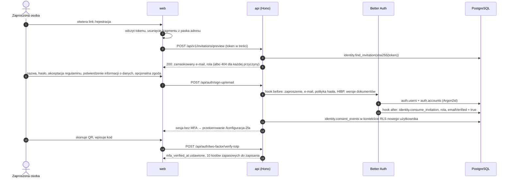
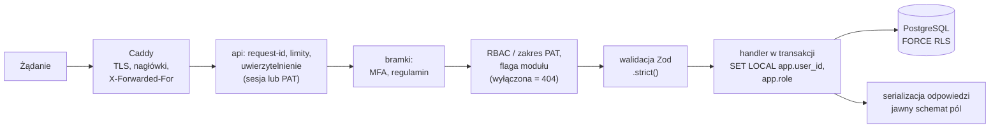

# Uwierzytelnianie i autoryzacja

**Cel:** opisać, kto i jak loguje się do OligInvest (ścieżki uwierzytelniania, hasła, 2FA, sesje, step-up, tokeny PAT, odzyskiwanie konta) oraz jak system decyduje, do czego zalogowany podmiot ma dostęp (RBAC, flagi, RLS, dostęp do pól) — z parametrami na tyle konkretnymi, żeby dało się je zaimplementować w Better Auth i przetestować.

Powiązane: [ADR-004](../09-decyzje/ADR-004-postgres-better-auth-rls.md), [`../02-api/konwencje-api.md`](../02-api/konwencje-api.md) § 2, [`../01-architektura/moduly.md`](../01-architektura/moduly.md) § 6, [`../01-architektura/przeplywy-danych.md`](../01-architektura/przeplywy-danych.md) § 1, [`../03-dane/schema.sql`](../03-dane/schema.sql), [`kontrole-bezpieczenstwa.md`](kontrole-bezpieczenstwa.md) (mapowanie ASVS), [`model-zagrozen.md`](model-zagrozen.md). Wymagania: FR-07.01–FR-07.12, FR-08.01–FR-08.02, NFR-03.02–NFR-03.05.

Wersje i fakty o Better Auth sprawdzone 2026-09-19 w dokumentacji v1.6.23 i w kodzie źródłowym (gałąź `main`): nazwy ciasteczek, szyfrowanie sekretów TOTP (XChaCha20-Poly1305), wersjonowane sekrety `BETTER_AUTH_SECRETS`, domyślne przechowywanie kodów zapasowych jawnym tekstem, token sesji `generateId(32)` zapisywany w bazie bez haszowania.

## 1. Ścieżki uwierzytelniania (ASVS V6.1.3, V6.3.4)

| Ścieżka | Czynniki | Gdzie działa | Status |
|---|---|---|---|
| Hasło + TOTP | wiedza + posiadanie | przeglądarka, PWA | MVP (FR-07.02, FR-07.04) |
| Hasło + kod zapasowy | wiedza + posiadanie (kod jednorazowy) | awaryjnie, gdy brak telefonu | MVP |
| OAuth Google/GitHub + TOTP | konto dostawcy + posiadanie | za flagą `auth.oauth` | P2 (FR-07.03, Z-04) |
| Passkey (WebAuthn) | posiadanie + biometria/PIN urządzenia | za flagą `auth.passkeys` | P3 (FR-07.11) |
| Token PAT | posiadanie sekretu | wyłącznie `/api/v1/quick/*` | M4 (FR-07.07) |

**Ścieżki zablokowane** (hook Better Auth zwraca `403`, test w CI wylicza wszystkie trasy biblioteki i sprawdza blokadę): rejestracja bez zaproszenia, logowanie linkiem magicznym i kodem e-mail, logowanie anonimowe, logowanie numerem telefonu, `/two-factor/disable`, „zaufane urządzenie” pomijające TOTP (`trustDevice`), impersonacja (wtyczka `admin`).

Każda sesja, niezależnie od ścieżki, przechodzi przez **bramkę MFA** (`auth.sessions.mfa_verified_at IS NOT NULL`), a potem przez **bramkę regulaminu** (FR-07.12). Tylko sesja po obu bramkach ma dostęp do danych.

### 1.1 Rejestracja z zaproszenia



Posiadanie linku wysłanego na adres z zaproszenia dowodzi kontroli nad skrzynką, więc konto startuje z `emailVerified = true` (FR-07.02). Jeśli zapis zgód się nie powiedzie, bramka regulaminu poprosi o akceptację przy pierwszym logowaniu — stan domyślny jest bezpieczny.

## 2. Hasła (ASVS V6.2, NFR-03.02)

| Reguła | Wartość |
|---|---|
| Długość | 12–128 znaków (FR-07.02); pełny ciąg UTF-8 bez przycinania i zmiany wielkości liter |
| Reguły składu | brak (bez wymogu cyfr, wielkich liter, znaków specjalnych) |
| Popularne hasła | lista 10 000 najpopularniejszych haseł w repozytorium (plik danych, sprawdzenie offline) |
| Słowa kontekstowe | `oliginvest`, `oligi`, `invest`, `inwestycje`, `portfel`, `xtb`, `mbank`, `emakler`, `gpw`, lokalna część adresu e-mail, nazwa użytkownika — także z cyframi na końcu (ASVS V6.1.2, V6.2.11) |
| Wycieki | wtyczka `haveIBeenPwned` — do usługi trafia 5 pierwszych znaków skrótu SHA-1 (k-anonimowość); przy niedostępności usługi obowiązuje sprawdzenie offline i wpis w logu (brak blokady rejestracji) |
| Rotacja | brak okresowej zmiany; zmiana wymuszana tylko po wykryciu wycieku |
| Wklejanie, menedżery haseł | dozwolone; pola `type=password` z przyciskiem podglądu; `autocomplete="new-password"`/`current-password` |
| Zmiana hasła | wymaga bieżącego hasła; domyślnie wylogowuje inne urządzenia; e-mail z powiadomieniem |

**Haszowanie:** Argon2id przez `@node-rs/argon2` (Better Auth domyślnie używa scrypt — zastępujemy własnymi funkcjami `hash`/`verify`). Parametry wg OWASP Password Storage Cheat Sheet: **m = 19 MiB (19 456 KiB), t = 2, p = 1**. Parametry są zapisane w samym skrócie (format PHC), więc ich podniesienie działa bez migracji: przy udanym logowaniu `api` sprawdza, czy skrót używa bieżących parametrów, i w razie potrzeby haszuje ponownie. Wybór m = 19 MiB, a nie większy, wynika z limitu pamięci kontenera `api` (384 MB) przy kilku równoczesnych logowaniach. **Bez „pieprzu” (pepper):** obowiązkowe TOTP z sekretem zaszyfrowanym kluczem spoza bazy sprawia, że sam wyciek bazy nie daje dostępu do kont; pieprz dołożyłby klucz bez możliwości rotacji bez resetu haseł.

## 3. Ochrona przed zgadywaniem i credential stuffing (ASVS V6.1.1, V6.3.1)

| Warstwa | Mechanizm | Parametry startowe |
|---|---|---|
| Krawędź | CrowdSec: scenariusze skanowania i ataków słownikowych na podstawie logów Caddy | blokada adresu na VPS (nftables) na 4 h |
| Adres IP | limiter Better Auth na trasach logowania, resetu i 2FA | 5 / min i 20 / h na IP (konwencje API § 7) |
| Konto | narastające opóźnienie odpowiedzi po nieudanych próbach na to samo konto (niezależnie od IP) | 0 s, 1 s, 2 s, 4 s… do 30 s; zerowane po udanym logowaniu |
| Drugi czynnik | licznik nieudanych kodów TOTP i blokada czasowa (Better Auth `failedVerificationCount`, `lockedUntil`) | 5 błędnych kodów → 15 min |
| Powiadomienie | e-mail do właściciela konta po serii nieudanych prób | ≥ 5 w 15 min, maks. 1 e-mail na godzinę |

**Brak trwałej blokady konta:** atakujący znający e-mail nie może zablokować właściciela na stałe — opóźnienia i blokady są czasowe, a hasło bez TOTP i tak nic nie daje. **Jednolite odpowiedzi:** logowanie, reset hasła i podgląd zaproszenia zwracają tę samą treść i porównywalny czas odpowiedzi niezależnie od istnienia konta (weryfikacja hasła wykonywana także dla nieistniejącego konta na stałym skrócie). CAPTCHA nie jest używana — wymagałaby usługi zewnętrznej, a obowiązkowe TOTP odbiera stuffingowi sens.

## 4. Sesje (ASVS V7, NFR-03.03)

| Parametr | Wartość | Uzasadnienie |
|---|---|---|
| Rodzaj | token referencyjny w bazie (`auth.sessions`), ciasteczko podpisane HMAC-SHA-256 sekretem serwera | unieważnienie działa natychmiast; sam wyciek bazy nie pozwala podrobić ciasteczka bez sekretu |
| Entropia tokenu | 32 znaki z generatora kryptograficznego (ok. 190 bitów) | ASVS V7.2.3 (≥ 128 bitów) |
| Ciasteczko | `__Host-oliginvest.session_token`; `HttpOnly`, `Secure`, `SameSite=Lax`, `Path=/`, bez `Domain` | § 4.1 |
| Bezczynność | 7 dni (termin przesuwany najwyżej raz na 24 h — Better Auth `expiresIn` + `updateAge`) | wygoda w PWA na telefonie; § 4.2 |
| Maksymalny czas życia | 30 dni od utworzenia (kontrola `createdAt` w `api`), potem logowanie z TOTP | ASVS V7.3.2 |
| Bez „zapamiętaj mnie” | ciasteczko sesyjne, sesja ważna 1 dzień | komputery współdzielone |
| Pamięć sesji w ciasteczku (`cookieCache`) | **wyłączona** | brak tokenów samowystarczalnych; odwołanie sesji działa od następnego żądania |
| Równoległe sesje | maks. 10 na konto; przy przekroczeniu najstarsza jest unieważniana, a właściciel dostaje e-mail | ASVS V7.1.2 |
| Nowy token | po logowaniu, po weryfikacji 2FA i po step-upie (rotacja) | ASVS V7.2.4 |
| Unieważnienie | wylogowanie, „wyloguj wszędzie”, zmiana hasła, reset hasła, reset 2FA, zmiana roli, blokada i usunięcie konta; otwarte strumienie SSE zamykane w ≤ 30 s | FR-07.05, FR-08.02 (≤ 60 s) |
| Lista urządzeń | przeglądarka, system, przybliżony adres IP, czas utworzenia i ostatniej aktywności; zamknięcie sesji wymaga step-upu | ASVS V7.5.2 |
| Wylogowanie | `Clear-Site-Data: "cache", "cookies", "storage"` + czyszczenie po stronie klienta | ASVS V14.3.1 |

### 4.1 Przedrostek `__Host-`

Przedrostek `__Host-` gwarantuje, że ciasteczka nie ustawi ani nie nadpisze sąsiednia subdomena `oligi.pl` (np. przejęty Immich) — bez niego możliwe jest „podrzucenie” ciasteczka sesji atakującego. Better Auth przy bezpiecznych ciasteczkach zawsze dokleja `__Secure-` do nazwy (sprawdzone w `createCookieGetter`), więc potrzebne jest obejście, które spike w M0 musi potwierdzić testem:

```ts
// apps/api/src/auth/config.ts — fragment ilustracyjny (spike M0)
advanced: {
  useSecureCookies: false, // wyłącza automatyczne doklejanie "__Secure-" do nazw
  defaultCookieAttributes: { secure: true, httpOnly: true, sameSite: "lax", path: "/" },
  cookies: {
    session_token: { name: "__Host-oliginvest.session_token" },
    dont_remember: { name: "__Host-oliginvest.dont_remember" },
    two_factor: { name: "__Host-oliginvest.two_factor" },
  },
  ipAddress: { ipAddressHeaders: ["x-forwarded-for"], trustedProxies: ["<CADDY_NET_CIDR>"] },
},
session: { expiresIn: 60 * 60 * 24 * 7, updateAge: 60 * 60 * 24, cookieCache: { enabled: false } },
```

Kryterium spiku: test e2e sprawdza, że każdy `Set-Cookie` z `api` ma przedrostek `__Host-`, atrybut `Secure`, `Path=/` i nie ma `Domain`, a logowanie, 2FA i wylogowanie działają. Jeśli obejście okaże się nietrwałe (np. zmiana w bibliotece), wracamy do `__Secure-oliginvest.session_token` i odstępstwo O-01 z [`kontrole-bezpieczenstwa.md`](kontrole-bezpieczenstwa.md) § 8 pozostaje otwarte.

### 4.2 Czas życia sesji a NIST SP 800-63B-4

NIST SP 800-63B-4 (wersja finalna z 2025 r.) zaleca dla AAL2 czas życia sesji nie dłuższy niż 24 h i limit bezczynności nie dłuższy niż 1 h (zalecenia „SHOULD”). OligInvest świadomie odchodzi od tych wartości (7 dni bezczynności, 30 dni maksymalnie), bo główny klient to zainstalowana PWA na prywatnym telefonie, a codzienne wpisywanie TOTP zniechęca do używania aplikacji. Środki kompensujące: obowiązkowe TOTP przy każdym logowaniu, step-up ≤ 15 min dla działań wrażliwych, brak danych finansowych w pamięci przeglądarki (poza migawką na żądanie), lista urządzeń ze zdalnym wylogowaniem, e-mail o logowaniu z nowego urządzenia, sesja 1-dniowa bez „zapamiętaj mnie”. Plan powrotu: po wdrożeniu passkeys (FR-07.11) — „odblokowanie Face ID” po 1 h bezczynności bez zmiany długości sesji.

## 5. Uwierzytelnianie dwuskładnikowe (FR-07.04)

| Element | Rozwiązanie |
|---|---|
| Algorytm | TOTP RFC 6238, HMAC-SHA-1 (wymóg zgodności z aplikacjami uwierzytelniającymi), 6 cyfr, okres 30 s |
| Tolerancja zegara | bieżący krok i jeden krok wstecz; czas serwera synchronizowany przez chrony (alert przy odchyłce > 2 s) |
| Jednorazowość (ASVS V6.5.1) | ostatni zaakceptowany krok czasowy per użytkownik w `valkey-queue` (bez wypierania, AOF), klucz z TTL 120 s — ponowne użycie tego samego kodu jest odrzucane |
| Sekret | 32 znaki losowe; w bazie zaszyfrowany XChaCha20-Poly1305 kluczem z `BETTER_AUTH_SECRETS` (koperta z numerem wersji klucza) |
| Konfiguracja | obowiązkowa przed dostępem do danych (bramka MFA); kod QR + sekret do ręcznego wpisania; aktywacja po poprawnym kodzie |
| Zmiana urządzenia | ponowne `two-factor/enable`: hasło + step-up (pełne ponowne uwierzytelnienie — ASVS V7.5.1), potem propozycja wylogowania innych urządzeń |
| Wyłączenie 2FA | niemożliwe (trasa zablokowana) |
| Kody zapasowe | 10 kodów po 10 znaków, **jawnie ustawione `storeBackupCodes: "encrypted"`** (domyślnie Better Auth zapisuje je jawnym tekstem); zużycie atomowe (warunkowy UPDATE); nowy komplet wymaga step-upu i unieważnia poprzedni; odstępstwo od haszowania — O-02 |
| Blokada | 5 błędnych kodów → 15 min (licznik w `auth.two_factors`) + e-mail |
| „Zaufane urządzenie” | wyłączone — każde logowanie wymaga drugiego czynnika |

## 6. Step-up — świeża weryfikacja (FR-07.04, ASVS V7.5)

**Działania wymagające kodu TOTP sprzed ≤ 15 min:** tworzenie tokenu PAT, eksport danych RODO i jego pobranie, usunięcie konta i rachunku, nowe kody zapasowe, zmiana urządzenia TOTP, wylogowanie innych urządzeń i zamknięcie sesji, wszystkie mutacje w panelu admina (zmiana roli, blokada, reset 2FA, zaproszenia, flagi, limity, dostawcy, eksport audytu).

Mechanizm: `POST /api/v1/me/step-up` z kodem → `auth.sessions.mfa_verified_at = now()` i **rotacja tokenu sesji** (nowe ciasteczko, stary token unieważniony). Brak świeżej weryfikacji → `403 STEP_UP_REQUIRED`; UI pokazuje okno z kodem i ponawia żądanie. Kod użyty do step-upu podlega tej samej ochronie przed powtórką i blokadzie co logowanie.

## 7. Tokeny PAT (FR-07.07, Z-17)

| Element | Rozwiązanie |
|---|---|
| Format | `oli_pat_` + ≥ 256 bitów losowych (base62); pokazywany raz, potem tylko początek (`start`) |
| Przechowywanie | skrót SHA-256 (wtyczka `@better-auth/api-key`); tokeny o entropii ≥ 112 bitów nie wymagają funkcji haszującej hasła (ASVS V6.5.2) |
| Zakresy | `portfolio:read`, `transactions:write`, `alerts:read`, `market:read`; brak zakresu → `403 PAT_SCOPE_MISSING` |
| Gdzie działa | wyłącznie `/api/v1/quick/*`; nie otwiera stron, SSE ani innych tras API; nie może zarządzać tokenami ani kontem |
| Ważność | domyślnie 90 dni, maks. 365; przypomnienie e-mail 7 dni przed wygaśnięciem |
| Limity | 30 żądań/min i 2 000/dobę na token; maks. 5 aktywnych tokenów na konto (konfigurowalne w `role_limits`) |
| Utworzenie | tylko z sesji po step-upie; wpis audytu |
| Nadzór | ostatnie użycie i przybliżony adres; pierwsze użycie z nowej sieci (prefiks /24 IPv4 lub /48 IPv6) → e-mail do właściciela |
| Odwołanie | natychmiastowe (`DELETE /me/tokens/{id}`); „wyloguj wszędzie” nie odwołuje tokenów — UI mówi o tym wprost |
| Bramki | token dziedziczy bramkę regulaminu właściciela; konto zablokowane lub usunięte → tokeny nieważne |

## 8. OAuth (P2) i passkeys (P3)

- **OAuth (Google, GitHub):** PKCE i `state` Better Auth; osobny adres zwrotny dla każdego dostawcy (ochrona przed pomyleniem dostawców); konto identyfikowane parą `providerId` + `accountId`; **brak automatycznego łączenia kont po e-mailu** — łączenie tylko z zalogowanej sesji po step-upie; tokeny dostawców zaszyfrowane (`encryptOAuthTokens`) i niewykorzystywane po zalogowaniu; po powrocie od dostawcy zawsze bramka MFA. Spike Z-04 potwierdza, że żadna trasa OAuth nie tworzy sesji z `mfa_verified_at`.
- **Passkeys:** wtyczka `passkey`; passkey z weryfikacją użytkownika (Face ID/PIN) może spełnić bramkę MFA jako czynnik odporny na phishing — decyzja w osobnym ADR przed włączeniem flagi `auth.passkeys`.

## 9. Odzyskiwanie dostępu

| Sytuacja | Procedura |
|---|---|
| Zapomniane hasło | link resetu (30 min, jednorazowy, token we fragmencie adresu) → nowe hasło → logowanie z TOTP; wszystkie sesje unieważnione; e-mail z powiadomieniem |
| Utracony telefon z TOTP | logowanie kodem zapasowym → nowe urządzenie TOTP (hasło + step-up kodem zapasowym) → odwołanie tokenów PAT z telefonu |
| Utracone TOTP i kody zapasowe | reset 2FA przez administratora po potwierdzeniu tożsamości poza systemem (rozmowa wideo lub spotkanie — ten sam poziom, co przy zapraszaniu, ASVS V6.4.4); wpis audytu, e-mail do użytkownika, unieważnienie sesji |
| Administrator bez dostępu | procedura „break-glass” z dostępem do serwera — [`plan-reagowania.md`](plan-reagowania.md) P13 |
| Zmiana adresu e-mail | wyłącznie administrator po potwierdzeniu tożsamości; powiadomienie na stary i nowy adres, unieważnienie sesji (ASVS V7.5.1) |

## 10. Autoryzacja

### 10.1 Warstwy decyzji



1. **Domyślnie odmowa.** Każda operacja w OpenAPI ma `x-permission` albo znajduje się na krótkiej liście tras publicznych (`health`, `openapi.json`, podgląd zaproszenia, trasy logowania). Test CI wylicza operacje ze specyfikacji i sprawdza obie listy.
2. **RBAC** — macierz ról i uprawnień w [`moduly.md`](../01-architektura/moduly.md) § 6; rola z `auth.users.role` przekazywana do bazy jako `app.role`.
3. **Flagi** — moduł wyłączony zwraca `404`, nie `403` (nie ujawniamy istnienia funkcji).
4. **RLS — ostatnia linia obrony** (NFR-03.04): rola `oliginvest_app` bez `BYPASSRLS`, `FORCE ROW LEVEL SECURITY` na każdej tabeli z `user_id`, kontekst ustawiany `SET LOCAL` w każdej transakcji, złożone klucze obce `(id, user_id)` uniemożliwiają podpięcie cudzego obiektu; zapytanie bez kontekstu zwraca zero wierszy. Scenariusze: [`../03-dane/testy-rls.sql`](../03-dane/testy-rls.sql).
5. **Cudzy zasób → `404`** (nie `403`), żeby nie potwierdzać istnienia identyfikatora.

### 10.2 Dostęp do pól (ASVS V8.1.2, V8.2.3, V15.3.3)

| Reguła | Egzekwowanie |
|---|---|
| Użytkownik nie ustawia `userId`, `role`, `source`, `importBatchId`, `createdAt`, `emailVerified` | schematy wejścia Zod `.strict()` bez tych pól; wartości nadaje serwer |
| Typ i rachunek operacji niezmienne po utworzeniu | `TransactionPatch` bez `type` i `accountId` |
| Administrator nie widzi danych finansowych | brak polityk RLS dla admina na tabelach `portfolio`, `analytics`, `alerts`, watchlistach; panel admina pokazuje metadane kont i zadań bez treści (FR-08.01) |
| Administrator nie zmienia własnej roli i nie usuwa ostatniego admina | walidacja w `api` + wpis audytu |
| Odpowiedzi zawierają tylko pola schematu | serializacja przez schematy odpowiedzi (`packages/contracts`), nigdy surowe wiersze z bazy |

### 10.3 Izolacja poza bazą (Z-22)

- Klucze `valkey-cache` z danymi użytkownika zawierają `user_id`; dane rynkowe mają klucze globalne.
- Kanały SSE per użytkownik (`sse:{userId}`) — [`../02-api/realtime.md`](../02-api/realtime.md).
- Logi bez danych finansowych (tylko identyfikatory) — [`kontrole-bezpieczenstwa.md`](kontrole-bezpieczenstwa.md) § 5.
- Worker `analytics` nie ma dostępu do tabel użytkowników; wynik zapisuje `jobs` w kontekście RLS właściciela zadania ustalonego przy jego utworzeniu (worker nie może wskazać innego użytkownika).
- Eksport RODO generowany w kontekście RLS właściciela.

## 11. Konfiguracja Better Auth — lista kontrolna

- [ ] `secrets` z `BETTER_AUTH_SECRETS` (wersjonowane, ≥ 32 znaki losowe); rotacja bez migracji — nowa wersja na początku listy, stara zostaje do odszyfrowania.
- [ ] Własne `password.hash`/`verify` (Argon2id, § 2) i `emailAndPassword.minPasswordLength: 12`, `maxPasswordLength: 128`, `revokeSessionsOnPasswordReset: true`, `resetPasswordTokenExpiresIn` = 30 min.
- [ ] Wtyczki: `twoFactor` (`storeBackupCodes: "encrypted"`, bez `trustDevice`), `admin` (bez impersonacji), `haveIBeenPwned`, `@better-auth/api-key` (prefiks `oli_pat_`, hashowanie włączone).
- [ ] Hooki: rejestracja tylko z zaproszeniem; blokada tras z § 1; polityka hasła; zapis zgód (FR-07.12).
- [ ] `trustedOrigins: ["https://invest.oligi.pl"]`; kontrola CSRF i originu włączona (`disableCSRFCheck`, `disableOriginCheck` nieustawione).
- [ ] `advanced.ipAddress.trustedProxies` = sieć Caddy; `ipAddressHeaders` = `x-forwarded-for` (Caddy nadpisuje nagłówek na podstawie protokołu PROXY).
- [ ] `session.cookieCache.enabled: false`; nazwy ciasteczek wg § 4.1.
- [ ] `rateLimit` z regułami dla `/sign-in/*`, `/request-password-reset`, `/two-factor/*`; magazyn: baza (`auth.rate_limits`).
- [ ] Adapter bazy z rolą `oliginvest_auth` (schemat `auth`); `database.generateId: "uuid"` zgodnie z `schema.sql`.

## 12. Testy

| Test | Poziom | Kryterium |
|---|---|---|
| Każda trasa z OpenAPI wymaga uwierzytelnienia i uprawnienia albo jest na liście publicznych | kontraktowy | 100 % operacji |
| Sesja bez MFA / bez akceptacji regulaminu | integracyjny | `403` z właściwym kodem na każdej trasie poza wyjątkami |
| Zablokowane trasy Better Auth | integracyjny | `403` dla każdej z listy § 1 |
| Seria nieudanych logowań | integracyjny | rosnące opóźnienie, blokada TOTP po 5 kodach, e-mail do właściciela |
| Powtórzony kod TOTP | integracyjny | drugie użycie odrzucone |
| Hasło z listy popularnych, ze słowem kontekstowym, z wycieku | jednostkowy/integracyjny | odrzucone z komunikatem |
| Atrybuty ciasteczek | e2e | `__Host-`, `Secure`, `HttpOnly`, `SameSite=Lax`, bez `Domain` |
| Rotacja tokenu przy step-upie | integracyjny | stary token nieważny |
| Unieważnienie sesji zdalnie | integracyjny | kolejne żądanie `401`, SSE zamknięte ≤ 30 s |
| RLS: izolacja, brak kontekstu, admin bez portfela, kaskada usunięcia | integracyjny (PostgreSQL 18) | [`../03-dane/testy-rls.sql`](../03-dane/testy-rls.sql) |
| PAT: zakres, trasy spoza `/quick/*`, limity | integracyjny | `403`/`401`/`429` |
