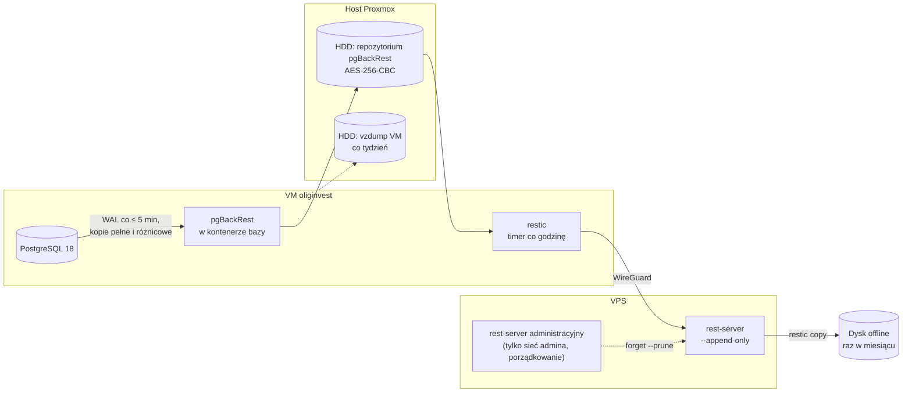

# Kopie zapasowe i odtwarzanie po awarii

**Cel:** zapewnić, że dane OligInvest da się odtworzyć po każdej przewidywalnej awarii — od pomyłki użytkownika po utratę całego serwera domowego — w czasie i z utratą danych mieszczącymi się w celach RPO/RTO, oraz że odtwarzanie jest regularnie **testowane i protokołowane**, a nie tylko zaplanowane (NFR-09.03).

Powiązane: [`infrastruktura.md`](infrastruktura.md), [`monitoring.md`](monitoring.md) (sygnały życia kopii), [`ci-cd.md`](ci-cd.md) § 6, [`../06-bezpieczenstwo/plan-reagowania.md`](../06-bezpieczenstwo/plan-reagowania.md) (P5–P8), [`../06-bezpieczenstwo/prywatnosc-rodo.md`](../06-bezpieczenstwo/prywatnosc-rodo.md) § 6–7, [`../06-bezpieczenstwo/kontrole-bezpieczenstwa.md`](../06-bezpieczenstwo/kontrole-bezpieczenstwa.md) § 1 (klucze, odstępstwo O-03), [`../03-dane/model-danych.md`](../03-dane/model-danych.md) § 4.

Narzędzia (sprawdzone 2026-09-19): pgBackRest 2.59.1 (MIT; szyfrowanie repozytorium wyłącznie `aes-256-cbc`, kompresja m.in. `zst`, repozytoria `posix` i `sftp`), restic 0.19.1 (BSD-2), rest-server 0.14.0 (BSD-2; tryb `--append-only`, `--private-repos`, uwierzytelnianie `.htpasswd` z bcrypt), Proxmox `vzdump`.

## 1. Cele

| Scenariusz | RPO (utrata danych) | RTO (czas przywrócenia) |
|---|---|---|
| Pomyłka użytkownika lub błędne wdrożenie | minuty (dowolny punkt w czasie z 35 dni) | ≤ 1 h |
| Uszkodzenie bazy lub wolumenu | ≤ 5 min | ≤ 1 h |
| Utrata VM (host sprawny) | ≤ 5 min | ≤ 3 h |
| Utrata całego serwera domowego (z dyskiem HDD) | ≤ 1 h (kopia poza domem) | ≤ 4 h od dostępności sprzętu zastępczego |
| Utrata VPS | 0 (VPS nie przechowuje danych aplikacji) | ≤ 2 h |

Wymaganie NFR-09.03: RPO ≤ 24 h (cel ≤ 1 h dla bazy), RTO ≤ 4 h, test odtworzenia co kwartał z protokołem — spełnione przez archiwizację WAL, kopię poza domem co godzinę i program testów z § 8.

## 2. Co chronimy

| Element | Metoda | Częstotliwość | Retencja | Uwagi |
|---|---|---|---|---|
| **Baza PostgreSQL** (wszystkie dane aplikacji) | pgBackRest: kopia pełna + różnicowe + ciągła archiwizacja WAL do repozytorium na HDD | pełna co tydzień, różnicowa codziennie, WAL co ≤ 5 min | 5 kopii pełnych (≈ 35 dni) | najważniejszy element |
| Repozytorium pgBackRest — kopia poza domem | restic → rest-server na VPS (append-only) | co godzinę | 48 h kopii godzinowych, 14 dziennych, 4 tygodniowe (≈ 35 dni) | szyfrowanie restic, klucze poza VPS |
| Dane Caddy (klucz konta ACME, certyfikaty) | restic razem z powyższym | co godzinę | jw. | konto ACME jest przypięte rekordem CAA |
| Plik `erasure-log.jsonl` (UUID usuniętych kont) | restic razem z powyższym | co godzinę | jw. | § 7 |
| Cała VM | `vzdump` (tryb migawki z `qemu-guest-agent`) na HDD | co tydzień | 2 kopie | szybkie odtworzenie systemu; zawiera pliki sekretów — **tylko lokalnie** |
| Kopia offline | `restic copy` najnowszej migawki z repozytorium poza domem na zaszyfrowany dysk zewnętrzny przechowywany poza serwerem | raz w miesiącu (administrator z laptopa w sieci administracyjnej) | 3 ostatnie | ochrona przed jednoczesną utratą domu i VPS |
| Sekrety aplikacji | kopia depozytowa w menedżerze haseł właściciela | przy każdej zmianie | — | bez `BETTER_AUTH_SECRETS` nie da się odszyfrować sekretów TOTP z kopii |
| Konfiguracja wdrożenia | paczka wydania w GitHub Releases + wartości `.env` w menedżerze haseł | przy wydaniu | — | niczego z VM nie trzeba kopiować poza tym |
| **Nie kopiujemy** | `valkey-queue` (zadania są odtwarzalne — § 6), `valkey-cache`, obrazy kontenerów (w GHCR) | — | — | — |

**Reguła 3-2-1:** trzy kopie danych (baza na SSD, repozytorium na HDD, repozytorium na VPS), dwa różne nośniki (SSD i HDD), jedna kopia poza domem — plus comiesięczna kopia offline.

## 3. Architektura



**Tryb append-only:** serwer domowy może tylko dopisywać migawki — nawet po jego przejęciu (ransomware) napastnik nie usunie kopii poza domem (T-INF-06). Porządkowanie według retencji wykonuje administrator z osobnymi poświadczeniami przez drugą instancję rest-server dostępną wyłącznie z sieci administracyjnej. Konto root na VPS mogłoby usunąć pliki — dlatego istnieją też kopie na HDD i offline ([`../06-bezpieczenstwo/plan-reagowania.md`](../06-bezpieczenstwo/plan-reagowania.md) P6).

### 3.1 Konfiguracja pgBackRest

```ini
# /etc/pgbackrest/pgbackrest.conf w kontenerze postgres — fragment ilustracyjny
[global]
repo1-path=/var/lib/pgbackrest
repo1-cipher-type=aes-256-cbc          # hasło z PGBACKREST_REPO1_CIPHER_PASS (plik sekretu)
repo1-retention-full=5
compress-type=zst
archive-async=y
spool-path=/var/spool/pgbackrest
start-fast=y

[oliginvest]
pg1-path=/var/lib/postgresql/data
```

W `postgresql.conf`: `archive_mode = on`, `archive_command = 'pgbackrest --stanza=oliginvest archive-push %p'`, `archive_timeout = 300`. Kopie uruchamiają timery systemd na hoście VM (`docker compose exec postgres pgbackrest … backup`); po każdej kopii `pgbackrest check`, a raz w tygodniu `pgbackrest verify`.

## 4. Szyfrowanie i klucze

| Klucz | Chroni | Gdzie jest | Gdzie go nie ma |
|---|---|---|---|
| hasło repozytorium pgBackRest | repozytorium na HDD (AES-256-CBC; odstępstwo O-03 — brak szyfrowania uwierzytelnionego) | plik sekretu w VM, menedżer haseł, zapieczętowany wydruk | VPS, repozytorium Git |
| hasło repozytorium restic | kopie poza domem i offline (AES-256-CTR + Poly1305, klucz ze scrypt) | plik sekretu w VM, menedżer haseł, wydruk | VPS |
| poświadczenia rest-server (append-only) | dopisywanie kopii | plik sekretu w VM | — |
| poświadczenia rest-server (administracyjne) | porządkowanie retencji | menedżer haseł administratora | VM |
| `BETTER_AUTH_SECRETS` | odszyfrowanie sekretów TOTP i kodów zapasowych w odtworzonej bazie | plik sekretu w VM, menedżer haseł | kopie poza domem |

Raz w roku (i po każdej rotacji) test, czy klucze z menedżera haseł otwierają repozytoria (część testu kwartalnego).

## 5. Procedury odtworzenia

### A. Odtworzenie do punktu w czasie (pomyłka, błędne wdrożenie)

1. Ustal czas docelowy (z audytu, logów lub zgłoszenia użytkownika).
2. Odtwórz bazę do **osobnej, tymczasowej instancji** (nowy wolumen na HDD): `pgbackrest restore --type=time --target=<czas UTC>`.
3. Wariant częściowy (zwykle): przenieś brakujące lub poprawne dane do produkcji skryptem administracyjnym (w kontekście RLS właściciela danych), sprawdź, usuń instancję tymczasową.
4. Wariant całościowy (rzadko, np. błąd migracji): zatrzymaj aplikację, zamień wolumen produkcyjny na odtworzony, wykonaj § 6.
5. Czas: ≤ 1 h.

### B. Pełne odtworzenie bazy w tej samej VM

1. Tryb serwisowy; zatrzymanie `api`, `jobs`, `analytics`.
2. `pgbackrest restore --delta` (najnowszy stan: ostatnia kopia + WAL).
3. Start bazy, `pg_amcheck`, `health/ready`; § 6.
4. Czas: ≤ 1 h.

### C. Odbudowa VM (host sprawny)

1. Najszybciej: odtworzenie VM z ostatniego `vzdump` (≤ 7 dni), potem **B** z najnowszego stanu repozytorium na HDD.
2. Jeśli `vzdump` jest niedostępny lub niezaufany (incydent — P7): nowa VM wg [`infrastruktura.md`](infrastruktura.md) § 10, sekrety z menedżera haseł, wdrożenie ostatniego wydania, `pgbackrest restore`, § 6.
3. Czas: ≤ 3 h.

### D. Utrata serwera domowego (host i HDD)

1. Sprzęt zastępczy: nowy serwer albo tymczasowo komputer właściciela z Dockerem (tryb awaryjny, bez Immicha).
2. Instalacja wg [`infrastruktura.md`](infrastruktura.md) § 10 (VM lub bezpośrednio Docker), sekrety z menedżera haseł.
3. `restic restore` najnowszej migawki z rest-server na VPS (poświadczenia administracyjne) — albo z dysku offline, jeśli VPS też jest niedostępny.
4. `pgbackrest restore` z odtworzonego repozytorium; wdrożenie ostatniego wydania; § 6.
5. Nowy peer WireGuard na VPS i przełączenie upstreamu w nginx `stream`.
6. Czas: ≤ 4 h od chwili dostępności sprzętu (bez sprzętu RTO nie jest gwarantowane — Z-27).

### E. Utrata VPS

1. Nowy VPS wg [`infrastruktura.md`](infrastruktura.md) § 4 z nowymi kluczami WireGuard i poświadczeniami rest-server.
2. Nowe repozytorium kopii poza domem i natychmiastowa pełna kopia; Uptime Kuma odtworzone z listy w [`monitoring.md`](monitoring.md) § 3.
3. Dane aplikacji nie są zagrożone (VPS ich nie przechowuje). Czas: ≤ 2 h.

## 6. Po każdym odtworzeniu

1. **Ponowne usunięcie kont** z najnowszej wersji `erasure-log.jsonl` (§ 7) — zawsze przed wpuszczeniem użytkowników.
2. **Sesje i tokeny:** po odtworzeniu do punktu starszego niż ostatnia godzina unieważnij wszystkie sesje i tokeny PAT — odwołania, zmiany haseł i resety 2FA wykonane po punkcie odtworzenia nie istnieją w odtworzonej bazie. Poproś użytkowników o ponowne utworzenie tokenów i — jeśli zmieniali hasło po punkcie odtworzenia — o ponowną zmianę.
3. **Stan pochodny:** przeliczenie pozycji i wycen (`portfolio.recompute-all`); ponowne kolejkowanie importów w stanie `uploaded` lub `parsing`; analizy w stanie `queued` lub `running` oznaczane jako nieudane z komunikatem „przerwane przez awarię”.
4. **Weryfikacja:** `pg_amcheck`, testy dymne, ostatnie wpisy audytu, porównanie liczby operacji z raportem sprzed awarii.
5. **Komunikacja:** informacja dla użytkowników o przerwie i ewentualnej utracie danych z okresu RPO; wpis audytu `system.restore`; ocena, czy to naruszenie ochrony danych (utrata dostępności — [`../06-bezpieczenstwo/plan-reagowania.md`](../06-bezpieczenstwo/plan-reagowania.md) § 7).

## 7. Usunięte konta a kopie zapasowe (RODO art. 17)

- Kopie zapasowe nie są modyfikowane — dane usuniętego konta wygasają z nich najpóźniej po 35 dniach (retencja kopii).
- Zadanie usuwania konta zapisuje UUID w `platform.erasure_log` **i** dopisuje linię `{"erased_user_id":"…","erased_at":"…"}` do pliku `erasure-log.jsonl` na dysku kopii, kopiowanego co godzinę poza dom. Plik zawiera wyłącznie identyfikatory i daty.
- Po odtworzeniu z dowolnej kopii (także starszej niż samo usunięcie) procedura z § 6 usuwa ponownie konta z **najnowszej** wersji pliku — konto usunięte po punkcie odtworzenia nie „wraca”.
- Wpisy starsze niż 40 dni są usuwane z tabeli i pliku (dłużej niż najdłuższa retencja kopii).

## 8. Testy odtwarzania

| Test | Częstotliwość | Zakres | Kryterium |
|---|---|---|---|
| Automatyczny test odtworzenia | co miesiąc (timer w VM) | odtworzenie najnowszego stanu do tymczasowego kontenera, `pg_amcheck`, zgodność wersji schematu, liczby wierszy w kluczowych tabelach, czas ostatniej transakcji w odtworzonej bazie ≤ 1 h przed testem | sygnał `restore-test` do Uptime Kuma; błąd = alert krytyczny |
| Weryfikacja repozytoriów | co tydzień | `pgbackrest verify`, `restic check --read-data-subset=5%` | alert przy błędzie |
| **Ćwiczenie odtworzenia (DR)** | **co kwartał, z protokołem** | rotacja scenariuszy: A → C → D (na sprzęcie zastępczym lub w osobnej VM) → E; w tym test kluczy z menedżera haseł i procedury z § 6–7 | zmierzone RPO i RTO w granicach § 1 |
| Pierwszy test | przed zaproszeniem innych użytkowników (M1) | scenariusz B i D | jw. |

**Protokół** (NFR-09.03) zapisywany w `docs/07-wdrozenie/protokoly/RRRR-MM-DD-test-odtworzenia.md` — bez adresów IP, nazw hostów i sekretów (ADR-013):

| Pole | Treść |
|---|---|
| Data, osoba | — |
| Scenariusz | A / B / C / D / E |
| Źródło kopii | lokalna / poza domem / offline; identyfikator migawki |
| Punkt odtworzenia i zmierzone RPO | czas ostatniej transakcji w kopii vs czas awarii |
| Start i koniec, zmierzone RTO | — |
| Kroki niezgodne z procedurą | — |
| Weryfikacja | `pg_amcheck`, testy dymne, liczby wierszy, ponowne usunięcie kont |
| Problemy i działania naprawcze | z terminami; aktualizacja tej procedury |
| Wynik | zaliczony / niezaliczony |

## 9. Pojemność (szacunki do pomiaru w M1)

| Element | Szacunek | Budżet |
|---|---|---|
| Baza (EOD ok. 2 000 instrumentów × 10 lat + dane użytkowników) | 1–2 GB | dysk VM 60 GB |
| Repozytorium pgBackRest (5 pełnych + różnicowe + WAL, kompresja zstd) | 2–5 GB | HDD 100 GB |
| Repozytorium restic poza domem (deduplikacja, kompresja) | 3–6 GB | ≤ 8 GB z 20 GB VPS; alert przy 80 % |
| `vzdump` VM (2 kopie, kompresja) | 2 × 10–20 GB | HDD 100 GB |

Przekroczenie budżetu VPS: najpierw skrócenie retencji godzinowej, potem tygodniowej; ostatecznie repozytorium poza domem wyłącznie dla kopii dziennych.

Koszt: 0 zł (sprzęt, VPS i dyski już posiadane; narzędzia open source).
