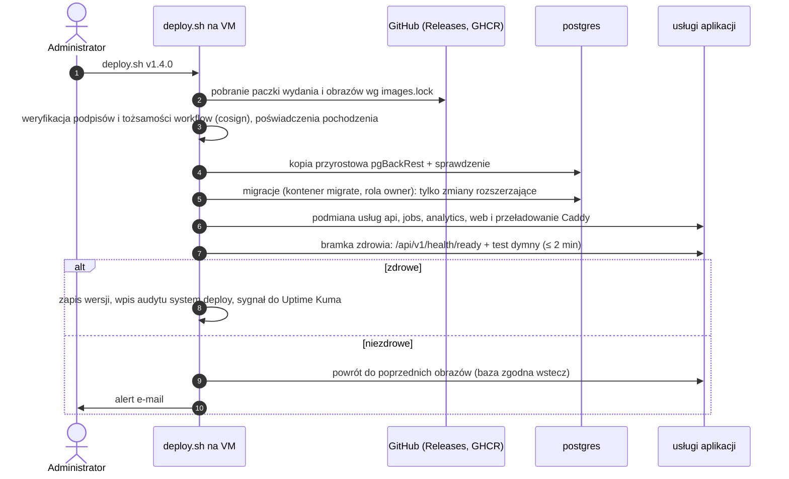

# CI/CD — testy, wydania, wdrożenie

**Cel:** opisać, jak kod OligInvest przechodzi od pull requesta do produkcji — ochronę gałęzi, zadania CI blokujące scalenie, budowanie podpisanych obrazów z SBOM, wdrożenie ściągane przez serwer domowy z weryfikacją podpisu, migracje zgodne wstecz i wycofanie — przy zerowym koszcie i bez dawania CI dostępu do serwera (NFR-03.09, NFR-09.05, NFR-10.02, NFR-10.03).

Powiązane: [`infrastruktura.md`](infrastruktura.md), [`backup-dr.md`](backup-dr.md), [`monitoring.md`](monitoring.md), [`../06-bezpieczenstwo/kontrole-bezpieczenstwa.md`](../06-bezpieczenstwo/kontrole-bezpieczenstwa.md) § 4, [ADR-013](../09-decyzje/ADR-013-repozytorium-publiczne.md), [`../04-frontend/wydajnosc.md`](../04-frontend/wydajnosc.md) § 6, [`../03-dane/model-danych.md`](../03-dane/model-danych.md) § 5.

Fakty sprawdzone 2026-09-19 w dokumentacji GitHub: runnery hostowane przez GitHub są darmowe dla repozytoriów publicznych; runnerów własnych nie należy używać w repozytoriach publicznych (każdy może otworzyć pull request i uruchomić kod na maszynie runnera); przypięcie akcji do pełnego SHA commitu to jedyny sposób na niezmienną wersję akcji.

## 1. Zasady

1. **CI nie ma dostępu do serwera.** Brak runnerów własnych, brak kluczy SSH i poświadczeń produkcyjnych w GitHubie. Serwer sam pobiera podpisane wydanie (model „pull”).
2. **CI nie ma sekretów.** Testy używają fixtures i atrap dostawców; podpis obrazów korzysta z tokenu OIDC wystawianego na czas zadania (cosign keyless).
3. **Scalenie tylko po zielonym CI.** Każde wymaganie z [`../06-bezpieczenstwo/kontrole-bezpieczenstwa.md`](../06-bezpieczenstwo/kontrole-bezpieczenstwa.md) § 7 oznaczone „T” ma test w CI.
4. **Dokumentacja przed kodem** (NFR-10.01): zmiana kontraktu (OpenAPI, schemat bazy, wzory) to zmiana dokumentu w tym samym PR — CI porównuje kod z dokumentacją.

## 2. Gałęzie i ochrona `main`

- **Model:** trunk-based — krótkie gałęzie tematyczne, PR do `main`, scalanie przez „squash”, tytuł PR w formacie Conventional Commits (sprawdzany w CI).
- **Reguły ochrony (ruleset) dla `main`:** wymagany PR; wymagane zadania CI z § 3 (status „success”); historia liniowa; zakaz force-push i usuwania gałęzi; wymagane rozwiązanie wątków przeglądu; reguły obowiązują także właściciela (bez obejść). Podpisane commity — zalecane.
- **Przegląd:** właściciel przegląda każdy PR, także przygotowany przez agenta AI (Codex, Claude) — T-SC-06; plik `CODEOWNERS` wskazuje właściciela dla `docs/06-bezpieczenstwo/`, `infra/`, `.github/`, `packages/db/`, `apps/api/src/auth/`.
- **Ustawienia repozytorium:** skanowanie sekretów z push protection, CodeQL, alerty Dependabot, prywatne zgłaszanie podatności (ADR-013); domyślne uprawnienia tokenu zadań: tylko odczyt; akcje tylko z listy dozwolonych (organizacje `actions`, `github`, `docker`, `sigstore`, `pnpm`, `astral-sh` i zweryfikowani twórcy) i przypięte SHA.

## 3. Zadania CI (pull request i `main`)

| Zadanie | Co sprawdza | Blokuje scalenie |
|---|---|---|
| `lint` | Biome (TS/JS, w tym reguły bezpieczeństwa: zakaz `eval`, `dangerouslySetInnerHTML`, `sql.raw`, importu `{ z }` z `zod` w kodzie klienckim), Ruff (Python), tytuł PR, format commitów | tak |
| `typecheck` | TypeScript (`strict`) w całym monorepo, mypy/pyright w `apps/analytics` | tak |
| `unit` | Vitest (w tym wektory `packages/test-vectors`), pytest (te same wektory dla Pythona) | tak |
| `contracts` | lint Redocly `docs/02-api/openapi.yaml`; zgodność OpenAPI generowanego z Zod z plikiem w `docs/`; aktualność typów klienta (`openapi-typescript`); zgodność JSON Schema dla zadań; `pnpm check:deps` (reguły warstw modułów) | tak |
| `db` | PostgreSQL 18 jako usługa: migracje Drizzle od zera, porównanie schematu z `docs/03-dane/schema.sql`, `testy-rls.sql`, testy integracyjne API z prawdziwą bazą | tak |
| `build` | Turborepo: wszystkie aplikacje; wariant „bez modułu funkcjonalnego” (macierz: po kolei bez `analytics`, `alerts`, `education`, `quick-actions`); obrazy Docker (bez publikacji) od M0-2 / BL-020 | tak |
| `budgets` | `size-limit`, raport JS per trasa, obecność zakazanych bibliotek w chunkach początkowych ([`../04-frontend/wydajnosc.md`](../04-frontend/wydajnosc.md) § 6) | tak |
| `e2e` | Playwright (Chromium, WebKit, Firefox), `@axe-core/playwright` i nagłówki; M0-1: strona testowa z lokalnego buildu produkcyjnego i usługi `compose.dev.yaml`; M0-2: obrazy produkcyjne po BL-020–BL-023; bramki MFA/regulaminu i zgoda RUM wraz z ich implementacją w M1 | tak |
| `lighthouse` | Lighthouse 13 (profil mobilny, 3 przebiegi, mediana) dla tras z budżetami | tak (od M1) |
| `deps-audit` | osv-scanner na lockfile'ach; licencje z SBOM (lista dozwolonych) | tak (dla podatności z dostępną poprawką powyżej progu) |
| `codeql` (kontrola GitHub) | Konfiguracja domyślna GitHub, poza własnymi workflow; **włączenie lub ponowna konfiguracja po scaleniu M0-1**. Właściciel sprawdza `javascript-typescript`, `python` oraz dostępność `actions` w panelu i zapisuje wynik według [instrukcji](ustawienia-repozytorium.md). Nazwę rzeczywistej kontroli pobiera z zakończonego przebiegu | alerty wysokie — tak; potwierdzenie ustawień jest częścią BL-019 |

W M0-1 wszystkie własne workflow mają wyłącznie `permissions: { contents: read }`. Nie dodajemy konfiguracji zaawansowanej CodeQL ani `security-events: write`. Stan „tylko Python” przed scaleniem szkieletu nie jest docelową listą języków: na `main` nie ma jeszcze TypeScript ani workflow. Brak `actions` w panelu należy zapisać jako lukę pokrycia do rozstrzygnięcia; nie zakładać dostępności i nie zastępować konfiguracji domyślnej bez nowej decyzji. Kryterium M0 nr 7 nie jest spełnione przez samo dodanie plików.

Przygotowanie przed upływem karencji: szkice znajdują się w `.github/workflow-drafts/`, więc GitHub ich nie uruchamia. Do `.github/workflows/` trafiają po podłączeniu i lokalnej weryfikacji rzeczywistych poleceń. Status w raporcie: **Konfiguracja przygotowana; nie uruchomiono jeszcze w CI**.

```yaml
# .github/workflows/ci.yml — fragment ilustracyjny
name: ci
on:
  pull_request:
  push: { branches: [main] }
permissions: { contents: read }
concurrency: { group: "ci-${{ github.ref }}", cancel-in-progress: true }
jobs:
  db:
    runs-on: ubuntu-24.04
    services:
      postgres:
        image: postgres:18@sha256:<DIGEST>
        env: { POSTGRES_PASSWORD: ci-only }
        ports: ["5432:5432"]
    steps:
      - uses: actions/checkout@<FULL_SHA>        # przypięte pełnym SHA (Renovate aktualizuje)
        with: { persist-credentials: false }
      - uses: pnpm/action-setup@<FULL_SHA>
      - uses: actions/setup-node@<FULL_SHA>
        with: { node-version-file: .nvmrc, cache: pnpm }
      - run: pnpm install --frozen-lockfile
      - run: pnpm db:test   # migracje od zera → porównanie z docs/03-dane/schema.sql → testy-rls.sql
```

Pull requesty z forków uruchamiają się z tokenem tylko do odczytu i bez sekretów (domyślne zachowanie GitHub); `pull_request_target` nie jest używany.

## 4. Zadania cykliczne

| Zadanie | Kiedy | Co |
|---|---|---|
| `security-weekly` | poniedziałek | osv-scanner na lockfile'ach i na obrazach ostatniego wydania; wynik jako issue prywatne lub alert |
| Renovate | wg harmonogramu § 7 | PR z aktualizacjami |
| `scorecard` (opcjonalnie) | co tydzień | OpenSSF Scorecard — ocena praktyk repozytorium |
| `ct-check` | codziennie | uruchamiany na serwerze, nie w CI ([`monitoring.md`](monitoring.md) § 3) |

## 5. Wydanie

**Wyzwalacz:** tag `vMAJOR.MINOR.PATCH` na `main` (SemVer aplikacji; wersja API `/v1` jest niezależna). Tag tworzy właściciel po scaleniu zmian; opis zmian generowany z Conventional Commits.

Zadanie `release` (uprawnienia tylko dla tego zadania: `contents: write`, `packages: write`, `id-token: write`, `attestations: write`):

1. Buduje obrazy `web`, `api`, `jobs`, `analytics`, `postgres` (z pgBackRest) i `migrate` z obrazów bazowych przypiętych digestem.
2. Publikuje je w GHCR (pakiety publiczne) i zapisuje digesty w `images.lock`.
3. Generuje SBOM (syft, CycloneDX) dla każdego obrazu i dołącza go do wydania oraz jako poświadczenie (`actions/attest-sbom`).
4. Tworzy poświadczenie pochodzenia (`actions/attest-build-provenance`) i podpis cosign keyless (tożsamość: workflow `release.yml` tego repozytorium, wystawca OIDC GitHub).
5. Skanuje obrazy osv-scannerem — krytyczna podatność z dostępną poprawką przerywa wydanie.
6. Publikuje **paczkę wdrożeniową** (`compose.yaml`, szablony konfiguracji Caddy i PostgreSQL, `images.lock`, skrypty) podpisaną `cosign sign-blob`.

## 6. Wdrożenie (serwer pobiera wydanie)

Administrator uruchamia na VM (przez SSH w sieci administracyjnej) skrypt `infra/scripts/deploy.sh <wersja>` (M0):



- **Weryfikacja przed uruchomieniem:** każdy obraz musi mieć ważny podpis cosign wystawiony dla workflow `release.yml` tego repozytorium (sprawdzenie tożsamości certyfikatu i wystawcy OIDC) — obraz bez podpisu lub z innej tożsamości nie zostanie uruchomiony (T-SC-03).
- **Przerwa ≤ 1 min (NFR-09.05):** usługi podmieniane kolejno; Caddy przez czas restartu ponawia połączenia do upstreamu (`lb_try_duration`), więc użytkownik widzi dłuższą odpowiedź zamiast błędu; SSE łączy się ponownie z `Last-Event-ID`.
- **Automatyczne aktualizacje:** domyślnie wyłączone — wdrożenie jest decyzją właściciela (moment kontroli przy przejęciu konta GitHub, T-SC-04). Opcja na później: timer, który sam wdraża tylko wersje poprawkowe (PATCH) po weryfikacji podpisu.

### 6.1 Migracje bazy (expand/contract)

- **Rozszerzanie** (nowe tabele, kolumny dopuszczające `NULL`, nowe indeksy `CONCURRENTLY`, nowe polityki RLS) — w dowolnym wydaniu, przed kodem, który ich używa.
- **Zawężanie** (usunięcie kolumn, `NOT NULL`, zmiana typu) — najwcześniej w następnym wydaniu po tym, w którym kod przestał używać starej struktury.
- **Brak migracji „w dół”:** wycofanie aplikacji nie wymaga cofania bazy (zgodność wstecz); błąd migracji naprawia kolejna migracja; poważna awaria — odtworzenie do punktu w czasie sprzed wdrożenia ([`backup-dr.md`](backup-dr.md) procedura A).
- **Każda nowa tabela z `user_id`:** polityka RLS i test w tym samym PR (CI wykrywa tabelę bez polityki).

## 7. Aktualizacje zależności — Renovate

```json
{
  "$schema": "https://docs.renovatebot.com/renovate-schema.json",
  "extends": ["config:recommended", "helpers:pinGitHubActionDigests", "docker:pinDigests", ":pinAllExceptPeerDependencies"],
  "timezone": "Europe/Warsaw",
  "schedule": ["before 6am on monday"],
  "minimumReleaseAge": "3 days",
  "prConcurrentLimit": 5,
  "vulnerabilityAlerts": { "labels": ["security"], "schedule": ["at any time"], "minimumReleaseAge": null },
  "lockFileMaintenance": { "enabled": true, "schedule": ["before 6am on the first day of the month"] },
  "packageRules": [
    { "matchUpdateTypes": ["major"], "dependencyDashboardApproval": true },
    { "matchManagers": ["github-actions"], "groupName": "akcje GitHub" },
    { "matchDepTypes": ["devDependencies"], "matchUpdateTypes": ["minor", "patch"], "groupName": "narzędzia deweloperskie" }
  ]
}
```

(`renovate.json` powstaje w M0.) Brak automatycznego scalania zależności produkcyjnych; aktualizacje bezpieczeństwa omijają opóźnienie i harmonogram, ale nadal przechodzą pełne CI i przegląd.

## 8. Środowiska

| Środowisko | Gdzie | Dane | Uwagi |
|---|---|---|---|
| Lokalne | Docker Compose, profil `dev` | seed demo + fixtures syntetyczne | Mailpit jako lokalny serwer SMTP; atrapy dostawców z zapisanych odpowiedzi; bez połączeń do prawdziwych API bez jawnej zmiennej |
| CI | runnery GitHub (efemeryczne) | fixtures syntetyczne | obrazy produkcyjne w testach e2e |
| Produkcja | VM `oliginvest` | prawdziwe | wdrożenie wg § 6 |

Brak osobnego środowiska testowego na serwerze — nie mieści się w budżecie RAM (NFR-01.08). Zastępują je testy e2e na obrazach produkcyjnych w CI i możliwość uruchomienia wydania lokalnie przed wdrożeniem.

## 9. Koszt

0 zł: GitHub Actions na runnerach hostowanych i GHCR dla pakietów publicznych są bezpłatne dla repozytoriów publicznych; Renovate jako aplikacja GitHub — bez opłat; cosign, syft, osv-scanner — narzędzia open source; Sigstore (Fulcio, Rekor) — publiczna infrastruktura bez opłat.
