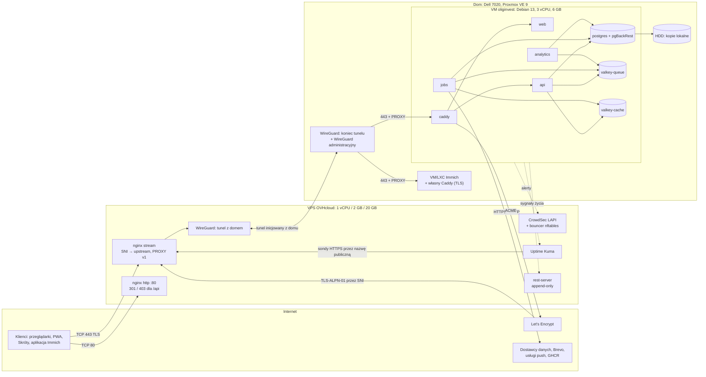

# Infrastruktura — topologia, serwery, kontenery, sieć

**Cel:** opisać docelową infrastrukturę OligInvest — VPS jako przekaźnik TCP, tunel WireGuard, serwer domowy z Proxmoxem i VM z kontenerami — z dozwolonymi przepływami sieciowymi, konfiguracją hardeningu, zarządzaniem sekretami i procedurą przeniesienia terminacji TLS Immicha z VPS do domu, tak aby wdrożenie dało się wykonać krok po kroku i sprawdzić listą kontrolną (NFR-03.11, NFR-01.08, NFR-05.03).

Powiązane: [ADR-011](../09-decyzje/ADR-011-topologia-wdrozenia.md), [`../01-architektura/przeglad-architektury.md`](../01-architektura/przeglad-architektury.md) § 4, [`ci-cd.md`](ci-cd.md), [`monitoring.md`](monitoring.md), [`backup-dr.md`](backup-dr.md), [`../06-bezpieczenstwo/kontrole-bezpieczenstwa.md`](../06-bezpieczenstwo/kontrole-bezpieczenstwa.md), [`../06-bezpieczenstwo/model-zagrozen.md`](../06-bezpieczenstwo/model-zagrozen.md).

**Zasada repozytorium publicznego (ADR-013):** w tym dokumencie i w plikach konfiguracyjnych w repozytorium adresy IP, niestandardowe porty i nazwy hostów wewnętrznych występują wyłącznie jako znaczniki `<…>` — rzeczywiste wartości są w plikach `.env` na serwerach i w menedżerze haseł właściciela.

Wersje (sprawdzone 2026-09-19): Debian 13 „trixie” (wydany 2025-08-09, wsparcie 5 lat), Proxmox VE 9, Caddy 2.11.4, CrowdSec 1.8.1 + bouncer zapory 0.0.36, restic 0.19.1, rest-server 0.14.0, pgBackRest 2.59.1, Uptime Kuma 2.5.5, Valkey 9.1.2.

## 1. Topologia



**Ruch wychodzący.** Homelab właściciela nie wystawia do internetu żadnych usług, a cały jego ruch wychodzi przez tunel WireGuard i publiczny adres VPS (potwierdzone przez właściciela 2026-09-19). Dotyczy to także połączeń VM do dostawców danych, SMTP, ACME i aktualizacji — strzałki do „Internet” na diagramie prowadzą przez tunel. Skutki:

- VPS widzi metadane połączeń wychodzących (adres docelowy, SNI, czas) i może je blokować; treść chroni TLS z weryfikacją certyfikatów.
- Protokoły bez szyfrowania uwierzytelniamy: czas przez NTS w chrony, DNS przez DNS-over-TLS (`systemd-resolved`). Przejęty VPS nie przestawi zegara (TOTP) ani nie podmieni odpowiedzi DNS (T-EDGE-02).
- Dostawcy danych widzą adres centrum danych OVH, który Yahoo ogranicza częściej niż adresy domowe, więc fallbacki z [`../03-dane/strategia-cache.md`](../03-dane/strategia-cache.md) § 8 są obowiązkowe. Jeśli blokady będą się powtarzać, ruch samego kontenera `jobs` można kierować bezpośrednio łączem domowym — bez otwierania portów w domu (decyzja właściciela).

## 2. Założenia sprzętowe i pojemność

| Zasób | Przydział | Uwagi |
|---|---|---|
| VM `oliginvest` — CPU | 3 vCPU, typ `host` | niższy priorytet niż Immich w nocy (udziały CPU w Proxmoxie) |
| VM — RAM | 6 GB, bez balloningu | suma limitów kontenerów ≈ 4,2 GB + procesy operacyjne ≈ 0,3 GB + system ≈ 0,8 GB |
| VM — dysk systemowy | ok. 60 GB na SSD (VirtIO SCSI single, `discard`, `iothread`) | baza, wolumeny, obrazy |
| VM — dysk kopii | ok. 100 GB na HDD (wg miejsca wolnego po Immichu) | repozytorium pgBackRest, logi kopii |
| VPS — RAM | nginx + WireGuard + CrowdSec + Uptime Kuma + rest-server ≈ 0,5–0,8 GB (szacunek; pomiar w M0) | z 2 GB |
| VPS — dysk | system ≈ 4 GB, logi ≤ 1 GB, Uptime Kuma ≤ 1 GB, kopie poza domem ≤ 8 GB | z 20 GB; alert przy 80 % |

## 3. Dozwolone przepływy sieciowe (ASVS V13.1.1)

| # | Źródło | Cel | Protokół | Po co |
|---|---|---|---|---|
| 1 | internet | VPS | TCP 443 | ruch HTTPS do aplikacji i Immicha (routing po SNI, bez odszyfrowania) |
| 2 | internet | VPS | TCP 80 | wyłącznie przekierowanie 301 na HTTPS; `/api/*` → 403 |
| 3 | internet | VPS | UDP `<WG_SITE_PORT>` | tunel z domem (klucz peera domowego) |
| 4 | internet | VPS | UDP `<WG_ADMIN_PORT>` | przekaźnik UDP do WireGuard administracyjnego w domu (pakiety zaszyfrowane end-to-end) |
| 5 | VPS (tunel) | VM `oliginvest` | TCP 443 | ruch aplikacji z nagłówkiem PROXY |
| 6 | VPS (tunel) | proxy Immicha | TCP 443 | ruch Immicha z nagłówkiem PROXY |
| 7 | VM (tunel) | VPS | TCP `<LAPI_PORT>` | agent CrowdSec → LAPI |
| 8 | VM (tunel) | VPS | TCP `<REST_PORT>` | restic → rest-server |
| 9 | VM (tunel) | VPS | TCP `<KUMA_PORT>` | sygnały życia (push) do Uptime Kuma |
| 10 | VM (przez tunel i VPS) | internet | TCP 443 | `jobs`: allowlista dostawców i usług push; `api`: Pwned Passwords, OAuth (P2); `caddy`: ACME; system: aktualizacje, obrazy z GHCR |
| 11 | VM (przez tunel i VPS) | internet | TCP 587 | `jobs` → SMTP Brevo (STARTTLS wymagany) |
| 12 | VM (przez tunel i VPS) | internet | TCP 4460, UDP 123 | synchronizacja czasu z NTS (chrony) |
| 13 | sieć administracyjna WireGuard | VM, host Proxmox, VPS | SSH, panel Proxmoxa, panel Uptime Kuma | administracja |
| 14 | VM (przez tunel i VPS) | resolver DNS | TCP 853 | DNS-over-TLS (`systemd-resolved`) |

**Wszystko inne jest blokowane** — zapora domyślnie odrzuca ruch przychodzący na VPS, na granicy domu (dla peera VPS: tylko przepływy 5 i 6), w Proxmoxie (zapora na poziomie VM) i w VM (nftables). Peer VPS nie ma dostępu do SSH, panelu Proxmoxa ani innych urządzeń w sieci domowej (T-EDGE-03).

**Dostęp administracyjny:** urządzenia administratora łączą się z interfejsem WireGuard **kończącym się w domu**; VPS tylko przekazuje zaszyfrowane pakiety UDP (przepływ 4), więc przejęty VPS nie może podszyć się pod administratora. Dom nie wystawia do internetu żadnych portów (potwierdzone 2026-09-19), więc przekaźnik na VPS jest jedyną drogą dostępu administracyjnego spoza domu. Pakiety WireGuard administracyjnego jadą wewnątrz tunelu z domem (WireGuard w WireGuardzie): MTU interfejsu administracyjnego ustaw o 80 bajtów mniejsze niż MTU tunelu (np. 1340 przy 1420), inaczej większe pakiety (SSH, panel Proxmoxa) mogą ginąć.

## 4. VPS — konfiguracja

- **System:** Debian z automatycznymi aktualizacjami bezpieczeństwa (`unattended-upgrades`), chrony, nftables z domyślnym odrzucaniem ruchu przychodzącego (dozwolone przepływy 1–4 i administracja przez WireGuard), SSH wyłącznie kluczem, bez logowania roota, dostępny tylko z sieci administracyjnej.
- **Brak na VPS:** kluczy prywatnych TLS aplikacji i Immicha (po migracji z § 9), danych aplikacji, sekretów aplikacji, kluczy szyfrowania kopii.
- **Ruch wychodzący z domu:** VPS przekazuje z NAT ruch wychodzący homelabu (istniejąca konfiguracja właściciela) — wyłącznie z adresów tunelu w stronę internetu. Ruch z internetu trafia do domu tylko przez nginx `stream` (przepływy 5–6) i przekaźnik WireGuard administracyjnego (przepływ 4).
- **nginx `stream` (routing po SNI):**

```nginx
# /etc/nginx/stream.d/sni.conf — fragment ilustracyjny (wartości <…> tylko na serwerze)
map $ssl_preread_server_name $sni_upstream {
    invest.oligi.pl   oliginvest;
    <IMMICH_HOST>     immich;
    default           reject;
}
upstream oliginvest { server <VM_TUNNEL_IP>:443; }
upstream immich     { server <IMMICH_TUNNEL_IP>:443; }
upstream reject     { server 127.0.0.1:1; }      # połączenie odrzucone: brak domyślnego celu
limit_conn_zone $binary_remote_addr zone=perip:10m;
log_format sni '$time_iso8601 $remote_addr $ssl_preread_server_name $status $bytes_sent $bytes_received $session_time';
server {
    listen 443;
    listen [::]:443;
    ssl_preread on;
    proxy_protocol on;                           # prawdziwy adres klienta dla Caddy i CrowdSec
    proxy_pass $sni_upstream;
    proxy_connect_timeout 5s;
    proxy_timeout 600s;                          # SSE i WebSocket Immicha mają własne sygnały podtrzymania
    limit_conn perip 50;
    access_log /var/log/nginx/sni.log sni;
}
```

- **Port 80:** osobny `server` HTTP tylko dla znanych nazw: `/api/` → `403` (ASVS V4.1.2), reszta → `301` na HTTPS; nieznane nazwy → zamknięcie połączenia. Certyfikaty nie korzystają z HTTP-01 (TLS-ALPN-01 przez SNI).
- **CrowdSec:** lokalne API (LAPI) i bouncer zapory nftables; agent w domu rejestrowany do LAPI przez tunel ([ADR-011](../09-decyzje/ADR-011-topologia-wdrozenia.md)); LAPI nasłuchuje wyłącznie na adresie tunelu; zablokowane adresy odrzucane przed nginx.
- **Uptime Kuma:** kontener lub usługa nasłuchująca wyłącznie na adresie tunelu i sieci administracyjnej; powiadomienia e-mail przez SMTP Brevo ([`monitoring.md`](monitoring.md)).
- **rest-server:** `--append-only --private-repos`, uwierzytelnianie `.htpasswd` (bcrypt), nasłuch na adresie tunelu, dane na osobnym katalogu z limitem miejsca ([`backup-dr.md`](backup-dr.md)).

## 5. Serwer domowy i VM `oliginvest`

### 5.1 Host Proxmox

Panel i SSH hosta dostępne wyłącznie z sieci administracyjnej; 2FA (TOTP) do panelu; aktualizacje co miesiąc (po kopii VM); zapora Proxmoxa włączona na poziomie VM (reguły z § 3); osobny most sieciowy (lub VLAN, jeśli router to wspiera) dla VM wystawionych przez tunel, oddzielony od reszty sieci domowej; kopie całej VM (`vzdump`) raz w tygodniu na HDD ([`backup-dr.md`](backup-dr.md) § 3).

### 5.2 System w VM

- Debian 13 w instalacji minimalnej; `unattended-upgrades` dla poprawek bezpieczeństwa z automatycznym restartem w oknie nocnym tylko wtedy, gdy wymaga go jądro; `qemu-guest-agent`; chrony z NTS (uwierzytelniony czas, bo ruch wychodzi przez VPS; alert przy odchyłce > 2 s — TOTP zależy od czasu); `systemd-resolved` z DNS-over-TLS.
- **nftables:** wejście domyślnie odrzucane; dozwolone TCP 443 wyłącznie z adresu tunelu VPS i SSH z sieci administracyjnej; wyjście dozwolone (kontrolę ruchu wychodzącego kontenerów zapewniają sieci Dockera i allowlista w aplikacji — § 6).
- **SSH:** tylko klucze Ed25519, `PermitRootLogin no`, `PasswordAuthentication no`, `AllowUsers` z jednym kontem administracyjnym, `sudo` z hasłem.
- **Docker Engine** z oficjalnego repozytorium Dockera (odcisk klucza zweryfikowany przy instalacji); AppArmor włączony (domyślny profil kontenerów); seccomp domyślny.

```json
{
  "no-new-privileges": true,
  "live-restore": true,
  "userland-proxy": false,
  "icc": false,
  "log-driver": "local",
  "log-opts": { "max-size": "20m", "max-file": "5" }
}
```

(`/etc/docker/daemon.json`; sterownik `local` rotuje i kompresuje logi — przy typowym ruchu ok. 14 dni historii.)

### 5.3 Układ katalogów

| Ścieżka | Zawartość | Uprawnienia |
|---|---|---|
| `/opt/oliginvest/` | pliki Compose i konfiguracje z paczki wydania (bez sekretów) | root, `0755` |
| `/etc/oliginvest/secrets/` | pliki sekretów (§ 8) | root, katalog `0700`, pliki `0600` |
| `/srv/oliginvest/` | wolumeny: `postgres`, `valkey-queue`, `caddy-data`, `caddy-logs` | właściciel = UID kontenera |
| `/srv/backup/` | dysk HDD: repozytorium pgBackRest, logi kopii | root / UID postgres |

## 6. Kontenery

### 6.1 Zasady dla każdego kontenera

Obraz przypięty digestem i podpisany (weryfikacja przy wdrożeniu — [`ci-cd.md`](ci-cd.md)); użytkownik nie-root; system plików tylko do odczytu + `tmpfs` na pliki tymczasowe; `cap_drop: [ALL]`; `no-new-privileges`; limity pamięci, CPU i liczby procesów; `healthcheck`; `restart: unless-stopped`; tylko potrzebne sieci; sekrety montowane jako pliki (`/run/secrets/…`), odczytywane przez zmienne `*_FILE`.

| Kontener | Obraz bazowy | Użytkownik | Sieci | Wyjście do internetu | Limit RAM |
|---|---|---|---|---|---|
| `caddy` | oficjalny `caddy` 2.11 | nie-root; port 443 przez `net.ipv4.ip_unprivileged_port_start=0` w przestrzeni sieci kontenera | `edge`, `egress` | ACME | 64 MB |
| `web` | `node:24` (slim) | `node` | `edge` | **brak** | 512 MB |
| `api` | `node:24` (slim) | `node` | `edge`, `backend`, `egress` | Pwned Passwords, OAuth (P2) | 384 MB |
| `jobs` | `node:24` (slim) | `node` | `backend`, `egress` | allowlista dostawców, SMTP, push | 384 MB |
| `analytics` | `python:3.13` (slim) | UID 10001 | `analytics` | **brak** | 1,5 GB, CPU ≤ 2 |
| `postgres` | oficjalny `postgres:18` + pgBackRest (obraz własny, podpisany) | `postgres` (UID 999, bez przełączania użytkownika) | `backend`, `analytics` | brak | 1 GB |
| `valkey-queue` | oficjalny `valkey` 9 | `valkey` | `backend`, `analytics` | brak | 128 MB |
| `valkey-cache` | oficjalny `valkey` 9 | `valkey` | `backend` | brak | 128 MB |

Procesy operacyjne na hoście VM (nie w Compose aplikacji): agent CrowdSec (pakiet z repozytorium CrowdSec; czyta logi Caddy i journald), timery systemd kopii zapasowych (restic, polecenia pgBackRest w kontenerze bazy) i skrypty sygnałów życia ([`monitoring.md`](monitoring.md)).

### 6.2 Sieci

```yaml
# compose.yaml — fragment ilustracyjny
networks:
  edge:      { internal: true }   # caddy ↔ web, api
  backend:   { internal: true }   # api, jobs ↔ postgres, valkey-*
  analytics: { internal: true }   # analytics ↔ valkey-queue, postgres (rola analytics_ro)
  egress:    {}                   # jedyna sieć z wyjściem: caddy, api, jobs
services:
  api:
    image: ghcr.io/<OWNER>/oliginvest-api@sha256:<DIGEST>
    user: "1000:1000"
    read_only: true
    tmpfs: ["/tmp:size=64m"]
    cap_drop: ["ALL"]
    security_opt: ["no-new-privileges:true"]
    pids_limit: 256
    mem_limit: 384m
    networks: [edge, backend, egress]
    secrets: [better_auth_secrets, db_auth_password, db_app_password, valkey_api_password, audit_pseudonym_key]
    healthcheck: { test: ["CMD", "node", "dist/healthcheck.js"], interval: 30s, timeout: 5s, retries: 3 }
    restart: unless-stopped
```

Sieci `internal: true` nie mają trasy na zewnątrz, więc `web` i `analytics` fizycznie nie mogą wysłać danych do internetu, nawet po przejęciu (T-AN-01, T-SC-01). Port 443 publikuje wyłącznie `caddy`.

### 6.3 Caddy

```caddyfile
{
	email {$ACME_EMAIL}
	servers :443 {
		protocols h1 h2
		listener_wrappers {
			proxy_protocol {
				timeout 2s
				allow {$VPS_TUNNEL_IP}/32
				fallback_policy reject
			}
			tls
		}
	}
}
invest.oligi.pl {
	tls {
		protocols tls1.3
		issuer acme {
			disable_http_challenge
		}
	}
	import security_headers
	reverse_proxy /api/* api:3000 {
		flush_interval -1
	}
	reverse_proxy web:3000
	log {
		output file /var/log/caddy/access.json
	}
}
```

Fragment `security_headers` ustawia nagłówki z [`../06-bezpieczenstwo/kontrole-bezpieczenstwa.md`](../06-bezpieczenstwo/kontrole-bezpieczenstwa.md) § 2.2 (CSP ustawia `web`). HTTP/3 wyłączone (VPS przekazuje tylko TCP); `flush_interval -1` dla strumienia SSE; kompresja (`encode zstd gzip`) tylko dla odpowiedzi innych niż `text/event-stream`. Caddy domyślnie redaguje nagłówki `Cookie` i `Authorization` w logach.

**Uzupełnienia z przeglądu kodu M0-1 (2026-09-22, do wdrożenia w M0-2 — [przegląd](../08-plan/m0-1-przeglad-kodu.md)):**

- **`X-Request-Id` (P-09):** Caddy usuwa nagłówek przychodzący z internetu i przekazuje do `api` własny identyfikator (np. `header_up X-Request-Id {http.request.uuid}`), który trafia też do logu dostępu — klient nie może wtedy nadawać identyfikatorów korelacji. Składnię i nazwę placeholdera potwierdzić w dokumentacji Caddy 2.11 (**NIEZWERYFIKOWANE**).
- **Keep-alive do upstreamu (P-08):** czas bezczynności połączeń Caddy → `api`/`web` musi być krótszy niż `keepAliveTimeout` serwerów Node (domyślnie 5 s) albo `keepAliveTimeout` trzeba jawnie wydłużyć w aplikacji — inaczej proxy użyje połączenia zamkniętego przez Node i zwróci sporadyczne 502. Domyślną wartość w Caddy potwierdzić przy konfiguracji (**NIEZWERYFIKOWANE**).
- **`/api/v1/health/ready` (P-01):** ścieżka jest publiczna (monitor `app-ready` w [`monitoring.md`](monitoring.md)). Caddy bez dodatkowych modułów nie ogranicza częstotliwości żądań, a VPS widzi wyłącznie TLS, więc podstawową ochroną jest buforowanie wyniku sond w `api`; CrowdSec może blokować jawne nadużycia na podstawie logów.

### 6.4 PostgreSQL i Valkey

- **PostgreSQL:** `password_encryption = scram-sha-256`; `pg_hba` dopuszcza tylko sieci Dockera i konkretne role do konkretnej bazy; `log_min_duration_statement = 500ms` z `log_parameter_max_length = 0` (bez wartości parametrów w logach); `archive_mode = on`, `archive_command` przez pgBackRest, `archive_timeout = 300s` ([`backup-dr.md`](backup-dr.md)); role wg [`../03-dane/schema.sql`](../03-dane/schema.sql) § 0.
- **Valkey:** ACL z osobnym użytkownikiem dla `api`, `jobs` i `analytics` (tylko potrzebne polecenia i prefiksy kluczy), użytkownik `default` wyłączony, polecenia administracyjne (`FLUSHALL`, `CONFIG`, `DEBUG`, `MODULE`) zablokowane; `valkey-queue`: `maxmemory-policy noeviction`, AOF co 1 s; `valkey-cache`: `allkeys-lru`, bez trwałości.

## 7. DNS, certyfikaty i poczta

| Rekord | Wartość | Po co |
|---|---|---|
| `invest.oligi.pl` A/AAAA | adres VPS | ruch do aplikacji |
| `invest.oligi.pl` CAA | `0 issue "letsencrypt.org;accounturi=<ACME_ACCOUNT_URI>;validationmethods=tls-alpn-01"` | tylko nasze konto ACME i tylko TLS-ALPN-01 (T-EDGE-01) |
| `invest.oligi.pl` CAA | `0 iodef "mailto:<SECURITY_EMAIL>"` | zgłoszenia od urzędów certyfikacji |
| `<IMMICH_HOST>` CAA | jak wyżej, z kontem ACME Caddy Immicha (po migracji z § 9) | jw. |
| SPF, DKIM, DMARC | dla domeny nadawczej e-maili ([ADR-010](../09-decyzje/ADR-010-kanaly-powiadomien.md)) | wiarygodność e-maili, ochrona przed podszywaniem |
| `oligi.pl` DNSSEC (rekord DS u rejestru) | włączony w panelu home.pl | autentyczność odpowiedzi DNS (T-EDGE-06) |

Rekordu CAA dla samej domeny `oligi.pl` nie ustawiamy — mógłby zablokować certyfikaty innych subdomen właściciela.

**Rejestrator i DNS: home.pl** (potwierdzone przez właściciela 2026-09-19). Według pomocy home.pl (sprawdzone 2026-09-19):

- DNSSEC jest bezpłatny dla większości domen `.pl`; włącza się go w Panelu klienta: Domeny → domena → DNSSEC → Włącz ([pomoc home.pl](https://pomoc.home.pl/baza-wiedzy/jak-wlaczyc-dnssec-w-panelu-klienta-home-pl)).
- Rekordy CAA z tagami `issue`, `issuewild` i `iodef` dodaje się w Panelu klienta nowej platformy ([pomoc home.pl](https://pomoc.home.pl/baza-wiedzy/rekordy-domeny)).
- **NIEZWERYFIKOWANE:** czy panel przyjmuje w wartości CAA parametry `accounturi` i `validationmethods` (RFC 8657) i czy pozwala dodać CAA dla subdomeny — sprawdzamy w M0. Bez tych parametrów przejęty VPS mógłby uzyskać certyfikat przez TLS-ALPN-01 (T-EDGE-01); wtedy albo przenosimy strefę do darmowego DNS z pełną obsługą CAA, albo zostajemy przy `0 issue "letsencrypt.org"` z monitoringiem CT co godzinę (decyzja w ADR).
- Konto home.pl: 2FA i blokada transferu domeny.

**Certyfikat SSL z home.pl** nie jest potrzebny dla `invest.oligi.pl`: Caddy sam uzyskuje i odnawia certyfikaty Let's Encrypt. Certyfikat instalowany ręcznie wymagałby coraz częstszej wymiany, bo maksymalna ważność certyfikatów publicznych spada do 200 dni od 15.03.2026, 100 dni od 15.03.2027 i 47 dni od 15.03.2029 ([CA/B Forum, SC-081v3](https://cabforum.org/2025/04/11/ballot-sc081v3-introduce-schedule-of-reducing-validity-and-data-reuse-periods/), sprawdzone 2026-09-19). Certyfikat z home.pl może dalej obsługiwać inne usługi właściciela. Jeśli jest to certyfikat wildcard `*.oligi.pl`, obejmuje też `invest.oligi.pl`, a rekord CAA na subdomenie tego nie zmienia (przy wildcardzie urząd certyfikacji sprawdza CAA domeny `oligi.pl`) — dlatego monitoring Certificate Transparency obejmuje również certyfikaty wildcard ([`monitoring.md`](monitoring.md) § 3).

## 8. Sekrety

Generowane skryptem instalacyjnym (`infra/scripts/generate-secrets.sh`, M0) z generatora kryptograficznego; przechowywane w `/etc/oliginvest/secrets/`; każdy kontener montuje tylko własne; kopia depozytowa w menedżerze haseł właściciela. Szczegóły kryptograficzne i rotacja: [`../06-bezpieczenstwo/kontrole-bezpieczenstwa.md`](../06-bezpieczenstwo/kontrole-bezpieczenstwa.md) § 1.

| Sekret | Używa | Rotacja |
|---|---|---|
| `BETTER_AUTH_SECRETS` (lista wersji) | `api` | raz w roku, po incydencie |
| `AUDIT_PSEUDONYM_KEY` | `api`, `jobs` | tylko po wycieku |
| hasła ról `oliginvest_owner`, `_auth`, `_app`, `_analytics_ro`, `_backup` | migracje, `api`, `jobs`, `analytics`, zadanie eksportu | raz w roku |
| hasła użytkowników ACL Valkey (per usługa i instancja) | `api`, `jobs`, `analytics` | raz w roku |
| `VAPID_PRIVATE_KEY` | `jobs` | tylko po wycieku |
| `SMTP_USER`, `SMTP_PASSWORD` | `jobs` | raz w roku |
| klucze API dostawców (Finnhub, Twelve Data, Alpha Vantage, FRED, Marketaux) | `jobs` | wg dostawcy, po incydencie |
| `PGBACKREST_REPO1_CIPHER_PASS` | kontener `postgres` | przy nowym repozytorium |
| hasło repozytorium restic, dane logowania do rest-server | timer kopii na hoście | raz w roku |
| adresy sygnałów życia Uptime Kuma (zawierają tokeny) | skrypty na hoście | przy wycieku |
| poświadczenia agenta CrowdSec | agent na hoście | przy odbudowie |
| klucze WireGuard, SSH | hosty | raz w roku |
| klucz konta ACME | wolumen `caddy-data` | przy utracie (zmiana CAA) |

### 8.1 Walidacja konfiguracji aplikacji (BL-005)

`packages/config` eksportuje schematy Zod `.strict()` i `loadConfig(service, env, { mode })` dla `web`, `api`, `jobs`, `analytics`. Tryb jest jawny (`development`, `test`, `production`); loader nie czyta `.env` samodzielnie. Korzeń kompozycji przekazuje środowisko procesu i tryb. Loader wybiera wyłącznie klucze danej usługi, dzięki czemu zmienne systemu, MCP, hosta i Compose nie trafiają do wyniku. Bezpośrednie parsowanie schematu odrzuca nieznane pola. Klucze pochodzą z [.env.example](../../.env.example); kontrakt połączeń i uruchamianie workerów pozostają do BL-007/008/013/014.

| Profil | Wymagane klucze | Opcjonalne |
|---|---|---|
| web | PUBLIC_BASE_URL, API_INTERNAL_URL | LEGAL_CONTROLLER_NAME, LEGAL_CONTACT_EMAIL |
| api | PUBLIC_BASE_URL, BETTER_AUTH_SECRETS, AUDIT_PSEUDONYM_KEY, DB_AUTH_PASSWORD, DB_APP_PASSWORD, VALKEY_QUEUE_API_PASSWORD, VALKEY_CACHE_API_PASSWORD | LEGAL_CONTROLLER_NAME, LEGAL_CONTACT_EMAIL, VAPID_PUBLIC_KEY, pary GOOGLE_CLIENT_ID/SECRET i GITHUB_CLIENT_ID/SECRET |
| jobs | PUBLIC_BASE_URL, AUDIT_PSEUDONYM_KEY, DB_APP_PASSWORD, VALKEY_QUEUE_JOBS_PASSWORD, VALKEY_CACHE_JOBS_PASSWORD | SMTP_HOST/USER/PASSWORD (komplet albo brak), para VAPID_PUBLIC_KEY/PRIVATE_KEY, klucze FINNHUB/TWELVEDATA/ALPHAVANTAGE/FRED/MARKETAUX |
| analytics | DB_ANALYTICS_RO_PASSWORD, VALKEY_QUEUE_ANALYTICS_PASSWORD | brak |

Sekrety można lokalnie podać jako `NAME` albo `NAME_FILE`. Jednoczesne niepuste wartości są błędem (brak cichego priorytetu). Produkcja wymaga wariantu `_FILE` dla każdego podanego sekretu, również opcjonalnego. `_FILE` nie jest obsługiwane dla publicznych adresów/kluczy. Puste zmienne oznaczają brak wartości; pusty plik sekretu jest błędem. Plik: ścieżka bezwzględna, zwykły plik UTF-8 do 64 KiB; usuwa się tylko jeden końcowy LF/CRLF, zachowując pozostałe znaki. Błąd zawiera nazwę znanego klucza i kod, nigdy wartość, ścieżkę pliku ani oryginalny wyjątek I/O/Zod.

Adresy HTTP(S) nie mogą zawierać poświadczeń, zapytania ani fragmentu; PUBLIC_BASE_URL jest originem, w produkcji HTTPS. API_INTERNAL_URL może używać HTTP w sieci wewnętrznej. BETTER_AUTH_SECRETS ma format Better Auth 1.7.5 `wersja:sekret,wersja:sekret` (najnowszy pierwszy); wersje są unikalnymi nieujemnymi liczbami całkowitymi, każdy sekret ma co najmniej 32 znaki. AUDIT_PSEUDONYM_KEY ma co najmniej 32 znaki. Walidacja długości nie potwierdza losowości — generator kryptograficzny pozostaje wymagany.

## 9. Migracja: TLS Immicha z VPS do domu

Dziś Caddy na VPS kończy TLS Immicha i ma jego klucz prywatny. Cel: VPS przekazuje tylko TCP, a TLS Immicha kończy się w domu ([ADR-011](../09-decyzje/ADR-011-topologia-wdrozenia.md)). Migracja w czterech krokach; każdy ma plan wycofania. DNS się nie zmienia — ruch nadal wchodzi przez VPS.

| Faza | Co | Przerwa | Wycofanie |
|---|---|---|---|
| **0. Przygotowanie** | kopia konfiguracji Caddy z VPS (Caddyfile i katalog danych z certyfikatami); w domu przygotowany Caddy przed Immichem (osobny kontener lub LXC przy Immichu) z `proxy_protocol` dopuszczającym tylko adres tunelu VPS i z konfiguracją nazwy Immicha; reguła zapory: peer VPS → proxy Immicha, tylko 443 | brak | — |
| **1. Router SNI na VPS** | Caddy na VPS przeniesiony z portu 443 na `127.0.0.1:<LOCAL_PORT>` z `proxy_protocol` dopuszczającym `127.0.0.1`; nginx `stream` na 443 kieruje nazwę Immicha do lokalnego Caddy (TLS nadal na VPS — jak dziś), a nazwę aplikacji do domu; port 80 obsługuje nginx (Caddy odnawia certyfikat Immicha przez TLS-ALPN-01) | kilka sekund (restart usług na porcie 443) | zatrzymanie nginx `stream`, przywrócenie Caddyfile z fazy 0 |
| **2. Start OligInvest** | nazwa `invest.oligi.pl` → VM w domu; pierwszy certyfikat wydany w domu przez TLS-ALPN-01; rekord CAA z `accounturi` domowego Caddy | brak dla Immicha | usunięcie nazwy z mapy SNI |
| **3. TLS Immicha w domu** (okno nocne, 15 min) | zmiana wpisu mapy SNI dla Immicha: lokalny Caddy → proxy w domu, `nginx -s reload` (trwające połączenia nie są zrywane); domowy Caddy uzyskuje certyfikat przez TLS-ALPN-01 w kilka sekund. Wariant bez żadnej przerwy: wcześniejsze wgranie bieżącego certyfikatu i klucza do domowego Caddy, a po uzyskaniu nowego — przejście na ACME | zwykle < 1 min (nowe połączenia do czasu wydania certyfikatu) | przywrócenie wpisu mapy na lokalny Caddy na VPS (ma stary certyfikat) i przeładowanie |
| **4. Sprzątanie** (po 7 dniach stabilnej pracy) | wyłączenie Caddy na VPS; unieważnienie starego certyfikatu Immicha; bezpieczne usunięcie jego klucza i danych Caddy z VPS; rekord CAA dla nazwy Immicha z kontem ACME domowego Caddy | brak | — (od tej chwili VPS nie ma kluczy) |

**Sprawdzenie po każdej fazie:** certyfikat widziany przez klienta (wystawca, numer seryjny, ważność); logowanie w przeglądarce i w aplikacji mobilnej Immich; wysyłanie dużego pliku (zdjęcie/wideo) i podgląd na żywo; w logach domowego proxy prawdziwe adresy IP klientów (nie adres VPS); `tcpdump` na interfejsie tunelu pokazuje wyłącznie TLS.

## 10. Pierwsza instalacja (M0)

1. VM w Proxmoxie wg § 2 z opcją „Start at boot”; Debian 13 minimalny; konto administracyjne i klucz SSH. W BIOS-ie serwera przywracanie zasilania ustawione na włączenie (*AC Recovery: Power On*) — serwer nie ma UPS, więc po zaniku prądu host i VM muszą wstać same ([`../10-ograniczenia.md`](../10-ograniczenia.md) § 2).
2. Hardening systemu (§ 5.2) — skrypt `infra/scripts/bootstrap-vm.sh` (M0), uruchamiany raz i idempotentny.
3. WireGuard (tunel, administracja z MTU z § 3) i reguły zapory na VPS, w domu, w Proxmoxie i w VM (§ 3); w home.pl: rekordy A/AAAA i CAA (§ 7), DNSSEC, 2FA i blokada transferu.
4. Docker z oficjalnego repozytorium; `daemon.json` (§ 5.2).
5. Sekrety: `generate-secrets.sh` → `/etc/oliginvest/secrets/`; kopia do menedżera haseł.
6. Wdrożenie pierwszej wersji ([`ci-cd.md`](ci-cd.md) § 6); migracje bazy.
7. Pierwsze zaproszenie administratora poleceniem CLI (brak kont domyślnych — ASVS V6.3.2); rejestracja, TOTP, akceptacja dokumentów.
8. Kopie zapasowe i monitoring ([`backup-dr.md`](backup-dr.md), [`monitoring.md`](monitoring.md)); **pierwszy test odtworzenia przed zaproszeniem innych osób**.
9. Skan zewnętrzny: SSL Labs (TLS 1.3, HSTS), nagłówki, zamknięte porty (skan z zewnątrz na adres VPS).

## 11. Lista kontrolna hardeningu (NFR-03.11)

**Host Proxmox:** ☐ panel i SSH tylko z sieci administracyjnej ☐ 2FA w panelu ☐ BIOS: *AC Recovery* = włączenie, VM „Start at boot” ☐ zapora VM włączona z regułami § 3 ☐ osobny most/VLAN dla VM wystawionych przez tunel ☐ aktualizacje co miesiąc

**VM:** ☐ Debian 13 minimalny ☐ `unattended-upgrades` ☐ chrony z NTS i alertem odchyłki ☐ DNS-over-TLS ☐ nftables: wejście tylko 443 z tunelu i SSH z administracji ☐ SSH: klucze, bez roota, `AllowUsers` ☐ agent CrowdSec (Caddy + SSH) ☐ AppArmor włączony

**Kontenery:** ☐ obrazy przypięte digestem i zweryfikowane podpisem ☐ użytkownicy nie-root ☐ `read_only` + `tmpfs` ☐ `cap_drop: ALL` ☐ `no-new-privileges` ☐ limity RAM, CPU, PID ☐ `healthcheck` ☐ sieci `internal` dla `web`, `analytics`, bazy i Valkey ☐ tylko `caddy` publikuje port ☐ sekrety jako pliki, nie zmienne w obrazie

**VPS:** ☐ nftables domyślnie odrzuca ☐ SSH tylko z administracji ☐ brak kluczy TLS usług po migracji ☐ nginx `stream` bez celu domyślnego ☐ port 80 tylko przekierowanie i 403 dla `/api` ☐ bouncer CrowdSec aktywny ☐ rest-server `--append-only` na adresie tunelu ☐ Uptime Kuma tylko na adresie tunelu

**DNS i TLS:** ☐ CAA z `accounturi` i `validationmethods` (albo decyzja z § 7) ☐ DNSSEC w home.pl ☐ monitoring CT, także `*.oligi.pl` ☐ 2FA u rejestratora, blokada transferu ☐ TLS 1.3, HSTS ☐ automatyczne odnawianie certyfikatów (Caddy) z alertem ważności < 14 dni

**Aplikacja:** ☐ nagłówki z `kontrole-bezpieczenstwa.md` § 2 ☐ trasy Better Auth spoza listy zablokowane ☐ tryb produkcyjny bez debugowania ☐ skan zewnętrzny po wdrożeniu
