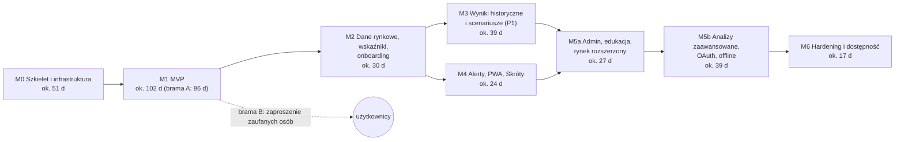

# Roadmapa: etapy M0–M6 z kryteriami wyjścia

**Cel:** ułożyć budowę OligInvest w etapy o jasnym zakresie i mierzalnych kryteriach wyjścia — tak, aby agent budujący (Codex) i właściciel wiedzieli, co wchodzi do etapu, kiedy etap jest skończony i co wolno odłożyć przy braku czasu.

Powiązane: [`mvp.md`](mvp.md) (zakres M1), [`backlog.md`](backlog.md) (zadania `BL-xxx` z estymacją i zależnościami), [`ryzyka.md`](ryzyka.md), [`prompty-codex.md`](prompty-codex.md), [`../00-przeglad/wymagania.md`](../00-przeglad/wymagania.md) (FR/NFR, priorytety), [`../../CONTRIBUTING.md`](../../CONTRIBUTING.md) (Definition of Done zadania).

## 1. Zasady planowania

- **Etap = temat + kryteria wyjścia.** Zadania i ich kolejność są w [`backlog.md`](backlog.md); etap kończy się dopiero, gdy spełnione są wszystkie kryteria z § 3 oraz kryteria wspólne z § 4.
- **Priorytet a etap.** Priorytet (P0–P3) mówi, co jest ważniejsze i co wycinamy przy braku czasu; etap wynika z tematu i zależności:

| Priorytet | Etap | Wyjątki |
|---|---|---|
| P0 | M1 (MVP); część NFR P0 obowiązuje od M0 | — |
| P1 | M2–M4 | wchodzą wcześniej do M1, bo bez nich nie wolno udostępnić aplikacji innym osobom: FR-07.05 (sesje), FR-07.08 (motyw i paleta — wymaga ich NFR-06.02 P0), FR-07.09 (prawa RODO), NFR-03.10 (zdarzenia bezpieczeństwa), NFR-07.03 (atrybucje danych); panele admina P1 (FR-08.02–FR-08.08) w M5a — [ADR-006](../09-decyzje/ADR-006-panel-administratora.md) |
| P2 | M5a–M5b | FR-09.05 i FR-09.06 (Skróty iOS, konfiguracje Androida) w M4 — bez nich API szybkich akcji nie daje wartości |
| P3 | po M6 („Później” w backlogu) | — |

- **Estymacja** w dniach pracy doświadczonego programisty (idealnych): **S** ≤ 0,5 d, **M** ≤ 2 d, **L** ≤ 5 d; zadanie większe dzielimy. Praca agenta bywa szybsza, ale przegląd właściciela i poprawki dodają ok. 30 % — sumy w backlogu to planowanie, nie termin.
- **Kolejność w etapie:** najpierw zadania blokujące (zależności), potem P0/P1, na końcu P2/P3. Przy braku czasu wycinamy od końca listy etapu, nigdy kryteriów wyjścia.
- **Jeden etap naraz.** Etapy M3 i M4 są od siebie niezależne i mogą iść równolegle w osobnych sesjach Codex, ale wąskim gardłem jest przegląd właściciela — domyślnie sekwencyjnie.

## 2. Przegląd

Sumy etapów pochodzą z [`backlog.md`](backlog.md) § 10 (po zaokrągleniu). Łącznie ok. 327 dni idealnych przed narzutem przeglądu — to skala pracy jednego doświadczonego programisty przez ponad rok; agent skraca kodowanie, ale nie przegląd, testy na urządzeniach ani prace na serwerze. Dlatego M1 ma dwie bramy (§ 3): właściciel zaczyna używać aplikacji po bramie A, zanim powstaną funkcje potrzebne dopiero do zaproszenia innych osób.

## 3. Etapy

### M0 — Szkielet i infrastruktura

**Cel:** puste, ale kompletne monorepo z CI, bezpieczeństwem łańcucha dostaw od pierwszego commita, schematem bazy z RLS i wdrożeniem pull na docelową infrastrukturę. Bez logiki domenowej.

**Zakres:** NFR-02.01–NFR-02.03, NFR-02.07, NFR-03.09, NFR-03.11, NFR-03.12, NFR-09.05, NFR-10.02–NFR-10.05 (narzędzia), fundamenty NFR-01.02–NFR-01.03 (egzekwowanie budżetów); spiki techniczne; migracja TLS Immicha. Zadania `BL-001`–`BL-034`.

**Kryteria wyjścia:**

1. `pnpm turbo run lint typecheck test build` przechodzi dla wszystkich pakietów (testy dymne); `pnpm check:deps` odrzuca niedozwolony import (test negatywny); build bez modułu `education` przechodzi ([ADR-002](../09-decyzje/ADR-002-monorepo.md)).
2. Migracje Drizzle od zera odtwarzają [`../03-dane/schema.sql`](../03-dane/schema.sql) (porównanie schematów = brak różnic), a [`../03-dane/testy-rls.sql`](../03-dane/testy-rls.sql) przechodzi w CI.
3. Test spójności OpenAPI działa: każda zaimplementowana operacja jest zgodna z [`../02-api/openapi.yaml`](../02-api/openapi.yaml); operacje jeszcze niezaimplementowane są na liście `apps/api/openapi-pending.json`, która może tylko maleć.
4. Tag `v0.1.0` tworzy podpisane obrazy (cosign), SBOM i poświadczenie pochodzenia; `infra/scripts/deploy.sh` weryfikuje podpisy i wdraża na VM; `https://invest.oligi.pl/api/v1/health/ready` odpowiada 200 przez router SNI na VPS; SSL Labs: TLS 1.3, HSTS.
5. VPS i VM zgodne z listą kontrolną hardeningu ([`../07-wdrozenie/infrastruktura.md`](../07-wdrozenie/infrastruktura.md) § 11), z decyzją w sprawie CAA w home.pl (§ 7); `tcpdump` na tunelu pokazuje wyłącznie TLS; Immich działa po migracji TLS (fazy 0–3; faza 4 po 7 dniach).
6. Kopie zapasowe działają (pgBackRest z WAL, restic na VPS w trybie append-only); Uptime Kuma monitoruje `app-ready`, `app-certificate`, `vm-health`.
7. Ustawienia repozytorium: ruleset `main`, skanowanie sekretów z push protection, CodeQL, alerty Dependabot, Renovate, prywatne zgłaszanie podatności, `CODEOWNERS`.
8. Spiki zamknięte notatką lub ADR: przedrostek `__Host-` w Better Auth (O-01), szyfrowanie sekretu TOTP i kluczy API w Better Auth ([ADR-004](../09-decyzje/ADR-004-postgres-better-auth-rls.md) pkt 6), czas Argon2id na serwerze (100–250 ms), zgodność TypeScript 7 (inaczej linia 6.x), parametry CAA w panelu home.pl.

### M1 — MVP

**Cel:** właściciel używa aplikacji na co dzień zamiast arkusza: import XTB, wycena portfela w PLN, P/L FIFO, wynik dnia, wykres świecowy — bezpiecznie i szybko na telefonie; potem, po spełnieniu wymogów prawnych i operacyjnych, zaproszenie zaufanych osób. Zakres szczegółowo: [`mvp.md`](mvp.md). Zadania `BL-101`–`BL-156`; w backlogu oznaczone **[A]** albo **[B]**.

**Brama A — MVP właściciela** (zadania [A], ok. 86 d). Do tego czasu aplikacji używa wyłącznie właściciel (konto utworzone poleceniem CLI):

1. Import realnego eksportu XTB właściciela (lokalnie, plik poza repozytorium): uzgodnienie gotówki i ilości co do 0,00; P/L zrealizowany zgodny z brokerem co do 0,01 PLN albo różnice wyjaśnione w raporcie uzgodnienia (FR-02.07, NFR-08.03). Syntetyczne fixtures przechodzą w CI.
2. Od wybrania pliku XTB do widoku portfela < 2 min (test e2e + pomiar na telefonie).
3. Wycena aktualizuje się przez SSE ≤ 5 s po nowych notowaniach; EOD GPW i kursy NBP pobierane automatycznie; awaria dostawcy daje flagę „nieaktualne”, nie błąd (FR-01.15, NFR-09.02 — test z wyłączonym adapterem).
4. Budżety wydajności w CI zielone dla `/logowanie`, `/`, `/portfel`, `/rynek/[instrumentId]` (JS początkowy, Lighthouse na profilu mobilnym); wykres 10 lat ≤ 3 000 punktów.
5. Uwierzytelnianie: bramka MFA, step-up, lista sesji, testy izolacji RLS, audyt poleceń administracyjnych; polecenia awaryjne z [`../06-bezpieczenstwo/plan-reagowania.md`](../06-bezpieczenstwo/plan-reagowania.md) § 4 działają.
6. Dostępność: axe bez naruszeń krytycznych; ręczny test VoiceOver: logowanie z TOTP, odczyt portfela, dodanie operacji, tabela zamiast wykresu.
7. Weryfikacja [ADR-001](../09-decyzje/ADR-001-baza-projektu.md): koszt `packages/core` i importu ≤ 2× estymacji z backlogu — inaczej przegląd decyzji o budowie własnej.

**Brama B — udostępnienie zaufanym osobom** (zadania [B], ok. 17 d):

1. Lista kontrolna [`../06-bezpieczenstwo/prywatnosc-rodo.md`](../06-bezpieczenstwo/prywatnosc-rodo.md) § 12 odhaczona: regulamin i informacja o prywatności w wersji `2026-09` opublikowane, bramka regulaminu działa, eksport i usunięcie konta działają (FR-07.09), zgoda RUM działa, umowy powierzenia zaakceptowane.
2. Panel `/admin` z zaproszeniami i rolami; rejestracja wyłącznie z zaproszenia; admin nie odczyta portfela innego użytkownika (test); każda trasa admina zapisuje audyt.
3. E-mail o nowym urządzeniu i reguły anomalii działają (NFR-03.10).
4. Bezpieczeństwo produkcji: nagłówki i CSP sprawdzone skanem; CrowdSec blokuje na VPS adres wykryty w domu w ≤ 60 s ([ADR-011](../09-decyzje/ADR-011-topologia-wdrozenia.md)).
5. Pierwszy test odtworzenia (scenariusze B i D) zaliczony z protokołem ([`../07-wdrozenie/backup-dr.md`](../07-wdrozenie/backup-dr.md) § 8); wszystkie 13 sond Uptime Kuma aktywne.

### M2 — Dane rynkowe, wskaźniki i onboarding

**Cel:** pełniejszy obraz rynku i portfela: wskaźniki techniczne z wyjaśnieniami, watchlisty, indeksy i benchmarki, alokacja, drugi broker (mBank), kontrola jakości danych oraz onboarding dla zaproszonych osób. Zadania `BL-201`–`BL-216`.

**Kryteria wyjścia:**

1. Wskaźniki zgodne z TA-Lib na wspólnych wektorach (tolerancja 1e-8); każdy wskaźnik ma wyjaśnienie dostępne z klawiatury (FR-01.05, FR-01.07, FR-06.02).
2. Indeksy z FR-01.09 mają historię EOD ≥ 5 lat; watchlista 50 pozycji renderuje się < 100 ms.
3. Import mBank: kryteria jak FR-03.01 na syntetycznych plikach i na realnym eksporcie właściciela (lokalnie).
4. Kontrola jakości danych oznacza problemy w UI, a seria z problemem `BLOCK` jest wyłączona z analiz (NFR-08.04).
5. Rozpoczęty pomiar z [ADR-005](../09-decyzje/ADR-005-strategia-danych-rynkowych.md): 20 kolejnych sesji z ≥ 95 % kompletnych danych EOD GPW pobranych automatycznie.
6. Test opóźnienia SSE: < 2 s p95 od zapisu do przeglądarki (NFR-01.06).
7. Onboarding ładowany leniwie (bez wpływu na JS początkowy), do pominięcia i powtórzenia, stan ukończenia zapisany per użytkownik (FR-06.01).

### M3 — Wyniki historyczne i analizy scenariuszowe (P1)

**Cel:** prawdziwy wynik inwestora (TWR, XIRR, benchmark, obsunięcia, dywidendy, ekspozycja walutowa, dziennik) i pierwsze analizy przyszłości jako rozkłady (Monte Carlo, rebalancing) — z izolowanym workerem Python. Zadania `BL-301`–`BL-319`.

**Kryteria wyjścia:**

1. XIRR zgodny z funkcją XIRR arkusza (1e-6); TWR, obsunięcia i metryki zgodne z wektorami `B`, `C`, `D` (także z empyrical-reloaded w pytest).
2. Monte Carlo: 10 000 ścieżek × 30 lat < 20 s na serwerze; ponowne uruchomienie z tym samym ziarnem daje identyczny wynik (NFR-08.05); p95 odczytów API rośnie w tym czasie ≤ 20 % (NFR-01.07).
3. Kontener `analytics` nie łączy się z internetem i nie ma `SELECT` na `portfolio.transactions` (testy z [ADR-003](../09-decyzje/ADR-003-hybryda-obliczen-i-kolejki.md)).
4. Każdy ekran wyników przechodzi checklistę zgodności ([`../11-zgodnosc-prawna.md`](../11-zgodnosc-prawna.md) § 4.4); przegląd metodologiczny Monte Carlo i rebalancingu zapisany w PR (checklisty z [`../../AGENTS.md`](../../AGENTS.md)).
5. Bramkowanie roli `pro` dla analiz ciężkich (FR-07.06): użytkownik bez roli dostaje 403 i wyjaśnienie w UI.

### M4 — Alerty, PWA i Skróty

**Cel:** aplikacja „w kieszeni”: instalowalna PWA, powiadomienia push z zapasem e-mail, alerty cenowe, tokeny PAT i gotowe Skróty iOS — „ile dziś zarobiłem” jednym stuknięciem. Zadania `BL-401`–`BL-412`.

**Kryteria wyjścia:**

1. Alert cenowy wyzwala się w ≤ 1 cyklu odświeżania (≤ 5 min w sesji), jednokrotnie na przekroczenie (histereza, cooldown); brak subskrypcji push → e-mail; historia pokazuje status doręczenia (FR-05.01, FR-05.06).
2. Na fizycznym iPhonie z zainstalowaną PWA powiadomienie dociera, a kliknięcie otwiera właściwy ekran (FR-09.03, FR-09.07).
3. `GET /api/v1/quick/today?format=text` odpowiada < 300 ms po stronie serwera; token z zakresem `portfolio:read` nie doda transakcji (FR-07.07, FR-09.04).
4. Cztery gotowe Skróty działają przez Stuknięcie w tył i Siri; konfiguracje HTTP Shortcuts działają na Androidzie ≥ 12 — testy ręczne z [`../05-mobile/strategia-mobilna.md`](../05-mobile/strategia-mobilna.md) § 9 zapisane w PR.
5. Treści alertów przechodzą checklistę języka (FR-05.07) i nie zawierają kwot portfela ([ADR-010](../09-decyzje/ADR-010-kanaly-powiadomien.md)).

### M5a — Administracja, edukacja i rynek rozszerzony

**Cel:** pełny panel administratora, tryb demo i glosariusz, heatmapa, screener, kalendarz i intraday. Zadania `BL-501`–`BL-516`.

**Kryteria wyjścia:**

1. Wszystkie ekrany `/admin/*` z [`../04-frontend/mapa-ekranow.md`](../04-frontend/mapa-ekranow.md) § 6 działają bez wglądu w dane finansowe; każda akcja w audycie; chunk `/admin` nie ładuje się na trasach użytkownika.
2. Glosariusz ≥ 60 haseł; tryb demo odizolowany od danych realnych (test).
3. Heatmapa GPW obejmuje ≥ 90 % spółek z subindeksów sektorowych i ma widok tabeli; screener na całej GPW < 1 s, bez rankingów.
4. Intraday (15 min, 1 h) z etykietą opóźnienia; przy braku danych przełącznik nieaktywny z wyjaśnieniem.

### M5b — Analizy zaawansowane, OAuth i offline

**Cel:** pozostałe funkcje P2: optymalizacja, testy skrajne, „co jeśli”, backtest, kalkulator celu, screening kandydatów, atrybucja, metryki ryzyka, statystyki decyzji, alerty wskaźnikowe i portfelowe, import generyczny CSV, OAuth, migawka offline. Zadania `BL-551`–`BL-566`.

**Kryteria wyjścia:**

1. Backtest: podział IS/OOS i walk-forward, raport liczby prób i Deflated Sharpe Ratio, test anty-look-ahead wykrywa sygnał „z przyszłości” (FR-04.08); uniwersum point-in-time dla GPW.
2. Optymalizacja: wyniki zgodne z PyPortfolioOpt na danych testowych, wagi jako przedziały; testy skrajne z jawnymi proxy i progiem pokrycia 80 %.
3. OAuth tylko z wymuszonym TOTP (spike zakończony ADR; flaga `auth.oauth`); test e2e logowania Google zakończonego ekranem kodu.
4. Migawka offline: tylko w zainstalowanej PWA, po zgodzie, ≤ 30 dni, kasowana przy wylogowaniu i 401 (test).
5. Checklista zgodności dla każdego nowego ekranu; przegląd `backtest-review` i `strategy-critique` zapisany w PR.

### M6 — Hardening i dostępność

**Cel:** dowody zamiast deklaracji: przegląd bezpieczeństwa z dowodami, skan DAST, ćwiczenie DR, pełny audyt dostępności i wydajności w terenie. Zadania `BL-601`–`BL-612`.

**Kryteria wyjścia:**

1. Tabela ASVS ([`../06-bezpieczenstwo/kontrole-bezpieczenstwa.md`](../06-bezpieczenstwo/kontrole-bezpieczenstwa.md) § 7) przejrzana z dowodami; brak otwartych ustaleń wysokich; protokół w `docs/06-bezpieczenstwo/przeglady/`.
2. ZAP baseline bez ostrzeżeń wysokich i średnich bez uzasadnienia; `require-trusted-types-for 'script'` włączone albo odstępstwo opisane.
3. Ćwiczenie DR (scenariusz D na zastępczej VM) zaliczone: zmierzone RPO i RTO w granicach celów.
4. RUM przez 2 tygodnie: p75 LCP < 2,0 s i INP < 200 ms dla logowania, startu, portfela i karty instrumentu (NFR-01.01) — albo decyzja z [`../10-ograniczenia.md`](../10-ograniczenia.md) L-04.
5. Ręczny audyt WCAG 2.1 AA (VoiceOver, TalkBack, NVDA) bez błędów blokujących.
6. Rejestr ryzyk i model zagrożeń zaktualizowane; odstępstwa O-01…O-09 przejrzane z warunkami powrotu.

## 4. Kryteria wspólne każdego etapu

- CI zielone na `main`; wszystkie zadania etapu spełniają Definition of Done z [`../../CONTRIBUTING.md`](../../CONTRIBUTING.md).
- Wydanie `v0.N.0` (N = numer etapu) wdrożone na serwer i sprawdzone testem dymnym.
- Dokumentacja zaktualizowana przed kodem: OpenAPI, schemat, wzory, [`backlog.md`](backlog.md) (status, odchylenia), [`ryzyka.md`](ryzyka.md), a przy zmianie decyzji — nowy ADR.
- Przegląd modelu zagrożeń ([`../06-bezpieczenstwo/model-zagrozen.md`](../06-bezpieczenstwo/model-zagrozen.md) § 9) i ręczny test czytnikiem ekranu dla nowych ekranów ([`../04-frontend/dostepnosc.md`](../04-frontend/dostepnosc.md)).
- Brak regresji budżetów wydajności; raport rozmiarów tras dołączony do wydania.

## 5. Po M6 — „Później” (P3)

Volume Profile (FR-01.06), newsy z „tonem” (FR-01.13), alerty na wynikach spółek i newsach (FR-05.04, FR-05.05), ścieżki nauki (FR-06.05), passkeys (FR-07.11), widżety z danymi przez Scriptable (FR-09.08), import „na żywo” przez XTB xAPI i udostępnianie pliku do PWA na Androidzie (propozycje z [`../03-dane/zrodla-danych.md`](../03-dane/zrodla-danych.md) i [`../05-mobile/android-integracje.md`](../05-mobile/android-integracje.md) § 7). Każda z tych funkcji przed startem przechodzi przegląd zgodności z [`../11-zgodnosc-prawna.md`](../11-zgodnosc-prawna.md) § 8.
