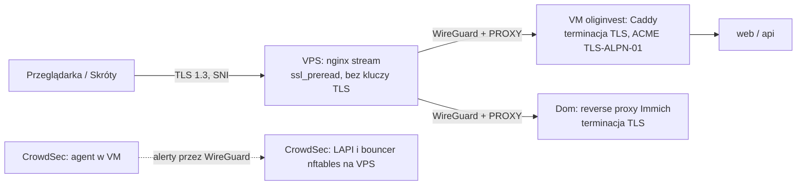

# ADR-011: Topologia — VM na Proxmoxie, VPS jako niezaufany przekaźnik z TLS passthrough

**Cel:** zapisać topologię wdrożenia (VM w domu, VPS jako przekaźnik TCP bez terminacji TLS) i jej skutki dla bezpieczeństwa i dostępności.

- **Status:** zaakceptowana; zaktualizowana 2026-09-19 po odpowiedzi na Q-02 (specyfikacja VPS, obecne miejsce terminacji TLS)
- **Data:** 2026-09-18 (aktualizacja 2026-09-19)
- **Decydent:** właściciel projektu (VM na Proxmoxie + VPS jako edge — Krok 0; TLS w HomeLabie — Krok 4)
- **Powiązane wymagania:** NFR-01.01, NFR-01.08, NFR-03.06, NFR-03.10, NFR-03.11, NFR-05.03, NFR-09.01, A-05, Z-18, Z-27

## Kontekst

- **Serwer domowy:** Dell 7020 (i5-4590 4C/4T, 16 GB RAM, SSD 240 GB + HDD 1 TB), Proxmox VE, obsługuje już Immich; w domu działa nginx.
- **VPS (OVH):** 1 vCPU / 2 GB RAM / 20 GB dysku, połączony z domem tunelem WireGuard (potwierdzone 2026-09-19).
- **Stan obecny:** TLS dla Immicha kończy się w **Caddy na VPS** — VPS widzi odszyfrowany ruch Immicha i przechowuje jego klucz prywatny.
- **Cel właściciela:** przenieść terminację TLS do HomeLabu i zostawić VPS wyłącznie jako przekaźnik TCP przez WireGuard, bez dostępu do odszyfrowanej treści — dla OligInvest i dla Immicha.

## Rozważane opcje

| Opcja | Zalety | Wady |
|---|---|---|
| **A. Routing L4 po SNI na VPS → WireGuard → terminacja TLS w domu** | VPS nie widzi danych jawnych ani kluczy TLS; jedna reguła dla wszystkich usług | Brak cache HTTP i reguł L7 na VPS; adres IP klienta trzeba przekazać protokołem PROXY |
| B. Terminacja TLS na VPS (stan obecny dla Immicha) | Możliwy cache i WAF na VPS | Odszyfrowane dane finansowe i zdjęcia na maszynie zewnętrznego dostawcy; klucze TLS na VPS |
| C. Aplikacja na VPS | Wyższa dostępność | 2 GB RAM nie mieści stosu (NFR-01.08: ~6 GB); dane poza domem; sprzeczne z wyborem właściciela |
| D. LXC zamiast VM dla OligInvest | Mniejszy narzut RAM | Wspólne jądro z hostem — słabsza izolacja danych finansowych |

Warianty routera L4 na VPS:

| Router | Za | Przeciw |
|---|---|---|
| **nginx `stream` + `ssl_preread`** (wybrany) | pakiet Debiana, znany właścicielowi, `limit_conn` per IP, mały narzut | protokół PROXY wysyłany w wersji 1 (tekstowej) — wystarczający |
| HAProxy (tryb TCP, `req.ssl_sni`) | protokół PROXY v2, tabele liczników do limitów | nowa technologia w utrzymaniu |
| Caddy z modułem `layer4` | jeden program na VPS i w domu | wymaga własnej kompilacji (`xcaddy`) — moduł spoza standardowej dystrybucji |

## Decyzja

Wariant **A** i **VM** (nie LXC):

- **VM `oliginvest`**: Debian 13, Docker Engine + Compose, **6 GB RAM, 3 vCPU**, dysk systemowy na SSD (~60 GB), kopie zapasowe na HDD 1 TB (`07-wdrozenie/backup-dr.md`, Krok 5); limity zasobów kontenerów wg [`../01-architektura/przeglad-architektury.md`](../01-architektura/przeglad-architektury.md) § 4; priorytet CPU niższy niż Immich w godzinach nocnych (zadania ciężkie) — do dostrojenia.
- **VPS = przekaźnik TCP bez terminacji TLS**:
  - nginx `stream` z `ssl_preread` kieruje połączenia na porcie 443 według nazwy serwera (SNI): nazwa aplikacji `invest.oligi.pl` → WireGuard → Caddy w VM `oliginvest`; nazwa Immicha → WireGuard → reverse proxy Immicha w domu;
  - połączenia bez SNI lub z nieznaną nazwą są zamykane (brak domyślnego backendu — mniej skanowania);
  - port 80: wyłącznie przekierowanie 301 na HTTPS (bez treści);
  - do domu wysyłany jest nagłówek **protokołu PROXY**, żeby Caddy, limity i CrowdSec widziały prawdziwy adres IP klienta; Caddy w domu przyjmuje go tylko od adresu VPS w tunelu (listener wrapper `proxy_protocol` z listą dozwolonych adresów);
  - VPS nie przechowuje danych, certyfikatów ani kluczy prywatnych usług; logi tylko metadanych połączeń (czas, IP, SNI, bajty).
- **Certyfikaty w domu:** Caddy uzyskuje certyfikaty ACME wyzwaniem **TLS-ALPN-01**, które przechodzi przez routing SNI bez zmian na VPS (wyzwanie DNS-01 wymagałoby tokenu API dostawcy DNS w domu i niestandardowej kompilacji Caddy — odrzucone).
- **CrowdSec (zmiana 2026-09-19, Krok 5):** agent (procesor logów) w VM analizuje logi Caddy i SSH i wysyła alerty do **LAPI na VPS** przez WireGuard — połączeniem wychodzącym z domu; na VPS **bouncer zapory (nftables)** pobiera decyzje z lokalnego LAPI i blokuje adresy na krawędzi, zanim ruch wejdzie do tunelu. Wariant z LAPI w domu wymagałby dodatkowego przepływu VPS → dom (port LAPI) — odrzucony, bo zwiększa powierzchnię ataku z niezaufanego VPS, a VPS i tak widzi adresy IP klientów.
- **Hardening VPS:** otwarte tylko 80, 443 i port WireGuard; SSH wyłącznie kluczem (najlepiej tylko przez WireGuard); automatyczne aktualizacje bezpieczeństwa; limity połączeń per IP w nginx `stream`.
- **Immich:** terminacja TLS przeniesiona do domu (reverse proxy przed Immichem z certyfikatem ACME), a Caddy na VPS wyłączony. Procedura migracji z krótkim oknem przerwy i planem powrotu — `07-wdrozenie/infrastruktura.md` (Krok 5). Kolejność: najpierw nowa nazwa OligInvest (brak ruchu do przerwania), potem Immich.
- **Wydajność (Z-18):** jeśli pomiary RUM pokażą przekroczenie LCP z powodu łącza domowego, opcją jest osobna subdomena zasobów statycznych (bez danych użytkowników) z cache na VPS — nowy ADR przed wdrożeniem.

## Konsekwencje

- Pozytywne: poufność end-to-end między urządzeniem użytkownika a domem dla OligInvest i Immicha; klucze TLS tylko w domu; izolacja OligInvest od Immicha (osobna VM); VPS o 2 GB RAM z dużym zapasem (router L4, WireGuard i bouncer zużywają zwykle kilkaset MB); 0 zł.
- Negatywne: awaria domu (prąd, łącze, sprzęt) = niedostępność aplikacji (Z-27, akceptowalne dla aplikacji prywatnej — [`../10-ograniczenia.md`](../10-ograniczenia.md) L-01, L-02); brak cache na krawędzi; zależność od przepustowości wysyłania łącza domowego; migracja Immicha wymaga krótkiego okna serwisowego.
- Zadania: VM i Compose (M0), router SNI na VPS i Caddy z protokołem PROXY (M0), migracja TLS Immicha (M0, osobne okno serwisowe), CrowdSec z bouncerem na VPS (M1 — przed zaproszeniem innych osób; zmiana w Kroku 6), pomiar RUM (M1+).

## Weryfikacja

- Przechwycenie ruchu na VPS (`tcpdump` na interfejsie WireGuard) pokazuje wyłącznie TLS dla obu usług; na VPS nie ma plików certyfikatów ani kluczy prywatnych usług.
- Test SSL Labs dla nazwy aplikacji: TLS 1.3, HSTS; certyfikat odnawiany automatycznie w domu (wyzwanie TLS-ALPN-01).
- Logi Caddy w domu zawierają prawdziwe adresy IP klientów (nie adres VPS); nagłówek PROXY od innego źródła jest odrzucany.
- Adres wykryty przez agenta CrowdSec w domu jest odrzucany na VPS w ≤ 60 s.
- Zużycie zasobów VM w teście obciążeniowym ≤ 6 GB RAM (NFR-01.08).
